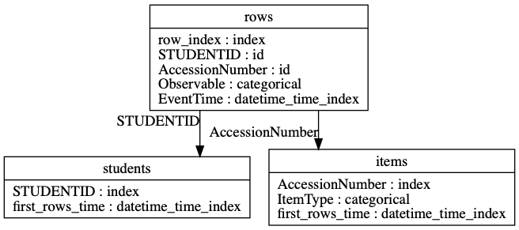

# Featuretools features

This folder will contain feature files generated by `features_featuretools.py`

Featuretools is a method for automatically extracting features from structured relational data: <https://github.com/FeatureLabs/featuretools>

In this case, we have provided Featuretools with the following relationships:

A complete alphabetized list of Featuretools features extracted for 30-minute data is as follows:

* 1 / AVG_TIME_BETWEEN(rows.EventTime)
* 1 / COUNT(rows)
* 1 / ENTROPY(rows.AccessionNumber)
* 1 / ENTROPY(rows.Observable)
* 1 / NUM_UNIQUE(rows.AccessionNumber)
* 1 / NUM_UNIQUE(rows.Observable)
* 1 / TIME_SINCE_FIRST(rows.EventTime)
* 1 / TIME_SINCE_LAST(rows.EventTime)
* 1 / TIME_SINCE_PREVIOUS(first_rows_time)
* AVG_TIME_BETWEEN(rows.EventTime WHERE AccessionNumber = VH098519)
* AVG_TIME_BETWEEN(rows.EventTime WHERE AccessionNumber = VH098522)
* AVG_TIME_BETWEEN(rows.EventTime WHERE AccessionNumber = VH098556)
* AVG_TIME_BETWEEN(rows.EventTime WHERE AccessionNumber = VH098597)
* AVG_TIME_BETWEEN(rows.EventTime WHERE AccessionNumber = VH098740)
* AVG_TIME_BETWEEN(rows.EventTime WHERE AccessionNumber = VH098753)
* AVG_TIME_BETWEEN(rows.EventTime WHERE AccessionNumber = VH098759)
* AVG_TIME_BETWEEN(rows.EventTime WHERE AccessionNumber = VH098779)
* AVG_TIME_BETWEEN(rows.EventTime WHERE AccessionNumber = VH098783)
* AVG_TIME_BETWEEN(rows.EventTime WHERE AccessionNumber = VH098808)
* AVG_TIME_BETWEEN(rows.EventTime WHERE AccessionNumber = VH098810)
* AVG_TIME_BETWEEN(rows.EventTime WHERE AccessionNumber = VH098812)
* AVG_TIME_BETWEEN(rows.EventTime WHERE AccessionNumber = VH098834)
* AVG_TIME_BETWEEN(rows.EventTime WHERE AccessionNumber = VH098839)
* AVG_TIME_BETWEEN(rows.EventTime WHERE AccessionNumber = VH134366)
* AVG_TIME_BETWEEN(rows.EventTime WHERE AccessionNumber = VH134373)
* AVG_TIME_BETWEEN(rows.EventTime WHERE AccessionNumber = VH134387)
* AVG_TIME_BETWEEN(rows.EventTime WHERE AccessionNumber = VH139047)
* AVG_TIME_BETWEEN(rows.EventTime WHERE AccessionNumber = VH139196)
* AVG_TIME_BETWEEN(rows.EventTime WHERE AccessionNumber = VH356862)
* AVG_TIME_BETWEEN(rows.EventTime WHERE items.ItemType = BlockReview)
* AVG_TIME_BETWEEN(rows.EventTime WHERE items.ItemType = CompositeCR)
* AVG_TIME_BETWEEN(rows.EventTime WHERE items.ItemType = Directions)
* AVG_TIME_BETWEEN(rows.EventTime WHERE items.ItemType = FillInBlank)
* AVG_TIME_BETWEEN(rows.EventTime WHERE items.ItemType = Help)
* AVG_TIME_BETWEEN(rows.EventTime WHERE items.ItemType = MatchMS )
* AVG_TIME_BETWEEN(rows.EventTime WHERE items.ItemType = MCSS)
* AVG_TIME_BETWEEN(rows.EventTime WHERE items.ItemType = MultipleFillInBlank)
* AVG_TIME_BETWEEN(rows.EventTime WHERE items.ItemType = TimeLeftMessage)
* AVG_TIME_BETWEEN(rows.EventTime WHERE items.ItemType = TimeOutMessage)
* AVG_TIME_BETWEEN(rows.EventTime WHERE Observable = Click Choice)
* AVG_TIME_BETWEEN(rows.EventTime WHERE Observable = Draw)
* AVG_TIME_BETWEEN(rows.EventTime WHERE Observable = DropChoice)
* AVG_TIME_BETWEEN(rows.EventTime WHERE Observable = Enter Item)
* AVG_TIME_BETWEEN(rows.EventTime WHERE Observable = Lose Focus)
* AVG_TIME_BETWEEN(rows.EventTime WHERE Observable = Math Keypress)
* AVG_TIME_BETWEEN(rows.EventTime WHERE Observable = Receive Focus)
* AVG_TIME_BETWEEN(rows.EventTime)
* AVG_TIME_BETWEEN(rows.EventTime) >= COUNT(rows)
* AVG_TIME_BETWEEN(rows.EventTime) >= ENTROPY(rows.AccessionNumber)
* AVG_TIME_BETWEEN(rows.EventTime) >= ENTROPY(rows.Observable)
* AVG_TIME_BETWEEN(rows.EventTime) >= NUM_UNIQUE(rows.AccessionNumber)
* AVG_TIME_BETWEEN(rows.EventTime) >= NUM_UNIQUE(rows.Observable)
* AVG_TIME_BETWEEN(rows.EventTime) >= TIME_SINCE_FIRST(rows.EventTime)
* AVG_TIME_BETWEEN(rows.EventTime) >= TIME_SINCE_LAST(rows.EventTime)
* AVG_TIME_BETWEEN(rows.EventTime) >= TIME_SINCE_PREVIOUS(first_rows_time)
* AVG_TIME_BETWEEN(rows.items.first_rows_time WHERE AccessionNumber = VH098519)
* AVG_TIME_BETWEEN(rows.items.first_rows_time WHERE AccessionNumber = VH098522)
* AVG_TIME_BETWEEN(rows.items.first_rows_time WHERE AccessionNumber = VH098556)
* AVG_TIME_BETWEEN(rows.items.first_rows_time WHERE AccessionNumber = VH098597)
* AVG_TIME_BETWEEN(rows.items.first_rows_time WHERE AccessionNumber = VH098740)
* AVG_TIME_BETWEEN(rows.items.first_rows_time WHERE AccessionNumber = VH098753)
* AVG_TIME_BETWEEN(rows.items.first_rows_time WHERE AccessionNumber = VH098759)
* AVG_TIME_BETWEEN(rows.items.first_rows_time WHERE AccessionNumber = VH098779)
* AVG_TIME_BETWEEN(rows.items.first_rows_time WHERE AccessionNumber = VH098783)
* AVG_TIME_BETWEEN(rows.items.first_rows_time WHERE AccessionNumber = VH098808)
* AVG_TIME_BETWEEN(rows.items.first_rows_time WHERE AccessionNumber = VH098810)
* AVG_TIME_BETWEEN(rows.items.first_rows_time WHERE AccessionNumber = VH098812)
* AVG_TIME_BETWEEN(rows.items.first_rows_time WHERE AccessionNumber = VH098834)
* AVG_TIME_BETWEEN(rows.items.first_rows_time WHERE AccessionNumber = VH098839)
* AVG_TIME_BETWEEN(rows.items.first_rows_time WHERE AccessionNumber = VH134366)
* AVG_TIME_BETWEEN(rows.items.first_rows_time WHERE AccessionNumber = VH134373)
* AVG_TIME_BETWEEN(rows.items.first_rows_time WHERE AccessionNumber = VH134387)
* AVG_TIME_BETWEEN(rows.items.first_rows_time WHERE AccessionNumber = VH139047)
* AVG_TIME_BETWEEN(rows.items.first_rows_time WHERE AccessionNumber = VH139196)
* AVG_TIME_BETWEEN(rows.items.first_rows_time WHERE AccessionNumber = VH356862)
* AVG_TIME_BETWEEN(rows.items.first_rows_time WHERE items.ItemType = BlockReview)
* AVG_TIME_BETWEEN(rows.items.first_rows_time WHERE items.ItemType = CompositeCR)
* AVG_TIME_BETWEEN(rows.items.first_rows_time WHERE items.ItemType = Directions)
* AVG_TIME_BETWEEN(rows.items.first_rows_time WHERE items.ItemType = FillInBlank)
* AVG_TIME_BETWEEN(rows.items.first_rows_time WHERE items.ItemType = Help)
* AVG_TIME_BETWEEN(rows.items.first_rows_time WHERE items.ItemType = MatchMS )
* AVG_TIME_BETWEEN(rows.items.first_rows_time WHERE items.ItemType = MCSS)
* AVG_TIME_BETWEEN(rows.items.first_rows_time WHERE items.ItemType = MultipleFillInBlank)
* AVG_TIME_BETWEEN(rows.items.first_rows_time WHERE items.ItemType = TimeLeftMessage)
* AVG_TIME_BETWEEN(rows.items.first_rows_time WHERE items.ItemType = TimeOutMessage)
* AVG_TIME_BETWEEN(rows.items.first_rows_time WHERE Observable = Click Choice)
* AVG_TIME_BETWEEN(rows.items.first_rows_time WHERE Observable = Draw)
* AVG_TIME_BETWEEN(rows.items.first_rows_time WHERE Observable = DropChoice)
* AVG_TIME_BETWEEN(rows.items.first_rows_time WHERE Observable = Enter Item)
* AVG_TIME_BETWEEN(rows.items.first_rows_time WHERE Observable = Lose Focus)
* AVG_TIME_BETWEEN(rows.items.first_rows_time WHERE Observable = Math Keypress)
* AVG_TIME_BETWEEN(rows.items.first_rows_time WHERE Observable = Receive Focus)
* AVG_TIME_BETWEEN(rows.items.first_rows_time)
* COUNT(rows WHERE AccessionNumber = VH098519)
* COUNT(rows WHERE AccessionNumber = VH098522)
* COUNT(rows WHERE AccessionNumber = VH098556)
* COUNT(rows WHERE AccessionNumber = VH098597)
* COUNT(rows WHERE AccessionNumber = VH098740)
* COUNT(rows WHERE AccessionNumber = VH098753)
* COUNT(rows WHERE AccessionNumber = VH098759)
* COUNT(rows WHERE AccessionNumber = VH098779)
* COUNT(rows WHERE AccessionNumber = VH098783)
* COUNT(rows WHERE AccessionNumber = VH098808)
* COUNT(rows WHERE AccessionNumber = VH098810)
* COUNT(rows WHERE AccessionNumber = VH098812)
* COUNT(rows WHERE AccessionNumber = VH098834)
* COUNT(rows WHERE AccessionNumber = VH098839)
* COUNT(rows WHERE AccessionNumber = VH134366)
* COUNT(rows WHERE AccessionNumber = VH134373)
* COUNT(rows WHERE AccessionNumber = VH134387)
* COUNT(rows WHERE AccessionNumber = VH139047)
* COUNT(rows WHERE AccessionNumber = VH139196)
* COUNT(rows WHERE AccessionNumber = VH356862)
* COUNT(rows WHERE items.ItemType = BlockReview)
* COUNT(rows WHERE items.ItemType = CompositeCR)
* COUNT(rows WHERE items.ItemType = Directions)
* COUNT(rows WHERE items.ItemType = FillInBlank)
* COUNT(rows WHERE items.ItemType = Help)
* COUNT(rows WHERE items.ItemType = MatchMS )
* COUNT(rows WHERE items.ItemType = MCSS)
* COUNT(rows WHERE items.ItemType = MultipleFillInBlank)
* COUNT(rows WHERE items.ItemType = TimeLeftMessage)
* COUNT(rows WHERE items.ItemType = TimeOutMessage)
* COUNT(rows WHERE Observable = Click Choice)
* COUNT(rows WHERE Observable = Draw)
* COUNT(rows WHERE Observable = DropChoice)
* COUNT(rows WHERE Observable = Enter Item)
* COUNT(rows WHERE Observable = Lose Focus)
* COUNT(rows WHERE Observable = Math Keypress)
* COUNT(rows WHERE Observable = Receive Focus)
* COUNT(rows)
* COUNT(rows) >= AVG_TIME_BETWEEN(rows.EventTime)
* COUNT(rows) >= ENTROPY(rows.AccessionNumber)
* COUNT(rows) >= ENTROPY(rows.Observable)
* COUNT(rows) >= NUM_UNIQUE(rows.AccessionNumber)
* COUNT(rows) >= NUM_UNIQUE(rows.Observable)
* COUNT(rows) >= TIME_SINCE_FIRST(rows.EventTime)
* COUNT(rows) >= TIME_SINCE_LAST(rows.EventTime)
* COUNT(rows) >= TIME_SINCE_PREVIOUS(first_rows_time)
* CUM_MAX(AVG_TIME_BETWEEN(rows.EventTime))
* CUM_MAX(COUNT(rows))
* CUM_MAX(ENTROPY(rows.AccessionNumber))
* CUM_MAX(ENTROPY(rows.Observable))
* CUM_MAX(NUM_UNIQUE(rows.AccessionNumber))
* CUM_MAX(NUM_UNIQUE(rows.Observable))
* CUM_MAX(TIME_SINCE_FIRST(rows.EventTime))
* CUM_MAX(TIME_SINCE_LAST(rows.EventTime))
* CUM_MAX(TIME_SINCE_PREVIOUS(first_rows_time))
* CUM_MAX(TIME_SINCE(first_rows_time))
* CUM_MEAN(AVG_TIME_BETWEEN(rows.EventTime))
* CUM_MEAN(COUNT(rows))
* CUM_MEAN(ENTROPY(rows.AccessionNumber))
* CUM_MEAN(ENTROPY(rows.Observable))
* CUM_MEAN(NUM_UNIQUE(rows.AccessionNumber))
* CUM_MEAN(NUM_UNIQUE(rows.Observable))
* CUM_MEAN(TIME_SINCE_FIRST(rows.EventTime))
* CUM_MEAN(TIME_SINCE_LAST(rows.EventTime))
* CUM_MEAN(TIME_SINCE_PREVIOUS(first_rows_time))
* CUM_MEAN(TIME_SINCE(first_rows_time))
* CUM_MIN(AVG_TIME_BETWEEN(rows.EventTime))
* CUM_MIN(COUNT(rows))
* CUM_MIN(ENTROPY(rows.AccessionNumber))
* CUM_MIN(ENTROPY(rows.Observable))
* CUM_MIN(NUM_UNIQUE(rows.AccessionNumber))
* CUM_MIN(NUM_UNIQUE(rows.Observable))
* CUM_MIN(TIME_SINCE_FIRST(rows.EventTime))
* CUM_MIN(TIME_SINCE_LAST(rows.EventTime))
* CUM_MIN(TIME_SINCE_PREVIOUS(first_rows_time))
* CUM_MIN(TIME_SINCE(first_rows_time))
* CUM_SUM(AVG_TIME_BETWEEN(rows.EventTime))
* CUM_SUM(COUNT(rows))
* CUM_SUM(ENTROPY(rows.AccessionNumber))
* CUM_SUM(ENTROPY(rows.Observable))
* CUM_SUM(NUM_UNIQUE(rows.AccessionNumber))
* CUM_SUM(NUM_UNIQUE(rows.Observable))
* CUM_SUM(TIME_SINCE_FIRST(rows.EventTime))
* CUM_SUM(TIME_SINCE_LAST(rows.EventTime))
* CUM_SUM(TIME_SINCE_PREVIOUS(first_rows_time))
* CUM_SUM(TIME_SINCE(first_rows_time))
* ENTROPY(rows.AccessionNumber WHERE items.ItemType = BlockReview)
* ENTROPY(rows.AccessionNumber WHERE items.ItemType = CompositeCR)
* ENTROPY(rows.AccessionNumber WHERE items.ItemType = Directions)
* ENTROPY(rows.AccessionNumber WHERE items.ItemType = FillInBlank)
* ENTROPY(rows.AccessionNumber WHERE items.ItemType = Help)
* ENTROPY(rows.AccessionNumber WHERE items.ItemType = MatchMS )
* ENTROPY(rows.AccessionNumber WHERE items.ItemType = MCSS)
* ENTROPY(rows.AccessionNumber WHERE items.ItemType = MultipleFillInBlank)
* ENTROPY(rows.AccessionNumber WHERE items.ItemType = TimeLeftMessage)
* ENTROPY(rows.AccessionNumber WHERE items.ItemType = TimeOutMessage)
* ENTROPY(rows.AccessionNumber WHERE Observable = Click Choice)
* ENTROPY(rows.AccessionNumber WHERE Observable = Draw)
* ENTROPY(rows.AccessionNumber WHERE Observable = DropChoice)
* ENTROPY(rows.AccessionNumber WHERE Observable = Enter Item)
* ENTROPY(rows.AccessionNumber WHERE Observable = Lose Focus)
* ENTROPY(rows.AccessionNumber WHERE Observable = Math Keypress)
* ENTROPY(rows.AccessionNumber WHERE Observable = Receive Focus)
* ENTROPY(rows.AccessionNumber)
* ENTROPY(rows.AccessionNumber) >= AVG_TIME_BETWEEN(rows.EventTime)
* ENTROPY(rows.AccessionNumber) >= COUNT(rows)
* ENTROPY(rows.AccessionNumber) >= ENTROPY(rows.Observable)
* ENTROPY(rows.AccessionNumber) >= NUM_UNIQUE(rows.AccessionNumber)
* ENTROPY(rows.AccessionNumber) >= NUM_UNIQUE(rows.Observable)
* ENTROPY(rows.AccessionNumber) >= TIME_SINCE_FIRST(rows.EventTime)
* ENTROPY(rows.AccessionNumber) >= TIME_SINCE_LAST(rows.EventTime)
* ENTROPY(rows.AccessionNumber) >= TIME_SINCE_PREVIOUS(first_rows_time)
* ENTROPY(rows.items.ItemType WHERE AccessionNumber = VH098519)
* ENTROPY(rows.items.ItemType WHERE AccessionNumber = VH098522)
* ENTROPY(rows.items.ItemType WHERE AccessionNumber = VH098556)
* ENTROPY(rows.items.ItemType WHERE AccessionNumber = VH098597)
* ENTROPY(rows.items.ItemType WHERE AccessionNumber = VH098740)
* ENTROPY(rows.items.ItemType WHERE AccessionNumber = VH098753)
* ENTROPY(rows.items.ItemType WHERE AccessionNumber = VH098759)
* ENTROPY(rows.items.ItemType WHERE AccessionNumber = VH098779)
* ENTROPY(rows.items.ItemType WHERE AccessionNumber = VH098783)
* ENTROPY(rows.items.ItemType WHERE AccessionNumber = VH098808)
* ENTROPY(rows.items.ItemType WHERE AccessionNumber = VH098810)
* ENTROPY(rows.items.ItemType WHERE AccessionNumber = VH098812)
* ENTROPY(rows.items.ItemType WHERE AccessionNumber = VH098834)
* ENTROPY(rows.items.ItemType WHERE AccessionNumber = VH098839)
* ENTROPY(rows.items.ItemType WHERE AccessionNumber = VH134366)
* ENTROPY(rows.items.ItemType WHERE AccessionNumber = VH134373)
* ENTROPY(rows.items.ItemType WHERE AccessionNumber = VH134387)
* ENTROPY(rows.items.ItemType WHERE AccessionNumber = VH139047)
* ENTROPY(rows.items.ItemType WHERE AccessionNumber = VH139196)
* ENTROPY(rows.items.ItemType WHERE AccessionNumber = VH356862)
* ENTROPY(rows.items.ItemType WHERE Observable = Click Choice)
* ENTROPY(rows.items.ItemType WHERE Observable = Draw)
* ENTROPY(rows.items.ItemType WHERE Observable = DropChoice)
* ENTROPY(rows.items.ItemType WHERE Observable = Enter Item)
* ENTROPY(rows.items.ItemType WHERE Observable = Lose Focus)
* ENTROPY(rows.items.ItemType WHERE Observable = Math Keypress)
* ENTROPY(rows.items.ItemType WHERE Observable = Receive Focus)
* ENTROPY(rows.items.ItemType)
* ENTROPY(rows.Observable WHERE AccessionNumber = VH098519)
* ENTROPY(rows.Observable WHERE AccessionNumber = VH098522)
* ENTROPY(rows.Observable WHERE AccessionNumber = VH098556)
* ENTROPY(rows.Observable WHERE AccessionNumber = VH098597)
* ENTROPY(rows.Observable WHERE AccessionNumber = VH098740)
* ENTROPY(rows.Observable WHERE AccessionNumber = VH098753)
* ENTROPY(rows.Observable WHERE AccessionNumber = VH098759)
* ENTROPY(rows.Observable WHERE AccessionNumber = VH098779)
* ENTROPY(rows.Observable WHERE AccessionNumber = VH098783)
* ENTROPY(rows.Observable WHERE AccessionNumber = VH098808)
* ENTROPY(rows.Observable WHERE AccessionNumber = VH098810)
* ENTROPY(rows.Observable WHERE AccessionNumber = VH098812)
* ENTROPY(rows.Observable WHERE AccessionNumber = VH098834)
* ENTROPY(rows.Observable WHERE AccessionNumber = VH098839)
* ENTROPY(rows.Observable WHERE AccessionNumber = VH134366)
* ENTROPY(rows.Observable WHERE AccessionNumber = VH134373)
* ENTROPY(rows.Observable WHERE AccessionNumber = VH134387)
* ENTROPY(rows.Observable WHERE AccessionNumber = VH139047)
* ENTROPY(rows.Observable WHERE AccessionNumber = VH139196)
* ENTROPY(rows.Observable WHERE AccessionNumber = VH356862)
* ENTROPY(rows.Observable WHERE items.ItemType = BlockReview)
* ENTROPY(rows.Observable WHERE items.ItemType = CompositeCR)
* ENTROPY(rows.Observable WHERE items.ItemType = Directions)
* ENTROPY(rows.Observable WHERE items.ItemType = FillInBlank)
* ENTROPY(rows.Observable WHERE items.ItemType = Help)
* ENTROPY(rows.Observable WHERE items.ItemType = MatchMS )
* ENTROPY(rows.Observable WHERE items.ItemType = MCSS)
* ENTROPY(rows.Observable WHERE items.ItemType = MultipleFillInBlank)
* ENTROPY(rows.Observable WHERE items.ItemType = TimeLeftMessage)
* ENTROPY(rows.Observable WHERE items.ItemType = TimeOutMessage)
* ENTROPY(rows.Observable)
* ENTROPY(rows.Observable) >= AVG_TIME_BETWEEN(rows.EventTime)
* ENTROPY(rows.Observable) >= COUNT(rows)
* ENTROPY(rows.Observable) >= ENTROPY(rows.AccessionNumber)
* ENTROPY(rows.Observable) >= NUM_UNIQUE(rows.AccessionNumber)
* ENTROPY(rows.Observable) >= NUM_UNIQUE(rows.Observable)
* ENTROPY(rows.Observable) >= TIME_SINCE_FIRST(rows.EventTime)
* ENTROPY(rows.Observable) >= TIME_SINCE_LAST(rows.EventTime)
* ENTROPY(rows.Observable) >= TIME_SINCE_PREVIOUS(first_rows_time)
* MAX(rows.CUM_COUNT(AccessionNumber) WHERE AccessionNumber = VH098519)
* MAX(rows.CUM_COUNT(AccessionNumber) WHERE AccessionNumber = VH098522)
* MAX(rows.CUM_COUNT(AccessionNumber) WHERE AccessionNumber = VH098556)
* MAX(rows.CUM_COUNT(AccessionNumber) WHERE AccessionNumber = VH098597)
* MAX(rows.CUM_COUNT(AccessionNumber) WHERE AccessionNumber = VH098740)
* MAX(rows.CUM_COUNT(AccessionNumber) WHERE AccessionNumber = VH098753)
* MAX(rows.CUM_COUNT(AccessionNumber) WHERE AccessionNumber = VH098759)
* MAX(rows.CUM_COUNT(AccessionNumber) WHERE AccessionNumber = VH098779)
* MAX(rows.CUM_COUNT(AccessionNumber) WHERE AccessionNumber = VH098783)
* MAX(rows.CUM_COUNT(AccessionNumber) WHERE AccessionNumber = VH098808)
* MAX(rows.CUM_COUNT(AccessionNumber) WHERE AccessionNumber = VH098810)
* MAX(rows.CUM_COUNT(AccessionNumber) WHERE AccessionNumber = VH098812)
* MAX(rows.CUM_COUNT(AccessionNumber) WHERE AccessionNumber = VH098834)
* MAX(rows.CUM_COUNT(AccessionNumber) WHERE AccessionNumber = VH098839)
* MAX(rows.CUM_COUNT(AccessionNumber) WHERE AccessionNumber = VH134366)
* MAX(rows.CUM_COUNT(AccessionNumber) WHERE AccessionNumber = VH134373)
* MAX(rows.CUM_COUNT(AccessionNumber) WHERE AccessionNumber = VH134387)
* MAX(rows.CUM_COUNT(AccessionNumber) WHERE AccessionNumber = VH139047)
* MAX(rows.CUM_COUNT(AccessionNumber) WHERE AccessionNumber = VH139196)
* MAX(rows.CUM_COUNT(AccessionNumber) WHERE AccessionNumber = VH356862)
* MAX(rows.CUM_COUNT(AccessionNumber) WHERE items.ItemType = BlockReview)
* MAX(rows.CUM_COUNT(AccessionNumber) WHERE items.ItemType = CompositeCR)
* MAX(rows.CUM_COUNT(AccessionNumber) WHERE items.ItemType = Directions)
* MAX(rows.CUM_COUNT(AccessionNumber) WHERE items.ItemType = FillInBlank)
* MAX(rows.CUM_COUNT(AccessionNumber) WHERE items.ItemType = Help)
* MAX(rows.CUM_COUNT(AccessionNumber) WHERE items.ItemType = MatchMS )
* MAX(rows.CUM_COUNT(AccessionNumber) WHERE items.ItemType = MCSS)
* MAX(rows.CUM_COUNT(AccessionNumber) WHERE items.ItemType = MultipleFillInBlank)
* MAX(rows.CUM_COUNT(AccessionNumber) WHERE items.ItemType = TimeLeftMessage)
* MAX(rows.CUM_COUNT(AccessionNumber) WHERE items.ItemType = TimeOutMessage)
* MAX(rows.CUM_COUNT(AccessionNumber) WHERE Observable = Click Choice)
* MAX(rows.CUM_COUNT(AccessionNumber) WHERE Observable = Draw)
* MAX(rows.CUM_COUNT(AccessionNumber) WHERE Observable = DropChoice)
* MAX(rows.CUM_COUNT(AccessionNumber) WHERE Observable = Enter Item)
* MAX(rows.CUM_COUNT(AccessionNumber) WHERE Observable = Lose Focus)
* MAX(rows.CUM_COUNT(AccessionNumber) WHERE Observable = Math Keypress)
* MAX(rows.CUM_COUNT(AccessionNumber) WHERE Observable = Receive Focus)
* MAX(rows.CUM_COUNT(AccessionNumber))
* MAX(rows.CUM_COUNT(STUDENTID) WHERE AccessionNumber = VH098519)
* MAX(rows.CUM_COUNT(STUDENTID) WHERE AccessionNumber = VH098522)
* MAX(rows.CUM_COUNT(STUDENTID) WHERE AccessionNumber = VH098556)
* MAX(rows.CUM_COUNT(STUDENTID) WHERE AccessionNumber = VH098597)
* MAX(rows.CUM_COUNT(STUDENTID) WHERE AccessionNumber = VH098740)
* MAX(rows.CUM_COUNT(STUDENTID) WHERE AccessionNumber = VH098753)
* MAX(rows.CUM_COUNT(STUDENTID) WHERE AccessionNumber = VH098759)
* MAX(rows.CUM_COUNT(STUDENTID) WHERE AccessionNumber = VH098779)
* MAX(rows.CUM_COUNT(STUDENTID) WHERE AccessionNumber = VH098783)
* MAX(rows.CUM_COUNT(STUDENTID) WHERE AccessionNumber = VH098808)
* MAX(rows.CUM_COUNT(STUDENTID) WHERE AccessionNumber = VH098810)
* MAX(rows.CUM_COUNT(STUDENTID) WHERE AccessionNumber = VH098812)
* MAX(rows.CUM_COUNT(STUDENTID) WHERE AccessionNumber = VH098834)
* MAX(rows.CUM_COUNT(STUDENTID) WHERE AccessionNumber = VH098839)
* MAX(rows.CUM_COUNT(STUDENTID) WHERE AccessionNumber = VH134366)
* MAX(rows.CUM_COUNT(STUDENTID) WHERE AccessionNumber = VH134373)
* MAX(rows.CUM_COUNT(STUDENTID) WHERE AccessionNumber = VH134387)
* MAX(rows.CUM_COUNT(STUDENTID) WHERE AccessionNumber = VH139047)
* MAX(rows.CUM_COUNT(STUDENTID) WHERE AccessionNumber = VH139196)
* MAX(rows.CUM_COUNT(STUDENTID) WHERE AccessionNumber = VH356862)
* MAX(rows.CUM_COUNT(STUDENTID) WHERE items.ItemType = BlockReview)
* MAX(rows.CUM_COUNT(STUDENTID) WHERE items.ItemType = CompositeCR)
* MAX(rows.CUM_COUNT(STUDENTID) WHERE items.ItemType = Directions)
* MAX(rows.CUM_COUNT(STUDENTID) WHERE items.ItemType = FillInBlank)
* MAX(rows.CUM_COUNT(STUDENTID) WHERE items.ItemType = Help)
* MAX(rows.CUM_COUNT(STUDENTID) WHERE items.ItemType = MatchMS )
* MAX(rows.CUM_COUNT(STUDENTID) WHERE items.ItemType = MCSS)
* MAX(rows.CUM_COUNT(STUDENTID) WHERE items.ItemType = MultipleFillInBlank)
* MAX(rows.CUM_COUNT(STUDENTID) WHERE items.ItemType = TimeLeftMessage)
* MAX(rows.CUM_COUNT(STUDENTID) WHERE items.ItemType = TimeOutMessage)
* MAX(rows.CUM_COUNT(STUDENTID) WHERE Observable = Click Choice)
* MAX(rows.CUM_COUNT(STUDENTID) WHERE Observable = Draw)
* MAX(rows.CUM_COUNT(STUDENTID) WHERE Observable = DropChoice)
* MAX(rows.CUM_COUNT(STUDENTID) WHERE Observable = Enter Item)
* MAX(rows.CUM_COUNT(STUDENTID) WHERE Observable = Lose Focus)
* MAX(rows.CUM_COUNT(STUDENTID) WHERE Observable = Math Keypress)
* MAX(rows.CUM_COUNT(STUDENTID) WHERE Observable = Receive Focus)
* MAX(rows.CUM_COUNT(STUDENTID))
* MAX(rows.TIME_SINCE_PREVIOUS(EventTime) WHERE AccessionNumber = VH098519)
* MAX(rows.TIME_SINCE_PREVIOUS(EventTime) WHERE AccessionNumber = VH098522)
* MAX(rows.TIME_SINCE_PREVIOUS(EventTime) WHERE AccessionNumber = VH098556)
* MAX(rows.TIME_SINCE_PREVIOUS(EventTime) WHERE AccessionNumber = VH098597)
* MAX(rows.TIME_SINCE_PREVIOUS(EventTime) WHERE AccessionNumber = VH098740)
* MAX(rows.TIME_SINCE_PREVIOUS(EventTime) WHERE AccessionNumber = VH098753)
* MAX(rows.TIME_SINCE_PREVIOUS(EventTime) WHERE AccessionNumber = VH098759)
* MAX(rows.TIME_SINCE_PREVIOUS(EventTime) WHERE AccessionNumber = VH098779)
* MAX(rows.TIME_SINCE_PREVIOUS(EventTime) WHERE AccessionNumber = VH098783)
* MAX(rows.TIME_SINCE_PREVIOUS(EventTime) WHERE AccessionNumber = VH098808)
* MAX(rows.TIME_SINCE_PREVIOUS(EventTime) WHERE AccessionNumber = VH098810)
* MAX(rows.TIME_SINCE_PREVIOUS(EventTime) WHERE AccessionNumber = VH098812)
* MAX(rows.TIME_SINCE_PREVIOUS(EventTime) WHERE AccessionNumber = VH098834)
* MAX(rows.TIME_SINCE_PREVIOUS(EventTime) WHERE AccessionNumber = VH098839)
* MAX(rows.TIME_SINCE_PREVIOUS(EventTime) WHERE AccessionNumber = VH134366)
* MAX(rows.TIME_SINCE_PREVIOUS(EventTime) WHERE AccessionNumber = VH134373)
* MAX(rows.TIME_SINCE_PREVIOUS(EventTime) WHERE AccessionNumber = VH134387)
* MAX(rows.TIME_SINCE_PREVIOUS(EventTime) WHERE AccessionNumber = VH139047)
* MAX(rows.TIME_SINCE_PREVIOUS(EventTime) WHERE AccessionNumber = VH139196)
* MAX(rows.TIME_SINCE_PREVIOUS(EventTime) WHERE AccessionNumber = VH356862)
* MAX(rows.TIME_SINCE_PREVIOUS(EventTime) WHERE items.ItemType = BlockReview)
* MAX(rows.TIME_SINCE_PREVIOUS(EventTime) WHERE items.ItemType = CompositeCR)
* MAX(rows.TIME_SINCE_PREVIOUS(EventTime) WHERE items.ItemType = Directions)
* MAX(rows.TIME_SINCE_PREVIOUS(EventTime) WHERE items.ItemType = FillInBlank)
* MAX(rows.TIME_SINCE_PREVIOUS(EventTime) WHERE items.ItemType = Help)
* MAX(rows.TIME_SINCE_PREVIOUS(EventTime) WHERE items.ItemType = MatchMS )
* MAX(rows.TIME_SINCE_PREVIOUS(EventTime) WHERE items.ItemType = MCSS)
* MAX(rows.TIME_SINCE_PREVIOUS(EventTime) WHERE items.ItemType = MultipleFillInBlank)
* MAX(rows.TIME_SINCE_PREVIOUS(EventTime) WHERE items.ItemType = TimeLeftMessage)
* MAX(rows.TIME_SINCE_PREVIOUS(EventTime) WHERE items.ItemType = TimeOutMessage)
* MAX(rows.TIME_SINCE_PREVIOUS(EventTime) WHERE Observable = Click Choice)
* MAX(rows.TIME_SINCE_PREVIOUS(EventTime) WHERE Observable = Draw)
* MAX(rows.TIME_SINCE_PREVIOUS(EventTime) WHERE Observable = DropChoice)
* MAX(rows.TIME_SINCE_PREVIOUS(EventTime) WHERE Observable = Enter Item)
* MAX(rows.TIME_SINCE_PREVIOUS(EventTime) WHERE Observable = Lose Focus)
* MAX(rows.TIME_SINCE_PREVIOUS(EventTime) WHERE Observable = Math Keypress)
* MAX(rows.TIME_SINCE_PREVIOUS(EventTime) WHERE Observable = Receive Focus)
* MAX(rows.TIME_SINCE_PREVIOUS(EventTime))
* MAX(rows.TIME_SINCE(EventTime) WHERE AccessionNumber = VH098519)
* MAX(rows.TIME_SINCE(EventTime) WHERE AccessionNumber = VH098522)
* MAX(rows.TIME_SINCE(EventTime) WHERE AccessionNumber = VH098556)
* MAX(rows.TIME_SINCE(EventTime) WHERE AccessionNumber = VH098597)
* MAX(rows.TIME_SINCE(EventTime) WHERE AccessionNumber = VH098740)
* MAX(rows.TIME_SINCE(EventTime) WHERE AccessionNumber = VH098753)
* MAX(rows.TIME_SINCE(EventTime) WHERE AccessionNumber = VH098759)
* MAX(rows.TIME_SINCE(EventTime) WHERE AccessionNumber = VH098779)
* MAX(rows.TIME_SINCE(EventTime) WHERE AccessionNumber = VH098783)
* MAX(rows.TIME_SINCE(EventTime) WHERE AccessionNumber = VH098808)
* MAX(rows.TIME_SINCE(EventTime) WHERE AccessionNumber = VH098810)
* MAX(rows.TIME_SINCE(EventTime) WHERE AccessionNumber = VH098812)
* MAX(rows.TIME_SINCE(EventTime) WHERE AccessionNumber = VH098834)
* MAX(rows.TIME_SINCE(EventTime) WHERE AccessionNumber = VH098839)
* MAX(rows.TIME_SINCE(EventTime) WHERE AccessionNumber = VH134366)
* MAX(rows.TIME_SINCE(EventTime) WHERE AccessionNumber = VH134373)
* MAX(rows.TIME_SINCE(EventTime) WHERE AccessionNumber = VH134387)
* MAX(rows.TIME_SINCE(EventTime) WHERE AccessionNumber = VH139047)
* MAX(rows.TIME_SINCE(EventTime) WHERE AccessionNumber = VH139196)
* MAX(rows.TIME_SINCE(EventTime) WHERE AccessionNumber = VH356862)
* MAX(rows.TIME_SINCE(EventTime) WHERE items.ItemType = BlockReview)
* MAX(rows.TIME_SINCE(EventTime) WHERE items.ItemType = CompositeCR)
* MAX(rows.TIME_SINCE(EventTime) WHERE items.ItemType = Directions)
* MAX(rows.TIME_SINCE(EventTime) WHERE items.ItemType = FillInBlank)
* MAX(rows.TIME_SINCE(EventTime) WHERE items.ItemType = Help)
* MAX(rows.TIME_SINCE(EventTime) WHERE items.ItemType = MatchMS )
* MAX(rows.TIME_SINCE(EventTime) WHERE items.ItemType = MCSS)
* MAX(rows.TIME_SINCE(EventTime) WHERE items.ItemType = MultipleFillInBlank)
* MAX(rows.TIME_SINCE(EventTime) WHERE items.ItemType = TimeLeftMessage)
* MAX(rows.TIME_SINCE(EventTime) WHERE items.ItemType = TimeOutMessage)
* MAX(rows.TIME_SINCE(EventTime) WHERE Observable = Click Choice)
* MAX(rows.TIME_SINCE(EventTime) WHERE Observable = Draw)
* MAX(rows.TIME_SINCE(EventTime) WHERE Observable = DropChoice)
* MAX(rows.TIME_SINCE(EventTime) WHERE Observable = Enter Item)
* MAX(rows.TIME_SINCE(EventTime) WHERE Observable = Lose Focus)
* MAX(rows.TIME_SINCE(EventTime) WHERE Observable = Math Keypress)
* MAX(rows.TIME_SINCE(EventTime) WHERE Observable = Receive Focus)
* MAX(rows.TIME_SINCE(EventTime))
* MEAN(rows.CUM_COUNT(AccessionNumber) WHERE AccessionNumber = VH098519)
* MEAN(rows.CUM_COUNT(AccessionNumber) WHERE AccessionNumber = VH098522)
* MEAN(rows.CUM_COUNT(AccessionNumber) WHERE AccessionNumber = VH098556)
* MEAN(rows.CUM_COUNT(AccessionNumber) WHERE AccessionNumber = VH098597)
* MEAN(rows.CUM_COUNT(AccessionNumber) WHERE AccessionNumber = VH098740)
* MEAN(rows.CUM_COUNT(AccessionNumber) WHERE AccessionNumber = VH098753)
* MEAN(rows.CUM_COUNT(AccessionNumber) WHERE AccessionNumber = VH098759)
* MEAN(rows.CUM_COUNT(AccessionNumber) WHERE AccessionNumber = VH098779)
* MEAN(rows.CUM_COUNT(AccessionNumber) WHERE AccessionNumber = VH098783)
* MEAN(rows.CUM_COUNT(AccessionNumber) WHERE AccessionNumber = VH098808)
* MEAN(rows.CUM_COUNT(AccessionNumber) WHERE AccessionNumber = VH098810)
* MEAN(rows.CUM_COUNT(AccessionNumber) WHERE AccessionNumber = VH098812)
* MEAN(rows.CUM_COUNT(AccessionNumber) WHERE AccessionNumber = VH098834)
* MEAN(rows.CUM_COUNT(AccessionNumber) WHERE AccessionNumber = VH098839)
* MEAN(rows.CUM_COUNT(AccessionNumber) WHERE AccessionNumber = VH134366)
* MEAN(rows.CUM_COUNT(AccessionNumber) WHERE AccessionNumber = VH134373)
* MEAN(rows.CUM_COUNT(AccessionNumber) WHERE AccessionNumber = VH134387)
* MEAN(rows.CUM_COUNT(AccessionNumber) WHERE AccessionNumber = VH139047)
* MEAN(rows.CUM_COUNT(AccessionNumber) WHERE AccessionNumber = VH139196)
* MEAN(rows.CUM_COUNT(AccessionNumber) WHERE AccessionNumber = VH356862)
* MEAN(rows.CUM_COUNT(AccessionNumber) WHERE items.ItemType = BlockReview)
* MEAN(rows.CUM_COUNT(AccessionNumber) WHERE items.ItemType = CompositeCR)
* MEAN(rows.CUM_COUNT(AccessionNumber) WHERE items.ItemType = Directions)
* MEAN(rows.CUM_COUNT(AccessionNumber) WHERE items.ItemType = FillInBlank)
* MEAN(rows.CUM_COUNT(AccessionNumber) WHERE items.ItemType = Help)
* MEAN(rows.CUM_COUNT(AccessionNumber) WHERE items.ItemType = MatchMS )
* MEAN(rows.CUM_COUNT(AccessionNumber) WHERE items.ItemType = MCSS)
* MEAN(rows.CUM_COUNT(AccessionNumber) WHERE items.ItemType = MultipleFillInBlank)
* MEAN(rows.CUM_COUNT(AccessionNumber) WHERE items.ItemType = TimeLeftMessage)
* MEAN(rows.CUM_COUNT(AccessionNumber) WHERE items.ItemType = TimeOutMessage)
* MEAN(rows.CUM_COUNT(AccessionNumber) WHERE Observable = Click Choice)
* MEAN(rows.CUM_COUNT(AccessionNumber) WHERE Observable = Draw)
* MEAN(rows.CUM_COUNT(AccessionNumber) WHERE Observable = DropChoice)
* MEAN(rows.CUM_COUNT(AccessionNumber) WHERE Observable = Enter Item)
* MEAN(rows.CUM_COUNT(AccessionNumber) WHERE Observable = Lose Focus)
* MEAN(rows.CUM_COUNT(AccessionNumber) WHERE Observable = Math Keypress)
* MEAN(rows.CUM_COUNT(AccessionNumber) WHERE Observable = Receive Focus)
* MEAN(rows.CUM_COUNT(AccessionNumber))
* MEAN(rows.CUM_COUNT(STUDENTID) WHERE AccessionNumber = VH098519)
* MEAN(rows.CUM_COUNT(STUDENTID) WHERE AccessionNumber = VH098522)
* MEAN(rows.CUM_COUNT(STUDENTID) WHERE AccessionNumber = VH098556)
* MEAN(rows.CUM_COUNT(STUDENTID) WHERE AccessionNumber = VH098597)
* MEAN(rows.CUM_COUNT(STUDENTID) WHERE AccessionNumber = VH098740)
* MEAN(rows.CUM_COUNT(STUDENTID) WHERE AccessionNumber = VH098753)
* MEAN(rows.CUM_COUNT(STUDENTID) WHERE AccessionNumber = VH098759)
* MEAN(rows.CUM_COUNT(STUDENTID) WHERE AccessionNumber = VH098779)
* MEAN(rows.CUM_COUNT(STUDENTID) WHERE AccessionNumber = VH098783)
* MEAN(rows.CUM_COUNT(STUDENTID) WHERE AccessionNumber = VH098808)
* MEAN(rows.CUM_COUNT(STUDENTID) WHERE AccessionNumber = VH098810)
* MEAN(rows.CUM_COUNT(STUDENTID) WHERE AccessionNumber = VH098812)
* MEAN(rows.CUM_COUNT(STUDENTID) WHERE AccessionNumber = VH098834)
* MEAN(rows.CUM_COUNT(STUDENTID) WHERE AccessionNumber = VH098839)
* MEAN(rows.CUM_COUNT(STUDENTID) WHERE AccessionNumber = VH134366)
* MEAN(rows.CUM_COUNT(STUDENTID) WHERE AccessionNumber = VH134373)
* MEAN(rows.CUM_COUNT(STUDENTID) WHERE AccessionNumber = VH134387)
* MEAN(rows.CUM_COUNT(STUDENTID) WHERE AccessionNumber = VH139047)
* MEAN(rows.CUM_COUNT(STUDENTID) WHERE AccessionNumber = VH139196)
* MEAN(rows.CUM_COUNT(STUDENTID) WHERE AccessionNumber = VH356862)
* MEAN(rows.CUM_COUNT(STUDENTID) WHERE items.ItemType = BlockReview)
* MEAN(rows.CUM_COUNT(STUDENTID) WHERE items.ItemType = CompositeCR)
* MEAN(rows.CUM_COUNT(STUDENTID) WHERE items.ItemType = Directions)
* MEAN(rows.CUM_COUNT(STUDENTID) WHERE items.ItemType = FillInBlank)
* MEAN(rows.CUM_COUNT(STUDENTID) WHERE items.ItemType = Help)
* MEAN(rows.CUM_COUNT(STUDENTID) WHERE items.ItemType = MatchMS )
* MEAN(rows.CUM_COUNT(STUDENTID) WHERE items.ItemType = MCSS)
* MEAN(rows.CUM_COUNT(STUDENTID) WHERE items.ItemType = MultipleFillInBlank)
* MEAN(rows.CUM_COUNT(STUDENTID) WHERE items.ItemType = TimeLeftMessage)
* MEAN(rows.CUM_COUNT(STUDENTID) WHERE items.ItemType = TimeOutMessage)
* MEAN(rows.CUM_COUNT(STUDENTID) WHERE Observable = Click Choice)
* MEAN(rows.CUM_COUNT(STUDENTID) WHERE Observable = Draw)
* MEAN(rows.CUM_COUNT(STUDENTID) WHERE Observable = DropChoice)
* MEAN(rows.CUM_COUNT(STUDENTID) WHERE Observable = Enter Item)
* MEAN(rows.CUM_COUNT(STUDENTID) WHERE Observable = Lose Focus)
* MEAN(rows.CUM_COUNT(STUDENTID) WHERE Observable = Math Keypress)
* MEAN(rows.CUM_COUNT(STUDENTID) WHERE Observable = Receive Focus)
* MEAN(rows.CUM_COUNT(STUDENTID))
* MEAN(rows.TIME_SINCE_PREVIOUS(EventTime) WHERE AccessionNumber = VH098519)
* MEAN(rows.TIME_SINCE_PREVIOUS(EventTime) WHERE AccessionNumber = VH098522)
* MEAN(rows.TIME_SINCE_PREVIOUS(EventTime) WHERE AccessionNumber = VH098556)
* MEAN(rows.TIME_SINCE_PREVIOUS(EventTime) WHERE AccessionNumber = VH098597)
* MEAN(rows.TIME_SINCE_PREVIOUS(EventTime) WHERE AccessionNumber = VH098740)
* MEAN(rows.TIME_SINCE_PREVIOUS(EventTime) WHERE AccessionNumber = VH098753)
* MEAN(rows.TIME_SINCE_PREVIOUS(EventTime) WHERE AccessionNumber = VH098759)
* MEAN(rows.TIME_SINCE_PREVIOUS(EventTime) WHERE AccessionNumber = VH098779)
* MEAN(rows.TIME_SINCE_PREVIOUS(EventTime) WHERE AccessionNumber = VH098783)
* MEAN(rows.TIME_SINCE_PREVIOUS(EventTime) WHERE AccessionNumber = VH098808)
* MEAN(rows.TIME_SINCE_PREVIOUS(EventTime) WHERE AccessionNumber = VH098810)
* MEAN(rows.TIME_SINCE_PREVIOUS(EventTime) WHERE AccessionNumber = VH098812)
* MEAN(rows.TIME_SINCE_PREVIOUS(EventTime) WHERE AccessionNumber = VH098834)
* MEAN(rows.TIME_SINCE_PREVIOUS(EventTime) WHERE AccessionNumber = VH098839)
* MEAN(rows.TIME_SINCE_PREVIOUS(EventTime) WHERE AccessionNumber = VH134366)
* MEAN(rows.TIME_SINCE_PREVIOUS(EventTime) WHERE AccessionNumber = VH134373)
* MEAN(rows.TIME_SINCE_PREVIOUS(EventTime) WHERE AccessionNumber = VH134387)
* MEAN(rows.TIME_SINCE_PREVIOUS(EventTime) WHERE AccessionNumber = VH139047)
* MEAN(rows.TIME_SINCE_PREVIOUS(EventTime) WHERE AccessionNumber = VH139196)
* MEAN(rows.TIME_SINCE_PREVIOUS(EventTime) WHERE AccessionNumber = VH356862)
* MEAN(rows.TIME_SINCE_PREVIOUS(EventTime) WHERE items.ItemType = BlockReview)
* MEAN(rows.TIME_SINCE_PREVIOUS(EventTime) WHERE items.ItemType = CompositeCR)
* MEAN(rows.TIME_SINCE_PREVIOUS(EventTime) WHERE items.ItemType = Directions)
* MEAN(rows.TIME_SINCE_PREVIOUS(EventTime) WHERE items.ItemType = FillInBlank)
* MEAN(rows.TIME_SINCE_PREVIOUS(EventTime) WHERE items.ItemType = Help)
* MEAN(rows.TIME_SINCE_PREVIOUS(EventTime) WHERE items.ItemType = MatchMS )
* MEAN(rows.TIME_SINCE_PREVIOUS(EventTime) WHERE items.ItemType = MCSS)
* MEAN(rows.TIME_SINCE_PREVIOUS(EventTime) WHERE items.ItemType = MultipleFillInBlank)
* MEAN(rows.TIME_SINCE_PREVIOUS(EventTime) WHERE items.ItemType = TimeLeftMessage)
* MEAN(rows.TIME_SINCE_PREVIOUS(EventTime) WHERE items.ItemType = TimeOutMessage)
* MEAN(rows.TIME_SINCE_PREVIOUS(EventTime) WHERE Observable = Click Choice)
* MEAN(rows.TIME_SINCE_PREVIOUS(EventTime) WHERE Observable = Draw)
* MEAN(rows.TIME_SINCE_PREVIOUS(EventTime) WHERE Observable = DropChoice)
* MEAN(rows.TIME_SINCE_PREVIOUS(EventTime) WHERE Observable = Enter Item)
* MEAN(rows.TIME_SINCE_PREVIOUS(EventTime) WHERE Observable = Lose Focus)
* MEAN(rows.TIME_SINCE_PREVIOUS(EventTime) WHERE Observable = Math Keypress)
* MEAN(rows.TIME_SINCE_PREVIOUS(EventTime) WHERE Observable = Receive Focus)
* MEAN(rows.TIME_SINCE_PREVIOUS(EventTime))
* MEAN(rows.TIME_SINCE(EventTime) WHERE AccessionNumber = VH098519)
* MEAN(rows.TIME_SINCE(EventTime) WHERE AccessionNumber = VH098522)
* MEAN(rows.TIME_SINCE(EventTime) WHERE AccessionNumber = VH098556)
* MEAN(rows.TIME_SINCE(EventTime) WHERE AccessionNumber = VH098597)
* MEAN(rows.TIME_SINCE(EventTime) WHERE AccessionNumber = VH098740)
* MEAN(rows.TIME_SINCE(EventTime) WHERE AccessionNumber = VH098753)
* MEAN(rows.TIME_SINCE(EventTime) WHERE AccessionNumber = VH098759)
* MEAN(rows.TIME_SINCE(EventTime) WHERE AccessionNumber = VH098779)
* MEAN(rows.TIME_SINCE(EventTime) WHERE AccessionNumber = VH098783)
* MEAN(rows.TIME_SINCE(EventTime) WHERE AccessionNumber = VH098808)
* MEAN(rows.TIME_SINCE(EventTime) WHERE AccessionNumber = VH098810)
* MEAN(rows.TIME_SINCE(EventTime) WHERE AccessionNumber = VH098812)
* MEAN(rows.TIME_SINCE(EventTime) WHERE AccessionNumber = VH098834)
* MEAN(rows.TIME_SINCE(EventTime) WHERE AccessionNumber = VH098839)
* MEAN(rows.TIME_SINCE(EventTime) WHERE AccessionNumber = VH134366)
* MEAN(rows.TIME_SINCE(EventTime) WHERE AccessionNumber = VH134373)
* MEAN(rows.TIME_SINCE(EventTime) WHERE AccessionNumber = VH134387)
* MEAN(rows.TIME_SINCE(EventTime) WHERE AccessionNumber = VH139047)
* MEAN(rows.TIME_SINCE(EventTime) WHERE AccessionNumber = VH139196)
* MEAN(rows.TIME_SINCE(EventTime) WHERE AccessionNumber = VH356862)
* MEAN(rows.TIME_SINCE(EventTime) WHERE items.ItemType = BlockReview)
* MEAN(rows.TIME_SINCE(EventTime) WHERE items.ItemType = CompositeCR)
* MEAN(rows.TIME_SINCE(EventTime) WHERE items.ItemType = Directions)
* MEAN(rows.TIME_SINCE(EventTime) WHERE items.ItemType = FillInBlank)
* MEAN(rows.TIME_SINCE(EventTime) WHERE items.ItemType = Help)
* MEAN(rows.TIME_SINCE(EventTime) WHERE items.ItemType = MatchMS )
* MEAN(rows.TIME_SINCE(EventTime) WHERE items.ItemType = MCSS)
* MEAN(rows.TIME_SINCE(EventTime) WHERE items.ItemType = MultipleFillInBlank)
* MEAN(rows.TIME_SINCE(EventTime) WHERE items.ItemType = TimeLeftMessage)
* MEAN(rows.TIME_SINCE(EventTime) WHERE items.ItemType = TimeOutMessage)
* MEAN(rows.TIME_SINCE(EventTime) WHERE Observable = Click Choice)
* MEAN(rows.TIME_SINCE(EventTime) WHERE Observable = Draw)
* MEAN(rows.TIME_SINCE(EventTime) WHERE Observable = DropChoice)
* MEAN(rows.TIME_SINCE(EventTime) WHERE Observable = Enter Item)
* MEAN(rows.TIME_SINCE(EventTime) WHERE Observable = Lose Focus)
* MEAN(rows.TIME_SINCE(EventTime) WHERE Observable = Math Keypress)
* MEAN(rows.TIME_SINCE(EventTime) WHERE Observable = Receive Focus)
* MEAN(rows.TIME_SINCE(EventTime))
* MEDIAN(rows.CUM_COUNT(AccessionNumber) WHERE AccessionNumber = VH098519)
* MEDIAN(rows.CUM_COUNT(AccessionNumber) WHERE AccessionNumber = VH098522)
* MEDIAN(rows.CUM_COUNT(AccessionNumber) WHERE AccessionNumber = VH098556)
* MEDIAN(rows.CUM_COUNT(AccessionNumber) WHERE AccessionNumber = VH098597)
* MEDIAN(rows.CUM_COUNT(AccessionNumber) WHERE AccessionNumber = VH098740)
* MEDIAN(rows.CUM_COUNT(AccessionNumber) WHERE AccessionNumber = VH098753)
* MEDIAN(rows.CUM_COUNT(AccessionNumber) WHERE AccessionNumber = VH098759)
* MEDIAN(rows.CUM_COUNT(AccessionNumber) WHERE AccessionNumber = VH098779)
* MEDIAN(rows.CUM_COUNT(AccessionNumber) WHERE AccessionNumber = VH098783)
* MEDIAN(rows.CUM_COUNT(AccessionNumber) WHERE AccessionNumber = VH098808)
* MEDIAN(rows.CUM_COUNT(AccessionNumber) WHERE AccessionNumber = VH098810)
* MEDIAN(rows.CUM_COUNT(AccessionNumber) WHERE AccessionNumber = VH098812)
* MEDIAN(rows.CUM_COUNT(AccessionNumber) WHERE AccessionNumber = VH098834)
* MEDIAN(rows.CUM_COUNT(AccessionNumber) WHERE AccessionNumber = VH098839)
* MEDIAN(rows.CUM_COUNT(AccessionNumber) WHERE AccessionNumber = VH134366)
* MEDIAN(rows.CUM_COUNT(AccessionNumber) WHERE AccessionNumber = VH134373)
* MEDIAN(rows.CUM_COUNT(AccessionNumber) WHERE AccessionNumber = VH134387)
* MEDIAN(rows.CUM_COUNT(AccessionNumber) WHERE AccessionNumber = VH139047)
* MEDIAN(rows.CUM_COUNT(AccessionNumber) WHERE AccessionNumber = VH139196)
* MEDIAN(rows.CUM_COUNT(AccessionNumber) WHERE AccessionNumber = VH356862)
* MEDIAN(rows.CUM_COUNT(AccessionNumber) WHERE items.ItemType = BlockReview)
* MEDIAN(rows.CUM_COUNT(AccessionNumber) WHERE items.ItemType = CompositeCR)
* MEDIAN(rows.CUM_COUNT(AccessionNumber) WHERE items.ItemType = Directions)
* MEDIAN(rows.CUM_COUNT(AccessionNumber) WHERE items.ItemType = FillInBlank)
* MEDIAN(rows.CUM_COUNT(AccessionNumber) WHERE items.ItemType = Help)
* MEDIAN(rows.CUM_COUNT(AccessionNumber) WHERE items.ItemType = MatchMS )
* MEDIAN(rows.CUM_COUNT(AccessionNumber) WHERE items.ItemType = MCSS)
* MEDIAN(rows.CUM_COUNT(AccessionNumber) WHERE items.ItemType = MultipleFillInBlank)
* MEDIAN(rows.CUM_COUNT(AccessionNumber) WHERE items.ItemType = TimeLeftMessage)
* MEDIAN(rows.CUM_COUNT(AccessionNumber) WHERE items.ItemType = TimeOutMessage)
* MEDIAN(rows.CUM_COUNT(AccessionNumber) WHERE Observable = Click Choice)
* MEDIAN(rows.CUM_COUNT(AccessionNumber) WHERE Observable = Draw)
* MEDIAN(rows.CUM_COUNT(AccessionNumber) WHERE Observable = DropChoice)
* MEDIAN(rows.CUM_COUNT(AccessionNumber) WHERE Observable = Enter Item)
* MEDIAN(rows.CUM_COUNT(AccessionNumber) WHERE Observable = Lose Focus)
* MEDIAN(rows.CUM_COUNT(AccessionNumber) WHERE Observable = Math Keypress)
* MEDIAN(rows.CUM_COUNT(AccessionNumber) WHERE Observable = Receive Focus)
* MEDIAN(rows.CUM_COUNT(AccessionNumber))
* MEDIAN(rows.CUM_COUNT(STUDENTID) WHERE AccessionNumber = VH098519)
* MEDIAN(rows.CUM_COUNT(STUDENTID) WHERE AccessionNumber = VH098522)
* MEDIAN(rows.CUM_COUNT(STUDENTID) WHERE AccessionNumber = VH098556)
* MEDIAN(rows.CUM_COUNT(STUDENTID) WHERE AccessionNumber = VH098597)
* MEDIAN(rows.CUM_COUNT(STUDENTID) WHERE AccessionNumber = VH098740)
* MEDIAN(rows.CUM_COUNT(STUDENTID) WHERE AccessionNumber = VH098753)
* MEDIAN(rows.CUM_COUNT(STUDENTID) WHERE AccessionNumber = VH098759)
* MEDIAN(rows.CUM_COUNT(STUDENTID) WHERE AccessionNumber = VH098779)
* MEDIAN(rows.CUM_COUNT(STUDENTID) WHERE AccessionNumber = VH098783)
* MEDIAN(rows.CUM_COUNT(STUDENTID) WHERE AccessionNumber = VH098808)
* MEDIAN(rows.CUM_COUNT(STUDENTID) WHERE AccessionNumber = VH098810)
* MEDIAN(rows.CUM_COUNT(STUDENTID) WHERE AccessionNumber = VH098812)
* MEDIAN(rows.CUM_COUNT(STUDENTID) WHERE AccessionNumber = VH098834)
* MEDIAN(rows.CUM_COUNT(STUDENTID) WHERE AccessionNumber = VH098839)
* MEDIAN(rows.CUM_COUNT(STUDENTID) WHERE AccessionNumber = VH134366)
* MEDIAN(rows.CUM_COUNT(STUDENTID) WHERE AccessionNumber = VH134373)
* MEDIAN(rows.CUM_COUNT(STUDENTID) WHERE AccessionNumber = VH134387)
* MEDIAN(rows.CUM_COUNT(STUDENTID) WHERE AccessionNumber = VH139047)
* MEDIAN(rows.CUM_COUNT(STUDENTID) WHERE AccessionNumber = VH139196)
* MEDIAN(rows.CUM_COUNT(STUDENTID) WHERE AccessionNumber = VH356862)
* MEDIAN(rows.CUM_COUNT(STUDENTID) WHERE items.ItemType = BlockReview)
* MEDIAN(rows.CUM_COUNT(STUDENTID) WHERE items.ItemType = CompositeCR)
* MEDIAN(rows.CUM_COUNT(STUDENTID) WHERE items.ItemType = Directions)
* MEDIAN(rows.CUM_COUNT(STUDENTID) WHERE items.ItemType = FillInBlank)
* MEDIAN(rows.CUM_COUNT(STUDENTID) WHERE items.ItemType = Help)
* MEDIAN(rows.CUM_COUNT(STUDENTID) WHERE items.ItemType = MatchMS )
* MEDIAN(rows.CUM_COUNT(STUDENTID) WHERE items.ItemType = MCSS)
* MEDIAN(rows.CUM_COUNT(STUDENTID) WHERE items.ItemType = MultipleFillInBlank)
* MEDIAN(rows.CUM_COUNT(STUDENTID) WHERE items.ItemType = TimeLeftMessage)
* MEDIAN(rows.CUM_COUNT(STUDENTID) WHERE items.ItemType = TimeOutMessage)
* MEDIAN(rows.CUM_COUNT(STUDENTID) WHERE Observable = Click Choice)
* MEDIAN(rows.CUM_COUNT(STUDENTID) WHERE Observable = Draw)
* MEDIAN(rows.CUM_COUNT(STUDENTID) WHERE Observable = DropChoice)
* MEDIAN(rows.CUM_COUNT(STUDENTID) WHERE Observable = Enter Item)
* MEDIAN(rows.CUM_COUNT(STUDENTID) WHERE Observable = Lose Focus)
* MEDIAN(rows.CUM_COUNT(STUDENTID) WHERE Observable = Math Keypress)
* MEDIAN(rows.CUM_COUNT(STUDENTID) WHERE Observable = Receive Focus)
* MEDIAN(rows.CUM_COUNT(STUDENTID))
* MEDIAN(rows.TIME_SINCE_PREVIOUS(EventTime) WHERE AccessionNumber = VH098519)
* MEDIAN(rows.TIME_SINCE_PREVIOUS(EventTime) WHERE AccessionNumber = VH098522)
* MEDIAN(rows.TIME_SINCE_PREVIOUS(EventTime) WHERE AccessionNumber = VH098556)
* MEDIAN(rows.TIME_SINCE_PREVIOUS(EventTime) WHERE AccessionNumber = VH098597)
* MEDIAN(rows.TIME_SINCE_PREVIOUS(EventTime) WHERE AccessionNumber = VH098740)
* MEDIAN(rows.TIME_SINCE_PREVIOUS(EventTime) WHERE AccessionNumber = VH098753)
* MEDIAN(rows.TIME_SINCE_PREVIOUS(EventTime) WHERE AccessionNumber = VH098759)
* MEDIAN(rows.TIME_SINCE_PREVIOUS(EventTime) WHERE AccessionNumber = VH098779)
* MEDIAN(rows.TIME_SINCE_PREVIOUS(EventTime) WHERE AccessionNumber = VH098783)
* MEDIAN(rows.TIME_SINCE_PREVIOUS(EventTime) WHERE AccessionNumber = VH098808)
* MEDIAN(rows.TIME_SINCE_PREVIOUS(EventTime) WHERE AccessionNumber = VH098810)
* MEDIAN(rows.TIME_SINCE_PREVIOUS(EventTime) WHERE AccessionNumber = VH098812)
* MEDIAN(rows.TIME_SINCE_PREVIOUS(EventTime) WHERE AccessionNumber = VH098834)
* MEDIAN(rows.TIME_SINCE_PREVIOUS(EventTime) WHERE AccessionNumber = VH098839)
* MEDIAN(rows.TIME_SINCE_PREVIOUS(EventTime) WHERE AccessionNumber = VH134366)
* MEDIAN(rows.TIME_SINCE_PREVIOUS(EventTime) WHERE AccessionNumber = VH134373)
* MEDIAN(rows.TIME_SINCE_PREVIOUS(EventTime) WHERE AccessionNumber = VH134387)
* MEDIAN(rows.TIME_SINCE_PREVIOUS(EventTime) WHERE AccessionNumber = VH139047)
* MEDIAN(rows.TIME_SINCE_PREVIOUS(EventTime) WHERE AccessionNumber = VH139196)
* MEDIAN(rows.TIME_SINCE_PREVIOUS(EventTime) WHERE AccessionNumber = VH356862)
* MEDIAN(rows.TIME_SINCE_PREVIOUS(EventTime) WHERE items.ItemType = BlockReview)
* MEDIAN(rows.TIME_SINCE_PREVIOUS(EventTime) WHERE items.ItemType = CompositeCR)
* MEDIAN(rows.TIME_SINCE_PREVIOUS(EventTime) WHERE items.ItemType = Directions)
* MEDIAN(rows.TIME_SINCE_PREVIOUS(EventTime) WHERE items.ItemType = FillInBlank)
* MEDIAN(rows.TIME_SINCE_PREVIOUS(EventTime) WHERE items.ItemType = Help)
* MEDIAN(rows.TIME_SINCE_PREVIOUS(EventTime) WHERE items.ItemType = MatchMS )
* MEDIAN(rows.TIME_SINCE_PREVIOUS(EventTime) WHERE items.ItemType = MCSS)
* MEDIAN(rows.TIME_SINCE_PREVIOUS(EventTime) WHERE items.ItemType = MultipleFillInBlank)
* MEDIAN(rows.TIME_SINCE_PREVIOUS(EventTime) WHERE items.ItemType = TimeLeftMessage)
* MEDIAN(rows.TIME_SINCE_PREVIOUS(EventTime) WHERE items.ItemType = TimeOutMessage)
* MEDIAN(rows.TIME_SINCE_PREVIOUS(EventTime) WHERE Observable = Click Choice)
* MEDIAN(rows.TIME_SINCE_PREVIOUS(EventTime) WHERE Observable = Draw)
* MEDIAN(rows.TIME_SINCE_PREVIOUS(EventTime) WHERE Observable = DropChoice)
* MEDIAN(rows.TIME_SINCE_PREVIOUS(EventTime) WHERE Observable = Enter Item)
* MEDIAN(rows.TIME_SINCE_PREVIOUS(EventTime) WHERE Observable = Lose Focus)
* MEDIAN(rows.TIME_SINCE_PREVIOUS(EventTime) WHERE Observable = Math Keypress)
* MEDIAN(rows.TIME_SINCE_PREVIOUS(EventTime) WHERE Observable = Receive Focus)
* MEDIAN(rows.TIME_SINCE_PREVIOUS(EventTime))
* MEDIAN(rows.TIME_SINCE(EventTime) WHERE AccessionNumber = VH098519)
* MEDIAN(rows.TIME_SINCE(EventTime) WHERE AccessionNumber = VH098522)
* MEDIAN(rows.TIME_SINCE(EventTime) WHERE AccessionNumber = VH098556)
* MEDIAN(rows.TIME_SINCE(EventTime) WHERE AccessionNumber = VH098597)
* MEDIAN(rows.TIME_SINCE(EventTime) WHERE AccessionNumber = VH098740)
* MEDIAN(rows.TIME_SINCE(EventTime) WHERE AccessionNumber = VH098753)
* MEDIAN(rows.TIME_SINCE(EventTime) WHERE AccessionNumber = VH098759)
* MEDIAN(rows.TIME_SINCE(EventTime) WHERE AccessionNumber = VH098779)
* MEDIAN(rows.TIME_SINCE(EventTime) WHERE AccessionNumber = VH098783)
* MEDIAN(rows.TIME_SINCE(EventTime) WHERE AccessionNumber = VH098808)
* MEDIAN(rows.TIME_SINCE(EventTime) WHERE AccessionNumber = VH098810)
* MEDIAN(rows.TIME_SINCE(EventTime) WHERE AccessionNumber = VH098812)
* MEDIAN(rows.TIME_SINCE(EventTime) WHERE AccessionNumber = VH098834)
* MEDIAN(rows.TIME_SINCE(EventTime) WHERE AccessionNumber = VH098839)
* MEDIAN(rows.TIME_SINCE(EventTime) WHERE AccessionNumber = VH134366)
* MEDIAN(rows.TIME_SINCE(EventTime) WHERE AccessionNumber = VH134373)
* MEDIAN(rows.TIME_SINCE(EventTime) WHERE AccessionNumber = VH134387)
* MEDIAN(rows.TIME_SINCE(EventTime) WHERE AccessionNumber = VH139047)
* MEDIAN(rows.TIME_SINCE(EventTime) WHERE AccessionNumber = VH139196)
* MEDIAN(rows.TIME_SINCE(EventTime) WHERE AccessionNumber = VH356862)
* MEDIAN(rows.TIME_SINCE(EventTime) WHERE items.ItemType = BlockReview)
* MEDIAN(rows.TIME_SINCE(EventTime) WHERE items.ItemType = CompositeCR)
* MEDIAN(rows.TIME_SINCE(EventTime) WHERE items.ItemType = Directions)
* MEDIAN(rows.TIME_SINCE(EventTime) WHERE items.ItemType = FillInBlank)
* MEDIAN(rows.TIME_SINCE(EventTime) WHERE items.ItemType = Help)
* MEDIAN(rows.TIME_SINCE(EventTime) WHERE items.ItemType = MatchMS )
* MEDIAN(rows.TIME_SINCE(EventTime) WHERE items.ItemType = MCSS)
* MEDIAN(rows.TIME_SINCE(EventTime) WHERE items.ItemType = MultipleFillInBlank)
* MEDIAN(rows.TIME_SINCE(EventTime) WHERE items.ItemType = TimeLeftMessage)
* MEDIAN(rows.TIME_SINCE(EventTime) WHERE items.ItemType = TimeOutMessage)
* MEDIAN(rows.TIME_SINCE(EventTime) WHERE Observable = Click Choice)
* MEDIAN(rows.TIME_SINCE(EventTime) WHERE Observable = Draw)
* MEDIAN(rows.TIME_SINCE(EventTime) WHERE Observable = DropChoice)
* MEDIAN(rows.TIME_SINCE(EventTime) WHERE Observable = Enter Item)
* MEDIAN(rows.TIME_SINCE(EventTime) WHERE Observable = Lose Focus)
* MEDIAN(rows.TIME_SINCE(EventTime) WHERE Observable = Math Keypress)
* MEDIAN(rows.TIME_SINCE(EventTime) WHERE Observable = Receive Focus)
* MEDIAN(rows.TIME_SINCE(EventTime))
* MIN(rows.CUM_COUNT(AccessionNumber) WHERE AccessionNumber = VH098519)
* MIN(rows.CUM_COUNT(AccessionNumber) WHERE AccessionNumber = VH098522)
* MIN(rows.CUM_COUNT(AccessionNumber) WHERE AccessionNumber = VH098556)
* MIN(rows.CUM_COUNT(AccessionNumber) WHERE AccessionNumber = VH098597)
* MIN(rows.CUM_COUNT(AccessionNumber) WHERE AccessionNumber = VH098740)
* MIN(rows.CUM_COUNT(AccessionNumber) WHERE AccessionNumber = VH098753)
* MIN(rows.CUM_COUNT(AccessionNumber) WHERE AccessionNumber = VH098759)
* MIN(rows.CUM_COUNT(AccessionNumber) WHERE AccessionNumber = VH098779)
* MIN(rows.CUM_COUNT(AccessionNumber) WHERE AccessionNumber = VH098783)
* MIN(rows.CUM_COUNT(AccessionNumber) WHERE AccessionNumber = VH098808)
* MIN(rows.CUM_COUNT(AccessionNumber) WHERE AccessionNumber = VH098810)
* MIN(rows.CUM_COUNT(AccessionNumber) WHERE AccessionNumber = VH098812)
* MIN(rows.CUM_COUNT(AccessionNumber) WHERE AccessionNumber = VH098834)
* MIN(rows.CUM_COUNT(AccessionNumber) WHERE AccessionNumber = VH098839)
* MIN(rows.CUM_COUNT(AccessionNumber) WHERE AccessionNumber = VH134366)
* MIN(rows.CUM_COUNT(AccessionNumber) WHERE AccessionNumber = VH134373)
* MIN(rows.CUM_COUNT(AccessionNumber) WHERE AccessionNumber = VH134387)
* MIN(rows.CUM_COUNT(AccessionNumber) WHERE AccessionNumber = VH139047)
* MIN(rows.CUM_COUNT(AccessionNumber) WHERE AccessionNumber = VH139196)
* MIN(rows.CUM_COUNT(AccessionNumber) WHERE AccessionNumber = VH356862)
* MIN(rows.CUM_COUNT(AccessionNumber) WHERE items.ItemType = BlockReview)
* MIN(rows.CUM_COUNT(AccessionNumber) WHERE items.ItemType = CompositeCR)
* MIN(rows.CUM_COUNT(AccessionNumber) WHERE items.ItemType = Directions)
* MIN(rows.CUM_COUNT(AccessionNumber) WHERE items.ItemType = FillInBlank)
* MIN(rows.CUM_COUNT(AccessionNumber) WHERE items.ItemType = Help)
* MIN(rows.CUM_COUNT(AccessionNumber) WHERE items.ItemType = MatchMS )
* MIN(rows.CUM_COUNT(AccessionNumber) WHERE items.ItemType = MCSS)
* MIN(rows.CUM_COUNT(AccessionNumber) WHERE items.ItemType = MultipleFillInBlank)
* MIN(rows.CUM_COUNT(AccessionNumber) WHERE items.ItemType = TimeLeftMessage)
* MIN(rows.CUM_COUNT(AccessionNumber) WHERE items.ItemType = TimeOutMessage)
* MIN(rows.CUM_COUNT(AccessionNumber) WHERE Observable = Click Choice)
* MIN(rows.CUM_COUNT(AccessionNumber) WHERE Observable = Draw)
* MIN(rows.CUM_COUNT(AccessionNumber) WHERE Observable = DropChoice)
* MIN(rows.CUM_COUNT(AccessionNumber) WHERE Observable = Enter Item)
* MIN(rows.CUM_COUNT(AccessionNumber) WHERE Observable = Lose Focus)
* MIN(rows.CUM_COUNT(AccessionNumber) WHERE Observable = Math Keypress)
* MIN(rows.CUM_COUNT(AccessionNumber) WHERE Observable = Receive Focus)
* MIN(rows.CUM_COUNT(AccessionNumber))
* MIN(rows.CUM_COUNT(STUDENTID) WHERE AccessionNumber = VH098519)
* MIN(rows.CUM_COUNT(STUDENTID) WHERE AccessionNumber = VH098522)
* MIN(rows.CUM_COUNT(STUDENTID) WHERE AccessionNumber = VH098556)
* MIN(rows.CUM_COUNT(STUDENTID) WHERE AccessionNumber = VH098597)
* MIN(rows.CUM_COUNT(STUDENTID) WHERE AccessionNumber = VH098740)
* MIN(rows.CUM_COUNT(STUDENTID) WHERE AccessionNumber = VH098753)
* MIN(rows.CUM_COUNT(STUDENTID) WHERE AccessionNumber = VH098759)
* MIN(rows.CUM_COUNT(STUDENTID) WHERE AccessionNumber = VH098779)
* MIN(rows.CUM_COUNT(STUDENTID) WHERE AccessionNumber = VH098783)
* MIN(rows.CUM_COUNT(STUDENTID) WHERE AccessionNumber = VH098808)
* MIN(rows.CUM_COUNT(STUDENTID) WHERE AccessionNumber = VH098810)
* MIN(rows.CUM_COUNT(STUDENTID) WHERE AccessionNumber = VH098812)
* MIN(rows.CUM_COUNT(STUDENTID) WHERE AccessionNumber = VH098834)
* MIN(rows.CUM_COUNT(STUDENTID) WHERE AccessionNumber = VH098839)
* MIN(rows.CUM_COUNT(STUDENTID) WHERE AccessionNumber = VH134366)
* MIN(rows.CUM_COUNT(STUDENTID) WHERE AccessionNumber = VH134373)
* MIN(rows.CUM_COUNT(STUDENTID) WHERE AccessionNumber = VH134387)
* MIN(rows.CUM_COUNT(STUDENTID) WHERE AccessionNumber = VH139047)
* MIN(rows.CUM_COUNT(STUDENTID) WHERE AccessionNumber = VH139196)
* MIN(rows.CUM_COUNT(STUDENTID) WHERE AccessionNumber = VH356862)
* MIN(rows.CUM_COUNT(STUDENTID) WHERE items.ItemType = BlockReview)
* MIN(rows.CUM_COUNT(STUDENTID) WHERE items.ItemType = CompositeCR)
* MIN(rows.CUM_COUNT(STUDENTID) WHERE items.ItemType = Directions)
* MIN(rows.CUM_COUNT(STUDENTID) WHERE items.ItemType = FillInBlank)
* MIN(rows.CUM_COUNT(STUDENTID) WHERE items.ItemType = Help)
* MIN(rows.CUM_COUNT(STUDENTID) WHERE items.ItemType = MatchMS )
* MIN(rows.CUM_COUNT(STUDENTID) WHERE items.ItemType = MCSS)
* MIN(rows.CUM_COUNT(STUDENTID) WHERE items.ItemType = MultipleFillInBlank)
* MIN(rows.CUM_COUNT(STUDENTID) WHERE items.ItemType = TimeLeftMessage)
* MIN(rows.CUM_COUNT(STUDENTID) WHERE items.ItemType = TimeOutMessage)
* MIN(rows.CUM_COUNT(STUDENTID) WHERE Observable = Click Choice)
* MIN(rows.CUM_COUNT(STUDENTID) WHERE Observable = Draw)
* MIN(rows.CUM_COUNT(STUDENTID) WHERE Observable = DropChoice)
* MIN(rows.CUM_COUNT(STUDENTID) WHERE Observable = Enter Item)
* MIN(rows.CUM_COUNT(STUDENTID) WHERE Observable = Lose Focus)
* MIN(rows.CUM_COUNT(STUDENTID) WHERE Observable = Math Keypress)
* MIN(rows.CUM_COUNT(STUDENTID) WHERE Observable = Receive Focus)
* MIN(rows.CUM_COUNT(STUDENTID))
* MIN(rows.TIME_SINCE_PREVIOUS(EventTime) WHERE AccessionNumber = VH098519)
* MIN(rows.TIME_SINCE_PREVIOUS(EventTime) WHERE AccessionNumber = VH098522)
* MIN(rows.TIME_SINCE_PREVIOUS(EventTime) WHERE AccessionNumber = VH098556)
* MIN(rows.TIME_SINCE_PREVIOUS(EventTime) WHERE AccessionNumber = VH098597)
* MIN(rows.TIME_SINCE_PREVIOUS(EventTime) WHERE AccessionNumber = VH098740)
* MIN(rows.TIME_SINCE_PREVIOUS(EventTime) WHERE AccessionNumber = VH098753)
* MIN(rows.TIME_SINCE_PREVIOUS(EventTime) WHERE AccessionNumber = VH098759)
* MIN(rows.TIME_SINCE_PREVIOUS(EventTime) WHERE AccessionNumber = VH098779)
* MIN(rows.TIME_SINCE_PREVIOUS(EventTime) WHERE AccessionNumber = VH098783)
* MIN(rows.TIME_SINCE_PREVIOUS(EventTime) WHERE AccessionNumber = VH098808)
* MIN(rows.TIME_SINCE_PREVIOUS(EventTime) WHERE AccessionNumber = VH098810)
* MIN(rows.TIME_SINCE_PREVIOUS(EventTime) WHERE AccessionNumber = VH098812)
* MIN(rows.TIME_SINCE_PREVIOUS(EventTime) WHERE AccessionNumber = VH098834)
* MIN(rows.TIME_SINCE_PREVIOUS(EventTime) WHERE AccessionNumber = VH098839)
* MIN(rows.TIME_SINCE_PREVIOUS(EventTime) WHERE AccessionNumber = VH134366)
* MIN(rows.TIME_SINCE_PREVIOUS(EventTime) WHERE AccessionNumber = VH134373)
* MIN(rows.TIME_SINCE_PREVIOUS(EventTime) WHERE AccessionNumber = VH134387)
* MIN(rows.TIME_SINCE_PREVIOUS(EventTime) WHERE AccessionNumber = VH139047)
* MIN(rows.TIME_SINCE_PREVIOUS(EventTime) WHERE AccessionNumber = VH139196)
* MIN(rows.TIME_SINCE_PREVIOUS(EventTime) WHERE AccessionNumber = VH356862)
* MIN(rows.TIME_SINCE_PREVIOUS(EventTime) WHERE items.ItemType = BlockReview)
* MIN(rows.TIME_SINCE_PREVIOUS(EventTime) WHERE items.ItemType = CompositeCR)
* MIN(rows.TIME_SINCE_PREVIOUS(EventTime) WHERE items.ItemType = Directions)
* MIN(rows.TIME_SINCE_PREVIOUS(EventTime) WHERE items.ItemType = FillInBlank)
* MIN(rows.TIME_SINCE_PREVIOUS(EventTime) WHERE items.ItemType = Help)
* MIN(rows.TIME_SINCE_PREVIOUS(EventTime) WHERE items.ItemType = MatchMS )
* MIN(rows.TIME_SINCE_PREVIOUS(EventTime) WHERE items.ItemType = MCSS)
* MIN(rows.TIME_SINCE_PREVIOUS(EventTime) WHERE items.ItemType = MultipleFillInBlank)
* MIN(rows.TIME_SINCE_PREVIOUS(EventTime) WHERE items.ItemType = TimeLeftMessage)
* MIN(rows.TIME_SINCE_PREVIOUS(EventTime) WHERE items.ItemType = TimeOutMessage)
* MIN(rows.TIME_SINCE_PREVIOUS(EventTime) WHERE Observable = Click Choice)
* MIN(rows.TIME_SINCE_PREVIOUS(EventTime) WHERE Observable = Draw)
* MIN(rows.TIME_SINCE_PREVIOUS(EventTime) WHERE Observable = DropChoice)
* MIN(rows.TIME_SINCE_PREVIOUS(EventTime) WHERE Observable = Enter Item)
* MIN(rows.TIME_SINCE_PREVIOUS(EventTime) WHERE Observable = Lose Focus)
* MIN(rows.TIME_SINCE_PREVIOUS(EventTime) WHERE Observable = Math Keypress)
* MIN(rows.TIME_SINCE_PREVIOUS(EventTime) WHERE Observable = Receive Focus)
* MIN(rows.TIME_SINCE_PREVIOUS(EventTime))
* MIN(rows.TIME_SINCE(EventTime) WHERE AccessionNumber = VH098519)
* MIN(rows.TIME_SINCE(EventTime) WHERE AccessionNumber = VH098522)
* MIN(rows.TIME_SINCE(EventTime) WHERE AccessionNumber = VH098556)
* MIN(rows.TIME_SINCE(EventTime) WHERE AccessionNumber = VH098597)
* MIN(rows.TIME_SINCE(EventTime) WHERE AccessionNumber = VH098740)
* MIN(rows.TIME_SINCE(EventTime) WHERE AccessionNumber = VH098753)
* MIN(rows.TIME_SINCE(EventTime) WHERE AccessionNumber = VH098759)
* MIN(rows.TIME_SINCE(EventTime) WHERE AccessionNumber = VH098779)
* MIN(rows.TIME_SINCE(EventTime) WHERE AccessionNumber = VH098783)
* MIN(rows.TIME_SINCE(EventTime) WHERE AccessionNumber = VH098808)
* MIN(rows.TIME_SINCE(EventTime) WHERE AccessionNumber = VH098810)
* MIN(rows.TIME_SINCE(EventTime) WHERE AccessionNumber = VH098812)
* MIN(rows.TIME_SINCE(EventTime) WHERE AccessionNumber = VH098834)
* MIN(rows.TIME_SINCE(EventTime) WHERE AccessionNumber = VH098839)
* MIN(rows.TIME_SINCE(EventTime) WHERE AccessionNumber = VH134366)
* MIN(rows.TIME_SINCE(EventTime) WHERE AccessionNumber = VH134373)
* MIN(rows.TIME_SINCE(EventTime) WHERE AccessionNumber = VH134387)
* MIN(rows.TIME_SINCE(EventTime) WHERE AccessionNumber = VH139047)
* MIN(rows.TIME_SINCE(EventTime) WHERE AccessionNumber = VH139196)
* MIN(rows.TIME_SINCE(EventTime) WHERE AccessionNumber = VH356862)
* MIN(rows.TIME_SINCE(EventTime) WHERE items.ItemType = BlockReview)
* MIN(rows.TIME_SINCE(EventTime) WHERE items.ItemType = CompositeCR)
* MIN(rows.TIME_SINCE(EventTime) WHERE items.ItemType = Directions)
* MIN(rows.TIME_SINCE(EventTime) WHERE items.ItemType = FillInBlank)
* MIN(rows.TIME_SINCE(EventTime) WHERE items.ItemType = Help)
* MIN(rows.TIME_SINCE(EventTime) WHERE items.ItemType = MatchMS )
* MIN(rows.TIME_SINCE(EventTime) WHERE items.ItemType = MCSS)
* MIN(rows.TIME_SINCE(EventTime) WHERE items.ItemType = MultipleFillInBlank)
* MIN(rows.TIME_SINCE(EventTime) WHERE items.ItemType = TimeLeftMessage)
* MIN(rows.TIME_SINCE(EventTime) WHERE items.ItemType = TimeOutMessage)
* MIN(rows.TIME_SINCE(EventTime) WHERE Observable = Click Choice)
* MIN(rows.TIME_SINCE(EventTime) WHERE Observable = Draw)
* MIN(rows.TIME_SINCE(EventTime) WHERE Observable = DropChoice)
* MIN(rows.TIME_SINCE(EventTime) WHERE Observable = Enter Item)
* MIN(rows.TIME_SINCE(EventTime) WHERE Observable = Lose Focus)
* MIN(rows.TIME_SINCE(EventTime) WHERE Observable = Math Keypress)
* MIN(rows.TIME_SINCE(EventTime) WHERE Observable = Receive Focus)
* MIN(rows.TIME_SINCE(EventTime))
* MODE(rows.AccessionNumber WHERE items.ItemType = BlockReview) = BlockRev
* MODE(rows.AccessionNumber WHERE items.ItemType = BlockReview) is unknown
* MODE(rows.AccessionNumber WHERE items.ItemType = CompositeCR) = VH139196
* MODE(rows.AccessionNumber WHERE items.ItemType = CompositeCR) is unknown
* MODE(rows.AccessionNumber WHERE items.ItemType = Directions) = VH356862
* MODE(rows.AccessionNumber WHERE items.ItemType = Directions) is unknown
* MODE(rows.AccessionNumber WHERE items.ItemType = FillInBlank) = VH134373
* MODE(rows.AccessionNumber WHERE items.ItemType = FillInBlank) = VH134387
* MODE(rows.AccessionNumber WHERE items.ItemType = FillInBlank) is unknown
* MODE(rows.AccessionNumber WHERE items.ItemType = Help) = HELPMAT8
* MODE(rows.AccessionNumber WHERE items.ItemType = Help) is unknown
* MODE(rows.AccessionNumber WHERE items.ItemType = MatchMS ) = VH139047
* MODE(rows.AccessionNumber WHERE items.ItemType = MatchMS ) is unknown
* MODE(rows.AccessionNumber WHERE items.ItemType = MCSS) = VH098519
* MODE(rows.AccessionNumber WHERE items.ItemType = MCSS) = VH098522
* MODE(rows.AccessionNumber WHERE items.ItemType = MCSS) = VH098740
* MODE(rows.AccessionNumber WHERE items.ItemType = MCSS) = VH098753
* MODE(rows.AccessionNumber WHERE items.ItemType = MCSS) = VH098759
* MODE(rows.AccessionNumber WHERE items.ItemType = MCSS) = VH098783
* MODE(rows.AccessionNumber WHERE items.ItemType = MCSS) = VH098808
* MODE(rows.AccessionNumber WHERE items.ItemType = MCSS) = VH098810
* MODE(rows.AccessionNumber WHERE items.ItemType = MCSS) = VH098812
* MODE(rows.AccessionNumber WHERE items.ItemType = MCSS) = VH098839
* MODE(rows.AccessionNumber WHERE items.ItemType = MCSS) is unknown
* MODE(rows.AccessionNumber WHERE items.ItemType = MultipleFillInBlank) = VH134366
* MODE(rows.AccessionNumber WHERE items.ItemType = MultipleFillInBlank) is unknown
* MODE(rows.AccessionNumber WHERE items.ItemType = TimeLeftMessage) = EOSTimeLft
* MODE(rows.AccessionNumber WHERE items.ItemType = TimeLeftMessage) is unknown
* MODE(rows.AccessionNumber WHERE items.ItemType = TimeOutMessage) = SecTimeOut
* MODE(rows.AccessionNumber WHERE items.ItemType = TimeOutMessage) is unknown
* MODE(rows.AccessionNumber WHERE Observable = Click Choice) = VH098519
* MODE(rows.AccessionNumber WHERE Observable = Click Choice) = VH098556
* MODE(rows.AccessionNumber WHERE Observable = Click Choice) = VH098597
* MODE(rows.AccessionNumber WHERE Observable = Click Choice) = VH098740
* MODE(rows.AccessionNumber WHERE Observable = Click Choice) = VH098753
* MODE(rows.AccessionNumber WHERE Observable = Click Choice) = VH098759
* MODE(rows.AccessionNumber WHERE Observable = Click Choice) = VH098779
* MODE(rows.AccessionNumber WHERE Observable = Click Choice) = VH098808
* MODE(rows.AccessionNumber WHERE Observable = Click Choice) = VH098810
* MODE(rows.AccessionNumber WHERE Observable = Click Choice) = VH098812
* MODE(rows.AccessionNumber WHERE Observable = Click Choice) is unknown
* MODE(rows.AccessionNumber WHERE Observable = Draw) = VH098519
* MODE(rows.AccessionNumber WHERE Observable = Draw) = VH098522
* MODE(rows.AccessionNumber WHERE Observable = Draw) = VH098753
* MODE(rows.AccessionNumber WHERE Observable = Draw) = VH098759
* MODE(rows.AccessionNumber WHERE Observable = Draw) = VH098783
* MODE(rows.AccessionNumber WHERE Observable = Draw) = VH098808
* MODE(rows.AccessionNumber WHERE Observable = Draw) = VH134366
* MODE(rows.AccessionNumber WHERE Observable = Draw) = VH134373
* MODE(rows.AccessionNumber WHERE Observable = Draw) = VH134387
* MODE(rows.AccessionNumber WHERE Observable = Draw) = VH139047
* MODE(rows.AccessionNumber WHERE Observable = Draw) is unknown
* MODE(rows.AccessionNumber WHERE Observable = DropChoice) = VH139047
* MODE(rows.AccessionNumber WHERE Observable = DropChoice) is unknown
* MODE(rows.AccessionNumber WHERE Observable = Enter Item) = BlockRev
* MODE(rows.AccessionNumber WHERE Observable = Enter Item) = VH098519
* MODE(rows.AccessionNumber WHERE Observable = Enter Item) = VH098522
* MODE(rows.AccessionNumber WHERE Observable = Enter Item) = VH098740
* MODE(rows.AccessionNumber WHERE Observable = Enter Item) = VH098753
* MODE(rows.AccessionNumber WHERE Observable = Enter Item) = VH098759
* MODE(rows.AccessionNumber WHERE Observable = Enter Item) = VH098783
* MODE(rows.AccessionNumber WHERE Observable = Enter Item) = VH098808
* MODE(rows.AccessionNumber WHERE Observable = Enter Item) = VH098839
* MODE(rows.AccessionNumber WHERE Observable = Enter Item) = VH134373
* MODE(rows.AccessionNumber WHERE Observable = Enter Item) is unknown
* MODE(rows.AccessionNumber WHERE Observable = Lose Focus) = VH134366
* MODE(rows.AccessionNumber WHERE Observable = Lose Focus) = VH134373
* MODE(rows.AccessionNumber WHERE Observable = Lose Focus) = VH134387
* MODE(rows.AccessionNumber WHERE Observable = Lose Focus) = VH139196
* MODE(rows.AccessionNumber WHERE Observable = Lose Focus) is unknown
* MODE(rows.AccessionNumber WHERE Observable = Math Keypress) = VH134366
* MODE(rows.AccessionNumber WHERE Observable = Math Keypress) = VH134373
* MODE(rows.AccessionNumber WHERE Observable = Math Keypress) = VH134387
* MODE(rows.AccessionNumber WHERE Observable = Math Keypress) = VH139196
* MODE(rows.AccessionNumber WHERE Observable = Math Keypress) is unknown
* MODE(rows.AccessionNumber WHERE Observable = Receive Focus) = VH134366
* MODE(rows.AccessionNumber WHERE Observable = Receive Focus) = VH134373
* MODE(rows.AccessionNumber WHERE Observable = Receive Focus) = VH134387
* MODE(rows.AccessionNumber WHERE Observable = Receive Focus) = VH139196
* MODE(rows.AccessionNumber WHERE Observable = Receive Focus) is unknown
* MODE(rows.AccessionNumber) = VH098519
* MODE(rows.AccessionNumber) = VH098522
* MODE(rows.AccessionNumber) = VH098759
* MODE(rows.AccessionNumber) = VH098783
* MODE(rows.AccessionNumber) = VH098808
* MODE(rows.AccessionNumber) = VH134366
* MODE(rows.AccessionNumber) = VH134373
* MODE(rows.AccessionNumber) = VH134387
* MODE(rows.AccessionNumber) = VH139047
* MODE(rows.AccessionNumber) = VH139196
* MODE(rows.AccessionNumber) is unknown
* MODE(rows.items.ItemType WHERE AccessionNumber = VH098519) = MCSS
* MODE(rows.items.ItemType WHERE AccessionNumber = VH098519) is unknown
* MODE(rows.items.ItemType WHERE AccessionNumber = VH098522) = MCSS
* MODE(rows.items.ItemType WHERE AccessionNumber = VH098522) is unknown
* MODE(rows.items.ItemType WHERE AccessionNumber = VH098556) = MCSS
* MODE(rows.items.ItemType WHERE AccessionNumber = VH098556) is unknown
* MODE(rows.items.ItemType WHERE AccessionNumber = VH098597) = MCSS
* MODE(rows.items.ItemType WHERE AccessionNumber = VH098597) is unknown
* MODE(rows.items.ItemType WHERE AccessionNumber = VH098740) = MCSS
* MODE(rows.items.ItemType WHERE AccessionNumber = VH098740) is unknown
* MODE(rows.items.ItemType WHERE AccessionNumber = VH098753) = MCSS
* MODE(rows.items.ItemType WHERE AccessionNumber = VH098753) is unknown
* MODE(rows.items.ItemType WHERE AccessionNumber = VH098759) = MCSS
* MODE(rows.items.ItemType WHERE AccessionNumber = VH098759) is unknown
* MODE(rows.items.ItemType WHERE AccessionNumber = VH098779) = MCSS
* MODE(rows.items.ItemType WHERE AccessionNumber = VH098779) is unknown
* MODE(rows.items.ItemType WHERE AccessionNumber = VH098783) = MCSS
* MODE(rows.items.ItemType WHERE AccessionNumber = VH098783) is unknown
* MODE(rows.items.ItemType WHERE AccessionNumber = VH098808) = MCSS
* MODE(rows.items.ItemType WHERE AccessionNumber = VH098808) is unknown
* MODE(rows.items.ItemType WHERE AccessionNumber = VH098810) = MCSS
* MODE(rows.items.ItemType WHERE AccessionNumber = VH098810) is unknown
* MODE(rows.items.ItemType WHERE AccessionNumber = VH098812) = MCSS
* MODE(rows.items.ItemType WHERE AccessionNumber = VH098812) is unknown
* MODE(rows.items.ItemType WHERE AccessionNumber = VH098834) = MCSS
* MODE(rows.items.ItemType WHERE AccessionNumber = VH098834) is unknown
* MODE(rows.items.ItemType WHERE AccessionNumber = VH098839) = MCSS
* MODE(rows.items.ItemType WHERE AccessionNumber = VH098839) is unknown
* MODE(rows.items.ItemType WHERE AccessionNumber = VH134366) = MultipleFillInBlank
* MODE(rows.items.ItemType WHERE AccessionNumber = VH134366) is unknown
* MODE(rows.items.ItemType WHERE AccessionNumber = VH134373) = FillInBlank
* MODE(rows.items.ItemType WHERE AccessionNumber = VH134373) is unknown
* MODE(rows.items.ItemType WHERE AccessionNumber = VH134387) = FillInBlank
* MODE(rows.items.ItemType WHERE AccessionNumber = VH134387) is unknown
* MODE(rows.items.ItemType WHERE AccessionNumber = VH139047) = MatchMS 
* MODE(rows.items.ItemType WHERE AccessionNumber = VH139047) is unknown
* MODE(rows.items.ItemType WHERE AccessionNumber = VH139196) = CompositeCR
* MODE(rows.items.ItemType WHERE AccessionNumber = VH139196) is unknown
* MODE(rows.items.ItemType WHERE AccessionNumber = VH356862) = Directions
* MODE(rows.items.ItemType WHERE AccessionNumber = VH356862) is unknown
* MODE(rows.items.ItemType WHERE Observable = Click Choice) = MCSS
* MODE(rows.items.ItemType WHERE Observable = Click Choice) is unknown
* MODE(rows.items.ItemType WHERE Observable = Draw) = BlockReview
* MODE(rows.items.ItemType WHERE Observable = Draw) = CompositeCR
* MODE(rows.items.ItemType WHERE Observable = Draw) = Directions
* MODE(rows.items.ItemType WHERE Observable = Draw) = FillInBlank
* MODE(rows.items.ItemType WHERE Observable = Draw) = MatchMS 
* MODE(rows.items.ItemType WHERE Observable = Draw) = MCSS
* MODE(rows.items.ItemType WHERE Observable = Draw) = MultipleFillInBlank
* MODE(rows.items.ItemType WHERE Observable = Draw) is unknown
* MODE(rows.items.ItemType WHERE Observable = DropChoice) = MatchMS 
* MODE(rows.items.ItemType WHERE Observable = DropChoice) is unknown
* MODE(rows.items.ItemType WHERE Observable = Enter Item) = Directions
* MODE(rows.items.ItemType WHERE Observable = Enter Item) = FillInBlank
* MODE(rows.items.ItemType WHERE Observable = Enter Item) = MCSS
* MODE(rows.items.ItemType WHERE Observable = Enter Item) is unknown
* MODE(rows.items.ItemType WHERE Observable = Lose Focus) = CompositeCR
* MODE(rows.items.ItemType WHERE Observable = Lose Focus) = FillInBlank
* MODE(rows.items.ItemType WHERE Observable = Lose Focus) = MultipleFillInBlank
* MODE(rows.items.ItemType WHERE Observable = Lose Focus) is unknown
* MODE(rows.items.ItemType WHERE Observable = Math Keypress) = CompositeCR
* MODE(rows.items.ItemType WHERE Observable = Math Keypress) = FillInBlank
* MODE(rows.items.ItemType WHERE Observable = Math Keypress) = MultipleFillInBlank
* MODE(rows.items.ItemType WHERE Observable = Math Keypress) is unknown
* MODE(rows.items.ItemType WHERE Observable = Receive Focus) = CompositeCR
* MODE(rows.items.ItemType WHERE Observable = Receive Focus) = FillInBlank
* MODE(rows.items.ItemType WHERE Observable = Receive Focus) = MultipleFillInBlank
* MODE(rows.items.ItemType WHERE Observable = Receive Focus) is unknown
* MODE(rows.items.ItemType) = CompositeCR
* MODE(rows.items.ItemType) = Directions
* MODE(rows.items.ItemType) = FillInBlank
* MODE(rows.items.ItemType) = MatchMS 
* MODE(rows.items.ItemType) = MCSS
* MODE(rows.items.ItemType) = MultipleFillInBlank
* MODE(rows.items.ItemType) is unknown
* MODE(rows.MONTH(EventTime) WHERE AccessionNumber = VH098519) = 1.0
* MODE(rows.MONTH(EventTime) WHERE AccessionNumber = VH098519) = 12.0
* MODE(rows.MONTH(EventTime) WHERE AccessionNumber = VH098519) = 2.0
* MODE(rows.MONTH(EventTime) WHERE AccessionNumber = VH098519) = 3.0
* MODE(rows.MONTH(EventTime) WHERE AccessionNumber = VH098519) is unknown
* MODE(rows.MONTH(EventTime) WHERE AccessionNumber = VH098522) = 1.0
* MODE(rows.MONTH(EventTime) WHERE AccessionNumber = VH098522) = 12.0
* MODE(rows.MONTH(EventTime) WHERE AccessionNumber = VH098522) = 2.0
* MODE(rows.MONTH(EventTime) WHERE AccessionNumber = VH098522) = 3.0
* MODE(rows.MONTH(EventTime) WHERE AccessionNumber = VH098522) is unknown
* MODE(rows.MONTH(EventTime) WHERE AccessionNumber = VH098556) = 1.0
* MODE(rows.MONTH(EventTime) WHERE AccessionNumber = VH098556) = 12.0
* MODE(rows.MONTH(EventTime) WHERE AccessionNumber = VH098556) = 2.0
* MODE(rows.MONTH(EventTime) WHERE AccessionNumber = VH098556) = 3.0
* MODE(rows.MONTH(EventTime) WHERE AccessionNumber = VH098556) is unknown
* MODE(rows.MONTH(EventTime) WHERE AccessionNumber = VH098597) = 1.0
* MODE(rows.MONTH(EventTime) WHERE AccessionNumber = VH098597) = 12.0
* MODE(rows.MONTH(EventTime) WHERE AccessionNumber = VH098597) = 2.0
* MODE(rows.MONTH(EventTime) WHERE AccessionNumber = VH098597) = 3.0
* MODE(rows.MONTH(EventTime) WHERE AccessionNumber = VH098597) is unknown
* MODE(rows.MONTH(EventTime) WHERE AccessionNumber = VH098740) = 1.0
* MODE(rows.MONTH(EventTime) WHERE AccessionNumber = VH098740) = 12.0
* MODE(rows.MONTH(EventTime) WHERE AccessionNumber = VH098740) = 2.0
* MODE(rows.MONTH(EventTime) WHERE AccessionNumber = VH098740) = 3.0
* MODE(rows.MONTH(EventTime) WHERE AccessionNumber = VH098740) is unknown
* MODE(rows.MONTH(EventTime) WHERE AccessionNumber = VH098753) = 1.0
* MODE(rows.MONTH(EventTime) WHERE AccessionNumber = VH098753) = 12.0
* MODE(rows.MONTH(EventTime) WHERE AccessionNumber = VH098753) = 2.0
* MODE(rows.MONTH(EventTime) WHERE AccessionNumber = VH098753) = 3.0
* MODE(rows.MONTH(EventTime) WHERE AccessionNumber = VH098753) is unknown
* MODE(rows.MONTH(EventTime) WHERE AccessionNumber = VH098759) = 1.0
* MODE(rows.MONTH(EventTime) WHERE AccessionNumber = VH098759) = 12.0
* MODE(rows.MONTH(EventTime) WHERE AccessionNumber = VH098759) = 2.0
* MODE(rows.MONTH(EventTime) WHERE AccessionNumber = VH098759) = 3.0
* MODE(rows.MONTH(EventTime) WHERE AccessionNumber = VH098759) is unknown
* MODE(rows.MONTH(EventTime) WHERE AccessionNumber = VH098779) = 1.0
* MODE(rows.MONTH(EventTime) WHERE AccessionNumber = VH098779) = 12.0
* MODE(rows.MONTH(EventTime) WHERE AccessionNumber = VH098779) = 2.0
* MODE(rows.MONTH(EventTime) WHERE AccessionNumber = VH098779) = 3.0
* MODE(rows.MONTH(EventTime) WHERE AccessionNumber = VH098779) is unknown
* MODE(rows.MONTH(EventTime) WHERE AccessionNumber = VH098783) = 1.0
* MODE(rows.MONTH(EventTime) WHERE AccessionNumber = VH098783) = 12.0
* MODE(rows.MONTH(EventTime) WHERE AccessionNumber = VH098783) = 2.0
* MODE(rows.MONTH(EventTime) WHERE AccessionNumber = VH098783) = 3.0
* MODE(rows.MONTH(EventTime) WHERE AccessionNumber = VH098783) is unknown
* MODE(rows.MONTH(EventTime) WHERE AccessionNumber = VH098808) = 1.0
* MODE(rows.MONTH(EventTime) WHERE AccessionNumber = VH098808) = 12.0
* MODE(rows.MONTH(EventTime) WHERE AccessionNumber = VH098808) = 2.0
* MODE(rows.MONTH(EventTime) WHERE AccessionNumber = VH098808) = 3.0
* MODE(rows.MONTH(EventTime) WHERE AccessionNumber = VH098808) is unknown
* MODE(rows.MONTH(EventTime) WHERE AccessionNumber = VH098810) = 1.0
* MODE(rows.MONTH(EventTime) WHERE AccessionNumber = VH098810) = 12.0
* MODE(rows.MONTH(EventTime) WHERE AccessionNumber = VH098810) = 2.0
* MODE(rows.MONTH(EventTime) WHERE AccessionNumber = VH098810) = 3.0
* MODE(rows.MONTH(EventTime) WHERE AccessionNumber = VH098810) is unknown
* MODE(rows.MONTH(EventTime) WHERE AccessionNumber = VH098812) = 1.0
* MODE(rows.MONTH(EventTime) WHERE AccessionNumber = VH098812) = 12.0
* MODE(rows.MONTH(EventTime) WHERE AccessionNumber = VH098812) = 2.0
* MODE(rows.MONTH(EventTime) WHERE AccessionNumber = VH098812) = 3.0
* MODE(rows.MONTH(EventTime) WHERE AccessionNumber = VH098812) is unknown
* MODE(rows.MONTH(EventTime) WHERE AccessionNumber = VH098834) = 1.0
* MODE(rows.MONTH(EventTime) WHERE AccessionNumber = VH098834) = 12.0
* MODE(rows.MONTH(EventTime) WHERE AccessionNumber = VH098834) = 2.0
* MODE(rows.MONTH(EventTime) WHERE AccessionNumber = VH098834) = 3.0
* MODE(rows.MONTH(EventTime) WHERE AccessionNumber = VH098834) is unknown
* MODE(rows.MONTH(EventTime) WHERE AccessionNumber = VH098839) = 1.0
* MODE(rows.MONTH(EventTime) WHERE AccessionNumber = VH098839) = 12.0
* MODE(rows.MONTH(EventTime) WHERE AccessionNumber = VH098839) = 2.0
* MODE(rows.MONTH(EventTime) WHERE AccessionNumber = VH098839) = 3.0
* MODE(rows.MONTH(EventTime) WHERE AccessionNumber = VH098839) is unknown
* MODE(rows.MONTH(EventTime) WHERE AccessionNumber = VH134366) = 1.0
* MODE(rows.MONTH(EventTime) WHERE AccessionNumber = VH134366) = 12.0
* MODE(rows.MONTH(EventTime) WHERE AccessionNumber = VH134366) = 2.0
* MODE(rows.MONTH(EventTime) WHERE AccessionNumber = VH134366) = 3.0
* MODE(rows.MONTH(EventTime) WHERE AccessionNumber = VH134366) is unknown
* MODE(rows.MONTH(EventTime) WHERE AccessionNumber = VH134373) = 1.0
* MODE(rows.MONTH(EventTime) WHERE AccessionNumber = VH134373) = 12.0
* MODE(rows.MONTH(EventTime) WHERE AccessionNumber = VH134373) = 2.0
* MODE(rows.MONTH(EventTime) WHERE AccessionNumber = VH134373) = 3.0
* MODE(rows.MONTH(EventTime) WHERE AccessionNumber = VH134373) is unknown
* MODE(rows.MONTH(EventTime) WHERE AccessionNumber = VH134387) = 1.0
* MODE(rows.MONTH(EventTime) WHERE AccessionNumber = VH134387) = 12.0
* MODE(rows.MONTH(EventTime) WHERE AccessionNumber = VH134387) = 2.0
* MODE(rows.MONTH(EventTime) WHERE AccessionNumber = VH134387) = 3.0
* MODE(rows.MONTH(EventTime) WHERE AccessionNumber = VH134387) is unknown
* MODE(rows.MONTH(EventTime) WHERE AccessionNumber = VH139047) = 1.0
* MODE(rows.MONTH(EventTime) WHERE AccessionNumber = VH139047) = 12.0
* MODE(rows.MONTH(EventTime) WHERE AccessionNumber = VH139047) = 2.0
* MODE(rows.MONTH(EventTime) WHERE AccessionNumber = VH139047) = 3.0
* MODE(rows.MONTH(EventTime) WHERE AccessionNumber = VH139047) is unknown
* MODE(rows.MONTH(EventTime) WHERE AccessionNumber = VH139196) = 1.0
* MODE(rows.MONTH(EventTime) WHERE AccessionNumber = VH139196) = 12.0
* MODE(rows.MONTH(EventTime) WHERE AccessionNumber = VH139196) = 2.0
* MODE(rows.MONTH(EventTime) WHERE AccessionNumber = VH139196) = 3.0
* MODE(rows.MONTH(EventTime) WHERE AccessionNumber = VH139196) is unknown
* MODE(rows.MONTH(EventTime) WHERE AccessionNumber = VH356862) = 1
* MODE(rows.MONTH(EventTime) WHERE AccessionNumber = VH356862) = 12
* MODE(rows.MONTH(EventTime) WHERE AccessionNumber = VH356862) = 2
* MODE(rows.MONTH(EventTime) WHERE AccessionNumber = VH356862) = 3
* MODE(rows.MONTH(EventTime) WHERE AccessionNumber = VH356862) is unknown
* MODE(rows.MONTH(EventTime) WHERE items.ItemType = BlockReview) = 1.0
* MODE(rows.MONTH(EventTime) WHERE items.ItemType = BlockReview) = 12.0
* MODE(rows.MONTH(EventTime) WHERE items.ItemType = BlockReview) = 2.0
* MODE(rows.MONTH(EventTime) WHERE items.ItemType = BlockReview) = 3.0
* MODE(rows.MONTH(EventTime) WHERE items.ItemType = BlockReview) is unknown
* MODE(rows.MONTH(EventTime) WHERE items.ItemType = CompositeCR) = 1.0
* MODE(rows.MONTH(EventTime) WHERE items.ItemType = CompositeCR) = 12.0
* MODE(rows.MONTH(EventTime) WHERE items.ItemType = CompositeCR) = 2.0
* MODE(rows.MONTH(EventTime) WHERE items.ItemType = CompositeCR) = 3.0
* MODE(rows.MONTH(EventTime) WHERE items.ItemType = CompositeCR) is unknown
* MODE(rows.MONTH(EventTime) WHERE items.ItemType = Directions) = 1
* MODE(rows.MONTH(EventTime) WHERE items.ItemType = Directions) = 12
* MODE(rows.MONTH(EventTime) WHERE items.ItemType = Directions) = 2
* MODE(rows.MONTH(EventTime) WHERE items.ItemType = Directions) = 3
* MODE(rows.MONTH(EventTime) WHERE items.ItemType = Directions) is unknown
* MODE(rows.MONTH(EventTime) WHERE items.ItemType = FillInBlank) = 1.0
* MODE(rows.MONTH(EventTime) WHERE items.ItemType = FillInBlank) = 12.0
* MODE(rows.MONTH(EventTime) WHERE items.ItemType = FillInBlank) = 2.0
* MODE(rows.MONTH(EventTime) WHERE items.ItemType = FillInBlank) = 3.0
* MODE(rows.MONTH(EventTime) WHERE items.ItemType = FillInBlank) is unknown
* MODE(rows.MONTH(EventTime) WHERE items.ItemType = Help) = 1.0
* MODE(rows.MONTH(EventTime) WHERE items.ItemType = Help) = 2.0
* MODE(rows.MONTH(EventTime) WHERE items.ItemType = Help) = 3.0
* MODE(rows.MONTH(EventTime) WHERE items.ItemType = Help) is unknown
* MODE(rows.MONTH(EventTime) WHERE items.ItemType = MatchMS ) = 1.0
* MODE(rows.MONTH(EventTime) WHERE items.ItemType = MatchMS ) = 12.0
* MODE(rows.MONTH(EventTime) WHERE items.ItemType = MatchMS ) = 2.0
* MODE(rows.MONTH(EventTime) WHERE items.ItemType = MatchMS ) = 3.0
* MODE(rows.MONTH(EventTime) WHERE items.ItemType = MatchMS ) is unknown
* MODE(rows.MONTH(EventTime) WHERE items.ItemType = MCSS) = 1.0
* MODE(rows.MONTH(EventTime) WHERE items.ItemType = MCSS) = 12.0
* MODE(rows.MONTH(EventTime) WHERE items.ItemType = MCSS) = 2.0
* MODE(rows.MONTH(EventTime) WHERE items.ItemType = MCSS) = 3.0
* MODE(rows.MONTH(EventTime) WHERE items.ItemType = MCSS) is unknown
* MODE(rows.MONTH(EventTime) WHERE items.ItemType = MultipleFillInBlank) = 1.0
* MODE(rows.MONTH(EventTime) WHERE items.ItemType = MultipleFillInBlank) = 12.0
* MODE(rows.MONTH(EventTime) WHERE items.ItemType = MultipleFillInBlank) = 2.0
* MODE(rows.MONTH(EventTime) WHERE items.ItemType = MultipleFillInBlank) = 3.0
* MODE(rows.MONTH(EventTime) WHERE items.ItemType = MultipleFillInBlank) is unknown
* MODE(rows.MONTH(EventTime) WHERE items.ItemType = TimeLeftMessage) = 1.0
* MODE(rows.MONTH(EventTime) WHERE items.ItemType = TimeLeftMessage) = 12.0
* MODE(rows.MONTH(EventTime) WHERE items.ItemType = TimeLeftMessage) = 2.0
* MODE(rows.MONTH(EventTime) WHERE items.ItemType = TimeLeftMessage) = 3.0
* MODE(rows.MONTH(EventTime) WHERE items.ItemType = TimeLeftMessage) is unknown
* MODE(rows.MONTH(EventTime) WHERE items.ItemType = TimeOutMessage) = 1.0
* MODE(rows.MONTH(EventTime) WHERE items.ItemType = TimeOutMessage) = 12.0
* MODE(rows.MONTH(EventTime) WHERE items.ItemType = TimeOutMessage) = 2.0
* MODE(rows.MONTH(EventTime) WHERE items.ItemType = TimeOutMessage) = 3.0
* MODE(rows.MONTH(EventTime) WHERE items.ItemType = TimeOutMessage) is unknown
* MODE(rows.MONTH(EventTime) WHERE Observable = Click Choice) = 1.0
* MODE(rows.MONTH(EventTime) WHERE Observable = Click Choice) = 12.0
* MODE(rows.MONTH(EventTime) WHERE Observable = Click Choice) = 2.0
* MODE(rows.MONTH(EventTime) WHERE Observable = Click Choice) = 3.0
* MODE(rows.MONTH(EventTime) WHERE Observable = Click Choice) is unknown
* MODE(rows.MONTH(EventTime) WHERE Observable = Draw) = 1.0
* MODE(rows.MONTH(EventTime) WHERE Observable = Draw) = 12.0
* MODE(rows.MONTH(EventTime) WHERE Observable = Draw) = 2.0
* MODE(rows.MONTH(EventTime) WHERE Observable = Draw) = 3.0
* MODE(rows.MONTH(EventTime) WHERE Observable = Draw) is unknown
* MODE(rows.MONTH(EventTime) WHERE Observable = DropChoice) = 1.0
* MODE(rows.MONTH(EventTime) WHERE Observable = DropChoice) = 12.0
* MODE(rows.MONTH(EventTime) WHERE Observable = DropChoice) = 2.0
* MODE(rows.MONTH(EventTime) WHERE Observable = DropChoice) = 3.0
* MODE(rows.MONTH(EventTime) WHERE Observable = DropChoice) is unknown
* MODE(rows.MONTH(EventTime) WHERE Observable = Enter Item) = 1
* MODE(rows.MONTH(EventTime) WHERE Observable = Enter Item) = 12
* MODE(rows.MONTH(EventTime) WHERE Observable = Enter Item) = 2
* MODE(rows.MONTH(EventTime) WHERE Observable = Enter Item) = 3
* MODE(rows.MONTH(EventTime) WHERE Observable = Enter Item) is unknown
* MODE(rows.MONTH(EventTime) WHERE Observable = Lose Focus) = 1.0
* MODE(rows.MONTH(EventTime) WHERE Observable = Lose Focus) = 12.0
* MODE(rows.MONTH(EventTime) WHERE Observable = Lose Focus) = 2.0
* MODE(rows.MONTH(EventTime) WHERE Observable = Lose Focus) = 3.0
* MODE(rows.MONTH(EventTime) WHERE Observable = Lose Focus) is unknown
* MODE(rows.MONTH(EventTime) WHERE Observable = Math Keypress) = 1.0
* MODE(rows.MONTH(EventTime) WHERE Observable = Math Keypress) = 12.0
* MODE(rows.MONTH(EventTime) WHERE Observable = Math Keypress) = 2.0
* MODE(rows.MONTH(EventTime) WHERE Observable = Math Keypress) = 3.0
* MODE(rows.MONTH(EventTime) WHERE Observable = Math Keypress) is unknown
* MODE(rows.MONTH(EventTime) WHERE Observable = Receive Focus) = 1.0
* MODE(rows.MONTH(EventTime) WHERE Observable = Receive Focus) = 12.0
* MODE(rows.MONTH(EventTime) WHERE Observable = Receive Focus) = 2.0
* MODE(rows.MONTH(EventTime) WHERE Observable = Receive Focus) = 3.0
* MODE(rows.MONTH(EventTime) WHERE Observable = Receive Focus) is unknown
* MODE(rows.MONTH(EventTime)) = 1
* MODE(rows.MONTH(EventTime)) = 12
* MODE(rows.MONTH(EventTime)) = 2
* MODE(rows.MONTH(EventTime)) = 3
* MODE(rows.MONTH(EventTime)) is unknown
* MODE(rows.Observable WHERE AccessionNumber = VH098519) = Calculator Buffer
* MODE(rows.Observable WHERE AccessionNumber = VH098519) = Change Theme
* MODE(rows.Observable WHERE AccessionNumber = VH098519) = Click Choice
* MODE(rows.Observable WHERE AccessionNumber = VH098519) = Click Progress Navigator
* MODE(rows.Observable WHERE AccessionNumber = VH098519) = Draw
* MODE(rows.Observable WHERE AccessionNumber = VH098519) = Eliminate Choice
* MODE(rows.Observable WHERE AccessionNumber = VH098519) = Enter Item
* MODE(rows.Observable WHERE AccessionNumber = VH098519) = Erase
* MODE(rows.Observable WHERE AccessionNumber = VH098519) = Move Calculator
* MODE(rows.Observable WHERE AccessionNumber = VH098519) = TextToSpeech
* MODE(rows.Observable WHERE AccessionNumber = VH098519) is unknown
* MODE(rows.Observable WHERE AccessionNumber = VH098522) = Back
* MODE(rows.Observable WHERE AccessionNumber = VH098522) = Calculator Buffer
* MODE(rows.Observable WHERE AccessionNumber = VH098522) = Click Choice
* MODE(rows.Observable WHERE AccessionNumber = VH098522) = Click Progress Navigator
* MODE(rows.Observable WHERE AccessionNumber = VH098522) = Draw
* MODE(rows.Observable WHERE AccessionNumber = VH098522) = Eliminate Choice
* MODE(rows.Observable WHERE AccessionNumber = VH098522) = Enter Item
* MODE(rows.Observable WHERE AccessionNumber = VH098522) = Highlight
* MODE(rows.Observable WHERE AccessionNumber = VH098522) = Move Calculator
* MODE(rows.Observable WHERE AccessionNumber = VH098522) = TextToSpeech
* MODE(rows.Observable WHERE AccessionNumber = VH098522) is unknown
* MODE(rows.Observable WHERE AccessionNumber = VH098556) = Back
* MODE(rows.Observable WHERE AccessionNumber = VH098556) = Calculator Buffer
* MODE(rows.Observable WHERE AccessionNumber = VH098556) = Change Theme
* MODE(rows.Observable WHERE AccessionNumber = VH098556) = Click Choice
* MODE(rows.Observable WHERE AccessionNumber = VH098556) = Click Progress Navigator
* MODE(rows.Observable WHERE AccessionNumber = VH098556) = Draw
* MODE(rows.Observable WHERE AccessionNumber = VH098556) = Eliminate Choice
* MODE(rows.Observable WHERE AccessionNumber = VH098556) = Enter Item
* MODE(rows.Observable WHERE AccessionNumber = VH098556) = Erase
* MODE(rows.Observable WHERE AccessionNumber = VH098556) = TextToSpeech
* MODE(rows.Observable WHERE AccessionNumber = VH098556) is unknown
* MODE(rows.Observable WHERE AccessionNumber = VH098597) = Calculator Buffer
* MODE(rows.Observable WHERE AccessionNumber = VH098597) = Change Theme
* MODE(rows.Observable WHERE AccessionNumber = VH098597) = Click Choice
* MODE(rows.Observable WHERE AccessionNumber = VH098597) = Click Progress Navigator
* MODE(rows.Observable WHERE AccessionNumber = VH098597) = Draw
* MODE(rows.Observable WHERE AccessionNumber = VH098597) = Eliminate Choice
* MODE(rows.Observable WHERE AccessionNumber = VH098597) = Enter Item
* MODE(rows.Observable WHERE AccessionNumber = VH098597) = Highlight
* MODE(rows.Observable WHERE AccessionNumber = VH098597) = Move Calculator
* MODE(rows.Observable WHERE AccessionNumber = VH098597) = TextToSpeech
* MODE(rows.Observable WHERE AccessionNumber = VH098597) is unknown
* MODE(rows.Observable WHERE AccessionNumber = VH098740) = Calculator Buffer
* MODE(rows.Observable WHERE AccessionNumber = VH098740) = Change Theme
* MODE(rows.Observable WHERE AccessionNumber = VH098740) = Click Choice
* MODE(rows.Observable WHERE AccessionNumber = VH098740) = Click Progress Navigator
* MODE(rows.Observable WHERE AccessionNumber = VH098740) = Draw
* MODE(rows.Observable WHERE AccessionNumber = VH098740) = Eliminate Choice
* MODE(rows.Observable WHERE AccessionNumber = VH098740) = Enter Item
* MODE(rows.Observable WHERE AccessionNumber = VH098740) = Highlight
* MODE(rows.Observable WHERE AccessionNumber = VH098740) = TextToSpeech
* MODE(rows.Observable WHERE AccessionNumber = VH098740) = Vertical Item Scroll
* MODE(rows.Observable WHERE AccessionNumber = VH098740) is unknown
* MODE(rows.Observable WHERE AccessionNumber = VH098753) = Calculator Buffer
* MODE(rows.Observable WHERE AccessionNumber = VH098753) = Change Theme
* MODE(rows.Observable WHERE AccessionNumber = VH098753) = Click Choice
* MODE(rows.Observable WHERE AccessionNumber = VH098753) = Click Progress Navigator
* MODE(rows.Observable WHERE AccessionNumber = VH098753) = Draw
* MODE(rows.Observable WHERE AccessionNumber = VH098753) = Eliminate Choice
* MODE(rows.Observable WHERE AccessionNumber = VH098753) = Enter Item
* MODE(rows.Observable WHERE AccessionNumber = VH098753) = Move Calculator
* MODE(rows.Observable WHERE AccessionNumber = VH098753) = Open Calculator
* MODE(rows.Observable WHERE AccessionNumber = VH098753) = TextToSpeech
* MODE(rows.Observable WHERE AccessionNumber = VH098753) is unknown
* MODE(rows.Observable WHERE AccessionNumber = VH098759) = Calculator Buffer
* MODE(rows.Observable WHERE AccessionNumber = VH098759) = Click Choice
* MODE(rows.Observable WHERE AccessionNumber = VH098759) = Click Progress Navigator
* MODE(rows.Observable WHERE AccessionNumber = VH098759) = Draw
* MODE(rows.Observable WHERE AccessionNumber = VH098759) = Eliminate Choice
* MODE(rows.Observable WHERE AccessionNumber = VH098759) = Enter Item
* MODE(rows.Observable WHERE AccessionNumber = VH098759) = Erase
* MODE(rows.Observable WHERE AccessionNumber = VH098759) = Highlight
* MODE(rows.Observable WHERE AccessionNumber = VH098759) = Move Calculator
* MODE(rows.Observable WHERE AccessionNumber = VH098759) = TextToSpeech
* MODE(rows.Observable WHERE AccessionNumber = VH098759) is unknown
* MODE(rows.Observable WHERE AccessionNumber = VH098779) = Back
* MODE(rows.Observable WHERE AccessionNumber = VH098779) = Calculator Buffer
* MODE(rows.Observable WHERE AccessionNumber = VH098779) = Change Theme
* MODE(rows.Observable WHERE AccessionNumber = VH098779) = Click Choice
* MODE(rows.Observable WHERE AccessionNumber = VH098779) = Click Progress Navigator
* MODE(rows.Observable WHERE AccessionNumber = VH098779) = Draw
* MODE(rows.Observable WHERE AccessionNumber = VH098779) = Eliminate Choice
* MODE(rows.Observable WHERE AccessionNumber = VH098779) = Enter Item
* MODE(rows.Observable WHERE AccessionNumber = VH098779) = Erase
* MODE(rows.Observable WHERE AccessionNumber = VH098779) = TextToSpeech
* MODE(rows.Observable WHERE AccessionNumber = VH098779) is unknown
* MODE(rows.Observable WHERE AccessionNumber = VH098783) = Calculator Buffer
* MODE(rows.Observable WHERE AccessionNumber = VH098783) = Click Choice
* MODE(rows.Observable WHERE AccessionNumber = VH098783) = Click Progress Navigator
* MODE(rows.Observable WHERE AccessionNumber = VH098783) = Draw
* MODE(rows.Observable WHERE AccessionNumber = VH098783) = Eliminate Choice
* MODE(rows.Observable WHERE AccessionNumber = VH098783) = Enter Item
* MODE(rows.Observable WHERE AccessionNumber = VH098783) = Highlight
* MODE(rows.Observable WHERE AccessionNumber = VH098783) = Move Calculator
* MODE(rows.Observable WHERE AccessionNumber = VH098783) = Open Calculator
* MODE(rows.Observable WHERE AccessionNumber = VH098783) = TextToSpeech
* MODE(rows.Observable WHERE AccessionNumber = VH098783) is unknown
* MODE(rows.Observable WHERE AccessionNumber = VH098808) = Calculator Buffer
* MODE(rows.Observable WHERE AccessionNumber = VH098808) = Change Theme
* MODE(rows.Observable WHERE AccessionNumber = VH098808) = Click Choice
* MODE(rows.Observable WHERE AccessionNumber = VH098808) = Click Progress Navigator
* MODE(rows.Observable WHERE AccessionNumber = VH098808) = Draw
* MODE(rows.Observable WHERE AccessionNumber = VH098808) = Eliminate Choice
* MODE(rows.Observable WHERE AccessionNumber = VH098808) = Enter Item
* MODE(rows.Observable WHERE AccessionNumber = VH098808) = Highlight
* MODE(rows.Observable WHERE AccessionNumber = VH098808) = Move Calculator
* MODE(rows.Observable WHERE AccessionNumber = VH098808) = TextToSpeech
* MODE(rows.Observable WHERE AccessionNumber = VH098808) is unknown
* MODE(rows.Observable WHERE AccessionNumber = VH098810) = Calculator Buffer
* MODE(rows.Observable WHERE AccessionNumber = VH098810) = Change Theme
* MODE(rows.Observable WHERE AccessionNumber = VH098810) = Clear Answer
* MODE(rows.Observable WHERE AccessionNumber = VH098810) = Click Choice
* MODE(rows.Observable WHERE AccessionNumber = VH098810) = Draw
* MODE(rows.Observable WHERE AccessionNumber = VH098810) = Eliminate Choice
* MODE(rows.Observable WHERE AccessionNumber = VH098810) = Enter Item
* MODE(rows.Observable WHERE AccessionNumber = VH098810) = Highlight
* MODE(rows.Observable WHERE AccessionNumber = VH098810) = Move Calculator
* MODE(rows.Observable WHERE AccessionNumber = VH098810) = TextToSpeech
* MODE(rows.Observable WHERE AccessionNumber = VH098810) is unknown
* MODE(rows.Observable WHERE AccessionNumber = VH098812) = Calculator Buffer
* MODE(rows.Observable WHERE AccessionNumber = VH098812) = Change Theme
* MODE(rows.Observable WHERE AccessionNumber = VH098812) = Click Choice
* MODE(rows.Observable WHERE AccessionNumber = VH098812) = Click Progress Navigator
* MODE(rows.Observable WHERE AccessionNumber = VH098812) = Draw
* MODE(rows.Observable WHERE AccessionNumber = VH098812) = Eliminate Choice
* MODE(rows.Observable WHERE AccessionNumber = VH098812) = Enter Item
* MODE(rows.Observable WHERE AccessionNumber = VH098812) = Highlight
* MODE(rows.Observable WHERE AccessionNumber = VH098812) = Move Calculator
* MODE(rows.Observable WHERE AccessionNumber = VH098812) = TextToSpeech
* MODE(rows.Observable WHERE AccessionNumber = VH098812) is unknown
* MODE(rows.Observable WHERE AccessionNumber = VH098834) = Calculator Buffer
* MODE(rows.Observable WHERE AccessionNumber = VH098834) = Click Choice
* MODE(rows.Observable WHERE AccessionNumber = VH098834) = Click Progress Navigator
* MODE(rows.Observable WHERE AccessionNumber = VH098834) = Draw
* MODE(rows.Observable WHERE AccessionNumber = VH098834) = Eliminate Choice
* MODE(rows.Observable WHERE AccessionNumber = VH098834) = Enter Item
* MODE(rows.Observable WHERE AccessionNumber = VH098834) = Highlight
* MODE(rows.Observable WHERE AccessionNumber = VH098834) = Move Calculator
* MODE(rows.Observable WHERE AccessionNumber = VH098834) = Open Calculator
* MODE(rows.Observable WHERE AccessionNumber = VH098834) = TextToSpeech
* MODE(rows.Observable WHERE AccessionNumber = VH098834) is unknown
* MODE(rows.Observable WHERE AccessionNumber = VH098839) = Calculator Buffer
* MODE(rows.Observable WHERE AccessionNumber = VH098839) = Change Theme
* MODE(rows.Observable WHERE AccessionNumber = VH098839) = Click Choice
* MODE(rows.Observable WHERE AccessionNumber = VH098839) = Click Progress Navigator
* MODE(rows.Observable WHERE AccessionNumber = VH098839) = Draw
* MODE(rows.Observable WHERE AccessionNumber = VH098839) = Eliminate Choice
* MODE(rows.Observable WHERE AccessionNumber = VH098839) = Enter Item
* MODE(rows.Observable WHERE AccessionNumber = VH098839) = Highlight
* MODE(rows.Observable WHERE AccessionNumber = VH098839) = Move Calculator
* MODE(rows.Observable WHERE AccessionNumber = VH098839) = TextToSpeech
* MODE(rows.Observable WHERE AccessionNumber = VH098839) is unknown
* MODE(rows.Observable WHERE AccessionNumber = VH134366) = Click Progress Navigator
* MODE(rows.Observable WHERE AccessionNumber = VH134366) = Draw
* MODE(rows.Observable WHERE AccessionNumber = VH134366) = Enter Item
* MODE(rows.Observable WHERE AccessionNumber = VH134366) = Highlight
* MODE(rows.Observable WHERE AccessionNumber = VH134366) = Lose Focus
* MODE(rows.Observable WHERE AccessionNumber = VH134366) = Math Keypress
* MODE(rows.Observable WHERE AccessionNumber = VH134366) = Move Calculator
* MODE(rows.Observable WHERE AccessionNumber = VH134366) = Receive Focus
* MODE(rows.Observable WHERE AccessionNumber = VH134366) = TextToSpeech
* MODE(rows.Observable WHERE AccessionNumber = VH134366) = Vertical Item Scroll
* MODE(rows.Observable WHERE AccessionNumber = VH134366) is unknown
* MODE(rows.Observable WHERE AccessionNumber = VH134373) = Calculator Buffer
* MODE(rows.Observable WHERE AccessionNumber = VH134373) = Change Theme
* MODE(rows.Observable WHERE AccessionNumber = VH134373) = Click Progress Navigator
* MODE(rows.Observable WHERE AccessionNumber = VH134373) = Draw
* MODE(rows.Observable WHERE AccessionNumber = VH134373) = Enter Item
* MODE(rows.Observable WHERE AccessionNumber = VH134373) = Lose Focus
* MODE(rows.Observable WHERE AccessionNumber = VH134373) = Math Keypress
* MODE(rows.Observable WHERE AccessionNumber = VH134373) = Move Calculator
* MODE(rows.Observable WHERE AccessionNumber = VH134373) = Receive Focus
* MODE(rows.Observable WHERE AccessionNumber = VH134373) = TextToSpeech
* MODE(rows.Observable WHERE AccessionNumber = VH134373) is unknown
* MODE(rows.Observable WHERE AccessionNumber = VH134387) = Calculator Buffer
* MODE(rows.Observable WHERE AccessionNumber = VH134387) = Change Theme
* MODE(rows.Observable WHERE AccessionNumber = VH134387) = Click Progress Navigator
* MODE(rows.Observable WHERE AccessionNumber = VH134387) = Draw
* MODE(rows.Observable WHERE AccessionNumber = VH134387) = Enter Item
* MODE(rows.Observable WHERE AccessionNumber = VH134387) = Lose Focus
* MODE(rows.Observable WHERE AccessionNumber = VH134387) = Math Keypress
* MODE(rows.Observable WHERE AccessionNumber = VH134387) = Move Calculator
* MODE(rows.Observable WHERE AccessionNumber = VH134387) = Receive Focus
* MODE(rows.Observable WHERE AccessionNumber = VH134387) = TextToSpeech
* MODE(rows.Observable WHERE AccessionNumber = VH134387) is unknown
* MODE(rows.Observable WHERE AccessionNumber = VH139047) = Calculator Buffer
* MODE(rows.Observable WHERE AccessionNumber = VH139047) = Change Theme
* MODE(rows.Observable WHERE AccessionNumber = VH139047) = Click Progress Navigator
* MODE(rows.Observable WHERE AccessionNumber = VH139047) = Draw
* MODE(rows.Observable WHERE AccessionNumber = VH139047) = DropChoice
* MODE(rows.Observable WHERE AccessionNumber = VH139047) = Enter Item
* MODE(rows.Observable WHERE AccessionNumber = VH139047) = Erase
* MODE(rows.Observable WHERE AccessionNumber = VH139047) = Move Calculator
* MODE(rows.Observable WHERE AccessionNumber = VH139047) = Open Calculator
* MODE(rows.Observable WHERE AccessionNumber = VH139047) = TextToSpeech
* MODE(rows.Observable WHERE AccessionNumber = VH139047) is unknown
* MODE(rows.Observable WHERE AccessionNumber = VH139196) = Calculator Buffer
* MODE(rows.Observable WHERE AccessionNumber = VH139196) = Click Progress Navigator
* MODE(rows.Observable WHERE AccessionNumber = VH139196) = Draw
* MODE(rows.Observable WHERE AccessionNumber = VH139196) = Enter Item
* MODE(rows.Observable WHERE AccessionNumber = VH139196) = Erase
* MODE(rows.Observable WHERE AccessionNumber = VH139196) = Lose Focus
* MODE(rows.Observable WHERE AccessionNumber = VH139196) = Math Keypress
* MODE(rows.Observable WHERE AccessionNumber = VH139196) = Receive Focus
* MODE(rows.Observable WHERE AccessionNumber = VH139196) = TextToSpeech
* MODE(rows.Observable WHERE AccessionNumber = VH139196) = Vertical Item Scroll
* MODE(rows.Observable WHERE AccessionNumber = VH139196) is unknown
* MODE(rows.Observable WHERE AccessionNumber = VH356862) = Calculator Buffer
* MODE(rows.Observable WHERE AccessionNumber = VH356862) = Change Theme
* MODE(rows.Observable WHERE AccessionNumber = VH356862) = Decrease Zoom
* MODE(rows.Observable WHERE AccessionNumber = VH356862) = Draw
* MODE(rows.Observable WHERE AccessionNumber = VH356862) = Enter Item
* MODE(rows.Observable WHERE AccessionNumber = VH356862) = Highlight
* MODE(rows.Observable WHERE AccessionNumber = VH356862) = TextToSpeech
* MODE(rows.Observable WHERE AccessionNumber = VH356862) is unknown
* MODE(rows.Observable WHERE items.ItemType = BlockReview) = Back
* MODE(rows.Observable WHERE items.ItemType = BlockReview) = Calculator Buffer
* MODE(rows.Observable WHERE items.ItemType = BlockReview) = Change Theme
* MODE(rows.Observable WHERE items.ItemType = BlockReview) = Click Progress Navigator
* MODE(rows.Observable WHERE items.ItemType = BlockReview) = Draw
* MODE(rows.Observable WHERE items.ItemType = BlockReview) = Enter Item
* MODE(rows.Observable WHERE items.ItemType = BlockReview) = Erase
* MODE(rows.Observable WHERE items.ItemType = BlockReview) = Highlight
* MODE(rows.Observable WHERE items.ItemType = BlockReview) = TextToSpeech
* MODE(rows.Observable WHERE items.ItemType = BlockReview) = Vertical Item Scroll
* MODE(rows.Observable WHERE items.ItemType = BlockReview) is unknown
* MODE(rows.Observable WHERE items.ItemType = CompositeCR) = Calculator Buffer
* MODE(rows.Observable WHERE items.ItemType = CompositeCR) = Click Progress Navigator
* MODE(rows.Observable WHERE items.ItemType = CompositeCR) = Draw
* MODE(rows.Observable WHERE items.ItemType = CompositeCR) = Enter Item
* MODE(rows.Observable WHERE items.ItemType = CompositeCR) = Erase
* MODE(rows.Observable WHERE items.ItemType = CompositeCR) = Lose Focus
* MODE(rows.Observable WHERE items.ItemType = CompositeCR) = Math Keypress
* MODE(rows.Observable WHERE items.ItemType = CompositeCR) = Receive Focus
* MODE(rows.Observable WHERE items.ItemType = CompositeCR) = TextToSpeech
* MODE(rows.Observable WHERE items.ItemType = CompositeCR) = Vertical Item Scroll
* MODE(rows.Observable WHERE items.ItemType = CompositeCR) is unknown
* MODE(rows.Observable WHERE items.ItemType = Directions) = Calculator Buffer
* MODE(rows.Observable WHERE items.ItemType = Directions) = Change Theme
* MODE(rows.Observable WHERE items.ItemType = Directions) = Decrease Zoom
* MODE(rows.Observable WHERE items.ItemType = Directions) = Draw
* MODE(rows.Observable WHERE items.ItemType = Directions) = Enter Item
* MODE(rows.Observable WHERE items.ItemType = Directions) = Highlight
* MODE(rows.Observable WHERE items.ItemType = Directions) = TextToSpeech
* MODE(rows.Observable WHERE items.ItemType = Directions) is unknown
* MODE(rows.Observable WHERE items.ItemType = FillInBlank) = Calculator Buffer
* MODE(rows.Observable WHERE items.ItemType = FillInBlank) = Change Theme
* MODE(rows.Observable WHERE items.ItemType = FillInBlank) = Click Progress Navigator
* MODE(rows.Observable WHERE items.ItemType = FillInBlank) = Draw
* MODE(rows.Observable WHERE items.ItemType = FillInBlank) = Enter Item
* MODE(rows.Observable WHERE items.ItemType = FillInBlank) = Lose Focus
* MODE(rows.Observable WHERE items.ItemType = FillInBlank) = Math Keypress
* MODE(rows.Observable WHERE items.ItemType = FillInBlank) = Move Calculator
* MODE(rows.Observable WHERE items.ItemType = FillInBlank) = Receive Focus
* MODE(rows.Observable WHERE items.ItemType = FillInBlank) = TextToSpeech
* MODE(rows.Observable WHERE items.ItemType = FillInBlank) is unknown
* MODE(rows.Observable WHERE items.ItemType = Help) = Back
* MODE(rows.Observable WHERE items.ItemType = Help) = Calculator Buffer
* MODE(rows.Observable WHERE items.ItemType = Help) = Change Theme
* MODE(rows.Observable WHERE items.ItemType = Help) = Enter Item
* MODE(rows.Observable WHERE items.ItemType = Help) = TextToSpeech
* MODE(rows.Observable WHERE items.ItemType = Help) = Vertical Item Scroll
* MODE(rows.Observable WHERE items.ItemType = Help) is unknown
* MODE(rows.Observable WHERE items.ItemType = MatchMS ) = Calculator Buffer
* MODE(rows.Observable WHERE items.ItemType = MatchMS ) = Change Theme
* MODE(rows.Observable WHERE items.ItemType = MatchMS ) = Click Progress Navigator
* MODE(rows.Observable WHERE items.ItemType = MatchMS ) = Draw
* MODE(rows.Observable WHERE items.ItemType = MatchMS ) = DropChoice
* MODE(rows.Observable WHERE items.ItemType = MatchMS ) = Enter Item
* MODE(rows.Observable WHERE items.ItemType = MatchMS ) = Erase
* MODE(rows.Observable WHERE items.ItemType = MatchMS ) = Move Calculator
* MODE(rows.Observable WHERE items.ItemType = MatchMS ) = Open Calculator
* MODE(rows.Observable WHERE items.ItemType = MatchMS ) = TextToSpeech
* MODE(rows.Observable WHERE items.ItemType = MatchMS ) is unknown
* MODE(rows.Observable WHERE items.ItemType = MCSS) = Calculator Buffer
* MODE(rows.Observable WHERE items.ItemType = MCSS) = Click Choice
* MODE(rows.Observable WHERE items.ItemType = MCSS) = Draw
* MODE(rows.Observable WHERE items.ItemType = MCSS) = Eliminate Choice
* MODE(rows.Observable WHERE items.ItemType = MCSS) = Enter Item
* MODE(rows.Observable WHERE items.ItemType = MCSS) = Erase
* MODE(rows.Observable WHERE items.ItemType = MCSS) = Highlight
* MODE(rows.Observable WHERE items.ItemType = MCSS) = Move Calculator
* MODE(rows.Observable WHERE items.ItemType = MCSS) = TextToSpeech
* MODE(rows.Observable WHERE items.ItemType = MCSS) = Vertical Item Scroll
* MODE(rows.Observable WHERE items.ItemType = MCSS) is unknown
* MODE(rows.Observable WHERE items.ItemType = MultipleFillInBlank) = Click Progress Navigator
* MODE(rows.Observable WHERE items.ItemType = MultipleFillInBlank) = Draw
* MODE(rows.Observable WHERE items.ItemType = MultipleFillInBlank) = Enter Item
* MODE(rows.Observable WHERE items.ItemType = MultipleFillInBlank) = Highlight
* MODE(rows.Observable WHERE items.ItemType = MultipleFillInBlank) = Lose Focus
* MODE(rows.Observable WHERE items.ItemType = MultipleFillInBlank) = Math Keypress
* MODE(rows.Observable WHERE items.ItemType = MultipleFillInBlank) = Move Calculator
* MODE(rows.Observable WHERE items.ItemType = MultipleFillInBlank) = Receive Focus
* MODE(rows.Observable WHERE items.ItemType = MultipleFillInBlank) = TextToSpeech
* MODE(rows.Observable WHERE items.ItemType = MultipleFillInBlank) = Vertical Item Scroll
* MODE(rows.Observable WHERE items.ItemType = MultipleFillInBlank) is unknown
* MODE(rows.Observable WHERE items.ItemType = TimeLeftMessage) = Enter Item
* MODE(rows.Observable WHERE items.ItemType = TimeLeftMessage) is unknown
* MODE(rows.Observable WHERE items.ItemType = TimeOutMessage) = Enter Item
* MODE(rows.Observable WHERE items.ItemType = TimeOutMessage) is unknown
* MODE(rows.Observable) = Click Choice
* MODE(rows.Observable) = Draw
* MODE(rows.Observable) = DropChoice
* MODE(rows.Observable) = Eliminate Choice
* MODE(rows.Observable) = Enter Item
* MODE(rows.Observable) = Math Keypress
* MODE(rows.Observable) = Move Calculator
* MODE(rows.Observable) = Receive Focus
* MODE(rows.Observable) = TextToSpeech
* MODE(rows.Observable) = Vertical Item Scroll
* MODE(rows.Observable) is unknown
* MODE(rows.WEEKDAY(EventTime) WHERE AccessionNumber = VH098519) = 0.0
* MODE(rows.WEEKDAY(EventTime) WHERE AccessionNumber = VH098519) = 1.0
* MODE(rows.WEEKDAY(EventTime) WHERE AccessionNumber = VH098519) = 2.0
* MODE(rows.WEEKDAY(EventTime) WHERE AccessionNumber = VH098519) = 3.0
* MODE(rows.WEEKDAY(EventTime) WHERE AccessionNumber = VH098519) = 4.0
* MODE(rows.WEEKDAY(EventTime) WHERE AccessionNumber = VH098519) = 5.0
* MODE(rows.WEEKDAY(EventTime) WHERE AccessionNumber = VH098519) = 6.0
* MODE(rows.WEEKDAY(EventTime) WHERE AccessionNumber = VH098519) is unknown
* MODE(rows.WEEKDAY(EventTime) WHERE AccessionNumber = VH098522) = 0.0
* MODE(rows.WEEKDAY(EventTime) WHERE AccessionNumber = VH098522) = 1.0
* MODE(rows.WEEKDAY(EventTime) WHERE AccessionNumber = VH098522) = 2.0
* MODE(rows.WEEKDAY(EventTime) WHERE AccessionNumber = VH098522) = 3.0
* MODE(rows.WEEKDAY(EventTime) WHERE AccessionNumber = VH098522) = 4.0
* MODE(rows.WEEKDAY(EventTime) WHERE AccessionNumber = VH098522) = 5.0
* MODE(rows.WEEKDAY(EventTime) WHERE AccessionNumber = VH098522) = 6.0
* MODE(rows.WEEKDAY(EventTime) WHERE AccessionNumber = VH098522) is unknown
* MODE(rows.WEEKDAY(EventTime) WHERE AccessionNumber = VH098556) = 0.0
* MODE(rows.WEEKDAY(EventTime) WHERE AccessionNumber = VH098556) = 1.0
* MODE(rows.WEEKDAY(EventTime) WHERE AccessionNumber = VH098556) = 2.0
* MODE(rows.WEEKDAY(EventTime) WHERE AccessionNumber = VH098556) = 3.0
* MODE(rows.WEEKDAY(EventTime) WHERE AccessionNumber = VH098556) = 4.0
* MODE(rows.WEEKDAY(EventTime) WHERE AccessionNumber = VH098556) = 5.0
* MODE(rows.WEEKDAY(EventTime) WHERE AccessionNumber = VH098556) = 6.0
* MODE(rows.WEEKDAY(EventTime) WHERE AccessionNumber = VH098556) is unknown
* MODE(rows.WEEKDAY(EventTime) WHERE AccessionNumber = VH098597) = 0.0
* MODE(rows.WEEKDAY(EventTime) WHERE AccessionNumber = VH098597) = 1.0
* MODE(rows.WEEKDAY(EventTime) WHERE AccessionNumber = VH098597) = 2.0
* MODE(rows.WEEKDAY(EventTime) WHERE AccessionNumber = VH098597) = 3.0
* MODE(rows.WEEKDAY(EventTime) WHERE AccessionNumber = VH098597) = 4.0
* MODE(rows.WEEKDAY(EventTime) WHERE AccessionNumber = VH098597) = 5.0
* MODE(rows.WEEKDAY(EventTime) WHERE AccessionNumber = VH098597) = 6.0
* MODE(rows.WEEKDAY(EventTime) WHERE AccessionNumber = VH098597) is unknown
* MODE(rows.WEEKDAY(EventTime) WHERE AccessionNumber = VH098740) = 0.0
* MODE(rows.WEEKDAY(EventTime) WHERE AccessionNumber = VH098740) = 1.0
* MODE(rows.WEEKDAY(EventTime) WHERE AccessionNumber = VH098740) = 2.0
* MODE(rows.WEEKDAY(EventTime) WHERE AccessionNumber = VH098740) = 3.0
* MODE(rows.WEEKDAY(EventTime) WHERE AccessionNumber = VH098740) = 4.0
* MODE(rows.WEEKDAY(EventTime) WHERE AccessionNumber = VH098740) = 5.0
* MODE(rows.WEEKDAY(EventTime) WHERE AccessionNumber = VH098740) = 6.0
* MODE(rows.WEEKDAY(EventTime) WHERE AccessionNumber = VH098740) is unknown
* MODE(rows.WEEKDAY(EventTime) WHERE AccessionNumber = VH098753) = 0.0
* MODE(rows.WEEKDAY(EventTime) WHERE AccessionNumber = VH098753) = 1.0
* MODE(rows.WEEKDAY(EventTime) WHERE AccessionNumber = VH098753) = 2.0
* MODE(rows.WEEKDAY(EventTime) WHERE AccessionNumber = VH098753) = 3.0
* MODE(rows.WEEKDAY(EventTime) WHERE AccessionNumber = VH098753) = 4.0
* MODE(rows.WEEKDAY(EventTime) WHERE AccessionNumber = VH098753) = 5.0
* MODE(rows.WEEKDAY(EventTime) WHERE AccessionNumber = VH098753) = 6.0
* MODE(rows.WEEKDAY(EventTime) WHERE AccessionNumber = VH098753) is unknown
* MODE(rows.WEEKDAY(EventTime) WHERE AccessionNumber = VH098759) = 0.0
* MODE(rows.WEEKDAY(EventTime) WHERE AccessionNumber = VH098759) = 1.0
* MODE(rows.WEEKDAY(EventTime) WHERE AccessionNumber = VH098759) = 2.0
* MODE(rows.WEEKDAY(EventTime) WHERE AccessionNumber = VH098759) = 3.0
* MODE(rows.WEEKDAY(EventTime) WHERE AccessionNumber = VH098759) = 4.0
* MODE(rows.WEEKDAY(EventTime) WHERE AccessionNumber = VH098759) = 5.0
* MODE(rows.WEEKDAY(EventTime) WHERE AccessionNumber = VH098759) = 6.0
* MODE(rows.WEEKDAY(EventTime) WHERE AccessionNumber = VH098759) is unknown
* MODE(rows.WEEKDAY(EventTime) WHERE AccessionNumber = VH098779) = 0.0
* MODE(rows.WEEKDAY(EventTime) WHERE AccessionNumber = VH098779) = 1.0
* MODE(rows.WEEKDAY(EventTime) WHERE AccessionNumber = VH098779) = 2.0
* MODE(rows.WEEKDAY(EventTime) WHERE AccessionNumber = VH098779) = 3.0
* MODE(rows.WEEKDAY(EventTime) WHERE AccessionNumber = VH098779) = 4.0
* MODE(rows.WEEKDAY(EventTime) WHERE AccessionNumber = VH098779) = 5.0
* MODE(rows.WEEKDAY(EventTime) WHERE AccessionNumber = VH098779) = 6.0
* MODE(rows.WEEKDAY(EventTime) WHERE AccessionNumber = VH098779) is unknown
* MODE(rows.WEEKDAY(EventTime) WHERE AccessionNumber = VH098783) = 0.0
* MODE(rows.WEEKDAY(EventTime) WHERE AccessionNumber = VH098783) = 1.0
* MODE(rows.WEEKDAY(EventTime) WHERE AccessionNumber = VH098783) = 2.0
* MODE(rows.WEEKDAY(EventTime) WHERE AccessionNumber = VH098783) = 3.0
* MODE(rows.WEEKDAY(EventTime) WHERE AccessionNumber = VH098783) = 4.0
* MODE(rows.WEEKDAY(EventTime) WHERE AccessionNumber = VH098783) = 5.0
* MODE(rows.WEEKDAY(EventTime) WHERE AccessionNumber = VH098783) = 6.0
* MODE(rows.WEEKDAY(EventTime) WHERE AccessionNumber = VH098783) is unknown
* MODE(rows.WEEKDAY(EventTime) WHERE AccessionNumber = VH098808) = 0.0
* MODE(rows.WEEKDAY(EventTime) WHERE AccessionNumber = VH098808) = 1.0
* MODE(rows.WEEKDAY(EventTime) WHERE AccessionNumber = VH098808) = 2.0
* MODE(rows.WEEKDAY(EventTime) WHERE AccessionNumber = VH098808) = 3.0
* MODE(rows.WEEKDAY(EventTime) WHERE AccessionNumber = VH098808) = 4.0
* MODE(rows.WEEKDAY(EventTime) WHERE AccessionNumber = VH098808) = 5.0
* MODE(rows.WEEKDAY(EventTime) WHERE AccessionNumber = VH098808) = 6.0
* MODE(rows.WEEKDAY(EventTime) WHERE AccessionNumber = VH098808) is unknown
* MODE(rows.WEEKDAY(EventTime) WHERE AccessionNumber = VH098810) = 0.0
* MODE(rows.WEEKDAY(EventTime) WHERE AccessionNumber = VH098810) = 1.0
* MODE(rows.WEEKDAY(EventTime) WHERE AccessionNumber = VH098810) = 2.0
* MODE(rows.WEEKDAY(EventTime) WHERE AccessionNumber = VH098810) = 3.0
* MODE(rows.WEEKDAY(EventTime) WHERE AccessionNumber = VH098810) = 4.0
* MODE(rows.WEEKDAY(EventTime) WHERE AccessionNumber = VH098810) = 5.0
* MODE(rows.WEEKDAY(EventTime) WHERE AccessionNumber = VH098810) = 6.0
* MODE(rows.WEEKDAY(EventTime) WHERE AccessionNumber = VH098810) is unknown
* MODE(rows.WEEKDAY(EventTime) WHERE AccessionNumber = VH098812) = 0.0
* MODE(rows.WEEKDAY(EventTime) WHERE AccessionNumber = VH098812) = 1.0
* MODE(rows.WEEKDAY(EventTime) WHERE AccessionNumber = VH098812) = 2.0
* MODE(rows.WEEKDAY(EventTime) WHERE AccessionNumber = VH098812) = 3.0
* MODE(rows.WEEKDAY(EventTime) WHERE AccessionNumber = VH098812) = 4.0
* MODE(rows.WEEKDAY(EventTime) WHERE AccessionNumber = VH098812) = 5.0
* MODE(rows.WEEKDAY(EventTime) WHERE AccessionNumber = VH098812) = 6.0
* MODE(rows.WEEKDAY(EventTime) WHERE AccessionNumber = VH098812) is unknown
* MODE(rows.WEEKDAY(EventTime) WHERE AccessionNumber = VH098834) = 0.0
* MODE(rows.WEEKDAY(EventTime) WHERE AccessionNumber = VH098834) = 1.0
* MODE(rows.WEEKDAY(EventTime) WHERE AccessionNumber = VH098834) = 2.0
* MODE(rows.WEEKDAY(EventTime) WHERE AccessionNumber = VH098834) = 3.0
* MODE(rows.WEEKDAY(EventTime) WHERE AccessionNumber = VH098834) = 4.0
* MODE(rows.WEEKDAY(EventTime) WHERE AccessionNumber = VH098834) = 5.0
* MODE(rows.WEEKDAY(EventTime) WHERE AccessionNumber = VH098834) = 6.0
* MODE(rows.WEEKDAY(EventTime) WHERE AccessionNumber = VH098834) is unknown
* MODE(rows.WEEKDAY(EventTime) WHERE AccessionNumber = VH098839) = 0.0
* MODE(rows.WEEKDAY(EventTime) WHERE AccessionNumber = VH098839) = 1.0
* MODE(rows.WEEKDAY(EventTime) WHERE AccessionNumber = VH098839) = 2.0
* MODE(rows.WEEKDAY(EventTime) WHERE AccessionNumber = VH098839) = 3.0
* MODE(rows.WEEKDAY(EventTime) WHERE AccessionNumber = VH098839) = 4.0
* MODE(rows.WEEKDAY(EventTime) WHERE AccessionNumber = VH098839) = 5.0
* MODE(rows.WEEKDAY(EventTime) WHERE AccessionNumber = VH098839) = 6.0
* MODE(rows.WEEKDAY(EventTime) WHERE AccessionNumber = VH098839) is unknown
* MODE(rows.WEEKDAY(EventTime) WHERE AccessionNumber = VH134366) = 0.0
* MODE(rows.WEEKDAY(EventTime) WHERE AccessionNumber = VH134366) = 1.0
* MODE(rows.WEEKDAY(EventTime) WHERE AccessionNumber = VH134366) = 2.0
* MODE(rows.WEEKDAY(EventTime) WHERE AccessionNumber = VH134366) = 3.0
* MODE(rows.WEEKDAY(EventTime) WHERE AccessionNumber = VH134366) = 4.0
* MODE(rows.WEEKDAY(EventTime) WHERE AccessionNumber = VH134366) = 5.0
* MODE(rows.WEEKDAY(EventTime) WHERE AccessionNumber = VH134366) = 6.0
* MODE(rows.WEEKDAY(EventTime) WHERE AccessionNumber = VH134366) is unknown
* MODE(rows.WEEKDAY(EventTime) WHERE AccessionNumber = VH134373) = 0.0
* MODE(rows.WEEKDAY(EventTime) WHERE AccessionNumber = VH134373) = 1.0
* MODE(rows.WEEKDAY(EventTime) WHERE AccessionNumber = VH134373) = 2.0
* MODE(rows.WEEKDAY(EventTime) WHERE AccessionNumber = VH134373) = 3.0
* MODE(rows.WEEKDAY(EventTime) WHERE AccessionNumber = VH134373) = 4.0
* MODE(rows.WEEKDAY(EventTime) WHERE AccessionNumber = VH134373) = 5.0
* MODE(rows.WEEKDAY(EventTime) WHERE AccessionNumber = VH134373) = 6.0
* MODE(rows.WEEKDAY(EventTime) WHERE AccessionNumber = VH134373) is unknown
* MODE(rows.WEEKDAY(EventTime) WHERE AccessionNumber = VH134387) = 0.0
* MODE(rows.WEEKDAY(EventTime) WHERE AccessionNumber = VH134387) = 1.0
* MODE(rows.WEEKDAY(EventTime) WHERE AccessionNumber = VH134387) = 2.0
* MODE(rows.WEEKDAY(EventTime) WHERE AccessionNumber = VH134387) = 3.0
* MODE(rows.WEEKDAY(EventTime) WHERE AccessionNumber = VH134387) = 4.0
* MODE(rows.WEEKDAY(EventTime) WHERE AccessionNumber = VH134387) = 5.0
* MODE(rows.WEEKDAY(EventTime) WHERE AccessionNumber = VH134387) = 6.0
* MODE(rows.WEEKDAY(EventTime) WHERE AccessionNumber = VH134387) is unknown
* MODE(rows.WEEKDAY(EventTime) WHERE AccessionNumber = VH139047) = 0.0
* MODE(rows.WEEKDAY(EventTime) WHERE AccessionNumber = VH139047) = 1.0
* MODE(rows.WEEKDAY(EventTime) WHERE AccessionNumber = VH139047) = 2.0
* MODE(rows.WEEKDAY(EventTime) WHERE AccessionNumber = VH139047) = 3.0
* MODE(rows.WEEKDAY(EventTime) WHERE AccessionNumber = VH139047) = 4.0
* MODE(rows.WEEKDAY(EventTime) WHERE AccessionNumber = VH139047) = 5.0
* MODE(rows.WEEKDAY(EventTime) WHERE AccessionNumber = VH139047) = 6.0
* MODE(rows.WEEKDAY(EventTime) WHERE AccessionNumber = VH139047) is unknown
* MODE(rows.WEEKDAY(EventTime) WHERE AccessionNumber = VH139196) = 0.0
* MODE(rows.WEEKDAY(EventTime) WHERE AccessionNumber = VH139196) = 1.0
* MODE(rows.WEEKDAY(EventTime) WHERE AccessionNumber = VH139196) = 2.0
* MODE(rows.WEEKDAY(EventTime) WHERE AccessionNumber = VH139196) = 3.0
* MODE(rows.WEEKDAY(EventTime) WHERE AccessionNumber = VH139196) = 4.0
* MODE(rows.WEEKDAY(EventTime) WHERE AccessionNumber = VH139196) = 5.0
* MODE(rows.WEEKDAY(EventTime) WHERE AccessionNumber = VH139196) = 6.0
* MODE(rows.WEEKDAY(EventTime) WHERE AccessionNumber = VH139196) is unknown
* MODE(rows.WEEKDAY(EventTime) WHERE AccessionNumber = VH356862) = 0
* MODE(rows.WEEKDAY(EventTime) WHERE AccessionNumber = VH356862) = 1
* MODE(rows.WEEKDAY(EventTime) WHERE AccessionNumber = VH356862) = 2
* MODE(rows.WEEKDAY(EventTime) WHERE AccessionNumber = VH356862) = 3
* MODE(rows.WEEKDAY(EventTime) WHERE AccessionNumber = VH356862) = 4
* MODE(rows.WEEKDAY(EventTime) WHERE AccessionNumber = VH356862) = 5
* MODE(rows.WEEKDAY(EventTime) WHERE AccessionNumber = VH356862) = 6
* MODE(rows.WEEKDAY(EventTime) WHERE AccessionNumber = VH356862) is unknown
* MODE(rows.WEEKDAY(EventTime) WHERE items.ItemType = BlockReview) = 0.0
* MODE(rows.WEEKDAY(EventTime) WHERE items.ItemType = BlockReview) = 1.0
* MODE(rows.WEEKDAY(EventTime) WHERE items.ItemType = BlockReview) = 2.0
* MODE(rows.WEEKDAY(EventTime) WHERE items.ItemType = BlockReview) = 3.0
* MODE(rows.WEEKDAY(EventTime) WHERE items.ItemType = BlockReview) = 4.0
* MODE(rows.WEEKDAY(EventTime) WHERE items.ItemType = BlockReview) = 5.0
* MODE(rows.WEEKDAY(EventTime) WHERE items.ItemType = BlockReview) = 6.0
* MODE(rows.WEEKDAY(EventTime) WHERE items.ItemType = BlockReview) is unknown
* MODE(rows.WEEKDAY(EventTime) WHERE items.ItemType = CompositeCR) = 0.0
* MODE(rows.WEEKDAY(EventTime) WHERE items.ItemType = CompositeCR) = 1.0
* MODE(rows.WEEKDAY(EventTime) WHERE items.ItemType = CompositeCR) = 2.0
* MODE(rows.WEEKDAY(EventTime) WHERE items.ItemType = CompositeCR) = 3.0
* MODE(rows.WEEKDAY(EventTime) WHERE items.ItemType = CompositeCR) = 4.0
* MODE(rows.WEEKDAY(EventTime) WHERE items.ItemType = CompositeCR) = 5.0
* MODE(rows.WEEKDAY(EventTime) WHERE items.ItemType = CompositeCR) = 6.0
* MODE(rows.WEEKDAY(EventTime) WHERE items.ItemType = CompositeCR) is unknown
* MODE(rows.WEEKDAY(EventTime) WHERE items.ItemType = Directions) = 0
* MODE(rows.WEEKDAY(EventTime) WHERE items.ItemType = Directions) = 1
* MODE(rows.WEEKDAY(EventTime) WHERE items.ItemType = Directions) = 2
* MODE(rows.WEEKDAY(EventTime) WHERE items.ItemType = Directions) = 3
* MODE(rows.WEEKDAY(EventTime) WHERE items.ItemType = Directions) = 4
* MODE(rows.WEEKDAY(EventTime) WHERE items.ItemType = Directions) = 5
* MODE(rows.WEEKDAY(EventTime) WHERE items.ItemType = Directions) = 6
* MODE(rows.WEEKDAY(EventTime) WHERE items.ItemType = Directions) is unknown
* MODE(rows.WEEKDAY(EventTime) WHERE items.ItemType = FillInBlank) = 0.0
* MODE(rows.WEEKDAY(EventTime) WHERE items.ItemType = FillInBlank) = 1.0
* MODE(rows.WEEKDAY(EventTime) WHERE items.ItemType = FillInBlank) = 2.0
* MODE(rows.WEEKDAY(EventTime) WHERE items.ItemType = FillInBlank) = 3.0
* MODE(rows.WEEKDAY(EventTime) WHERE items.ItemType = FillInBlank) = 4.0
* MODE(rows.WEEKDAY(EventTime) WHERE items.ItemType = FillInBlank) = 5.0
* MODE(rows.WEEKDAY(EventTime) WHERE items.ItemType = FillInBlank) = 6.0
* MODE(rows.WEEKDAY(EventTime) WHERE items.ItemType = FillInBlank) is unknown
* MODE(rows.WEEKDAY(EventTime) WHERE items.ItemType = Help) = 0.0
* MODE(rows.WEEKDAY(EventTime) WHERE items.ItemType = Help) = 1.0
* MODE(rows.WEEKDAY(EventTime) WHERE items.ItemType = Help) = 2.0
* MODE(rows.WEEKDAY(EventTime) WHERE items.ItemType = Help) = 3.0
* MODE(rows.WEEKDAY(EventTime) WHERE items.ItemType = Help) = 4.0
* MODE(rows.WEEKDAY(EventTime) WHERE items.ItemType = Help) is unknown
* MODE(rows.WEEKDAY(EventTime) WHERE items.ItemType = MatchMS ) = 0.0
* MODE(rows.WEEKDAY(EventTime) WHERE items.ItemType = MatchMS ) = 1.0
* MODE(rows.WEEKDAY(EventTime) WHERE items.ItemType = MatchMS ) = 2.0
* MODE(rows.WEEKDAY(EventTime) WHERE items.ItemType = MatchMS ) = 3.0
* MODE(rows.WEEKDAY(EventTime) WHERE items.ItemType = MatchMS ) = 4.0
* MODE(rows.WEEKDAY(EventTime) WHERE items.ItemType = MatchMS ) = 5.0
* MODE(rows.WEEKDAY(EventTime) WHERE items.ItemType = MatchMS ) = 6.0
* MODE(rows.WEEKDAY(EventTime) WHERE items.ItemType = MatchMS ) is unknown
* MODE(rows.WEEKDAY(EventTime) WHERE items.ItemType = MCSS) = 0.0
* MODE(rows.WEEKDAY(EventTime) WHERE items.ItemType = MCSS) = 1.0
* MODE(rows.WEEKDAY(EventTime) WHERE items.ItemType = MCSS) = 2.0
* MODE(rows.WEEKDAY(EventTime) WHERE items.ItemType = MCSS) = 3.0
* MODE(rows.WEEKDAY(EventTime) WHERE items.ItemType = MCSS) = 4.0
* MODE(rows.WEEKDAY(EventTime) WHERE items.ItemType = MCSS) = 5.0
* MODE(rows.WEEKDAY(EventTime) WHERE items.ItemType = MCSS) = 6.0
* MODE(rows.WEEKDAY(EventTime) WHERE items.ItemType = MCSS) is unknown
* MODE(rows.WEEKDAY(EventTime) WHERE items.ItemType = MultipleFillInBlank) = 0.0
* MODE(rows.WEEKDAY(EventTime) WHERE items.ItemType = MultipleFillInBlank) = 1.0
* MODE(rows.WEEKDAY(EventTime) WHERE items.ItemType = MultipleFillInBlank) = 2.0
* MODE(rows.WEEKDAY(EventTime) WHERE items.ItemType = MultipleFillInBlank) = 3.0
* MODE(rows.WEEKDAY(EventTime) WHERE items.ItemType = MultipleFillInBlank) = 4.0
* MODE(rows.WEEKDAY(EventTime) WHERE items.ItemType = MultipleFillInBlank) = 5.0
* MODE(rows.WEEKDAY(EventTime) WHERE items.ItemType = MultipleFillInBlank) = 6.0
* MODE(rows.WEEKDAY(EventTime) WHERE items.ItemType = MultipleFillInBlank) is unknown
* MODE(rows.WEEKDAY(EventTime) WHERE items.ItemType = TimeLeftMessage) = 0.0
* MODE(rows.WEEKDAY(EventTime) WHERE items.ItemType = TimeLeftMessage) = 1.0
* MODE(rows.WEEKDAY(EventTime) WHERE items.ItemType = TimeLeftMessage) = 2.0
* MODE(rows.WEEKDAY(EventTime) WHERE items.ItemType = TimeLeftMessage) = 3.0
* MODE(rows.WEEKDAY(EventTime) WHERE items.ItemType = TimeLeftMessage) = 4.0
* MODE(rows.WEEKDAY(EventTime) WHERE items.ItemType = TimeLeftMessage) = 5.0
* MODE(rows.WEEKDAY(EventTime) WHERE items.ItemType = TimeLeftMessage) = 6.0
* MODE(rows.WEEKDAY(EventTime) WHERE items.ItemType = TimeLeftMessage) is unknown
* MODE(rows.WEEKDAY(EventTime) WHERE items.ItemType = TimeOutMessage) = 0.0
* MODE(rows.WEEKDAY(EventTime) WHERE items.ItemType = TimeOutMessage) = 1.0
* MODE(rows.WEEKDAY(EventTime) WHERE items.ItemType = TimeOutMessage) = 2.0
* MODE(rows.WEEKDAY(EventTime) WHERE items.ItemType = TimeOutMessage) = 3.0
* MODE(rows.WEEKDAY(EventTime) WHERE items.ItemType = TimeOutMessage) = 4.0
* MODE(rows.WEEKDAY(EventTime) WHERE items.ItemType = TimeOutMessage) = 5.0
* MODE(rows.WEEKDAY(EventTime) WHERE items.ItemType = TimeOutMessage) = 6.0
* MODE(rows.WEEKDAY(EventTime) WHERE items.ItemType = TimeOutMessage) is unknown
* MODE(rows.WEEKDAY(EventTime) WHERE Observable = Click Choice) = 0.0
* MODE(rows.WEEKDAY(EventTime) WHERE Observable = Click Choice) = 1.0
* MODE(rows.WEEKDAY(EventTime) WHERE Observable = Click Choice) = 2.0
* MODE(rows.WEEKDAY(EventTime) WHERE Observable = Click Choice) = 3.0
* MODE(rows.WEEKDAY(EventTime) WHERE Observable = Click Choice) = 4.0
* MODE(rows.WEEKDAY(EventTime) WHERE Observable = Click Choice) = 5.0
* MODE(rows.WEEKDAY(EventTime) WHERE Observable = Click Choice) = 6.0
* MODE(rows.WEEKDAY(EventTime) WHERE Observable = Click Choice) is unknown
* MODE(rows.WEEKDAY(EventTime) WHERE Observable = Draw) = 0.0
* MODE(rows.WEEKDAY(EventTime) WHERE Observable = Draw) = 1.0
* MODE(rows.WEEKDAY(EventTime) WHERE Observable = Draw) = 2.0
* MODE(rows.WEEKDAY(EventTime) WHERE Observable = Draw) = 3.0
* MODE(rows.WEEKDAY(EventTime) WHERE Observable = Draw) = 4.0
* MODE(rows.WEEKDAY(EventTime) WHERE Observable = Draw) = 5.0
* MODE(rows.WEEKDAY(EventTime) WHERE Observable = Draw) = 6.0
* MODE(rows.WEEKDAY(EventTime) WHERE Observable = Draw) is unknown
* MODE(rows.WEEKDAY(EventTime) WHERE Observable = DropChoice) = 0.0
* MODE(rows.WEEKDAY(EventTime) WHERE Observable = DropChoice) = 1.0
* MODE(rows.WEEKDAY(EventTime) WHERE Observable = DropChoice) = 2.0
* MODE(rows.WEEKDAY(EventTime) WHERE Observable = DropChoice) = 3.0
* MODE(rows.WEEKDAY(EventTime) WHERE Observable = DropChoice) = 4.0
* MODE(rows.WEEKDAY(EventTime) WHERE Observable = DropChoice) = 5.0
* MODE(rows.WEEKDAY(EventTime) WHERE Observable = DropChoice) = 6.0
* MODE(rows.WEEKDAY(EventTime) WHERE Observable = DropChoice) is unknown
* MODE(rows.WEEKDAY(EventTime) WHERE Observable = Enter Item) = 0
* MODE(rows.WEEKDAY(EventTime) WHERE Observable = Enter Item) = 1
* MODE(rows.WEEKDAY(EventTime) WHERE Observable = Enter Item) = 2
* MODE(rows.WEEKDAY(EventTime) WHERE Observable = Enter Item) = 3
* MODE(rows.WEEKDAY(EventTime) WHERE Observable = Enter Item) = 4
* MODE(rows.WEEKDAY(EventTime) WHERE Observable = Enter Item) = 5
* MODE(rows.WEEKDAY(EventTime) WHERE Observable = Enter Item) = 6
* MODE(rows.WEEKDAY(EventTime) WHERE Observable = Enter Item) is unknown
* MODE(rows.WEEKDAY(EventTime) WHERE Observable = Lose Focus) = 0.0
* MODE(rows.WEEKDAY(EventTime) WHERE Observable = Lose Focus) = 1.0
* MODE(rows.WEEKDAY(EventTime) WHERE Observable = Lose Focus) = 2.0
* MODE(rows.WEEKDAY(EventTime) WHERE Observable = Lose Focus) = 3.0
* MODE(rows.WEEKDAY(EventTime) WHERE Observable = Lose Focus) = 4.0
* MODE(rows.WEEKDAY(EventTime) WHERE Observable = Lose Focus) = 5.0
* MODE(rows.WEEKDAY(EventTime) WHERE Observable = Lose Focus) = 6.0
* MODE(rows.WEEKDAY(EventTime) WHERE Observable = Lose Focus) is unknown
* MODE(rows.WEEKDAY(EventTime) WHERE Observable = Math Keypress) = 0.0
* MODE(rows.WEEKDAY(EventTime) WHERE Observable = Math Keypress) = 1.0
* MODE(rows.WEEKDAY(EventTime) WHERE Observable = Math Keypress) = 2.0
* MODE(rows.WEEKDAY(EventTime) WHERE Observable = Math Keypress) = 3.0
* MODE(rows.WEEKDAY(EventTime) WHERE Observable = Math Keypress) = 4.0
* MODE(rows.WEEKDAY(EventTime) WHERE Observable = Math Keypress) = 5.0
* MODE(rows.WEEKDAY(EventTime) WHERE Observable = Math Keypress) = 6.0
* MODE(rows.WEEKDAY(EventTime) WHERE Observable = Math Keypress) is unknown
* MODE(rows.WEEKDAY(EventTime) WHERE Observable = Receive Focus) = 0.0
* MODE(rows.WEEKDAY(EventTime) WHERE Observable = Receive Focus) = 1.0
* MODE(rows.WEEKDAY(EventTime) WHERE Observable = Receive Focus) = 2.0
* MODE(rows.WEEKDAY(EventTime) WHERE Observable = Receive Focus) = 3.0
* MODE(rows.WEEKDAY(EventTime) WHERE Observable = Receive Focus) = 4.0
* MODE(rows.WEEKDAY(EventTime) WHERE Observable = Receive Focus) = 5.0
* MODE(rows.WEEKDAY(EventTime) WHERE Observable = Receive Focus) = 6.0
* MODE(rows.WEEKDAY(EventTime) WHERE Observable = Receive Focus) is unknown
* MODE(rows.WEEKDAY(EventTime)) = 0
* MODE(rows.WEEKDAY(EventTime)) = 1
* MODE(rows.WEEKDAY(EventTime)) = 2
* MODE(rows.WEEKDAY(EventTime)) = 3
* MODE(rows.WEEKDAY(EventTime)) = 4
* MODE(rows.WEEKDAY(EventTime)) = 5
* MODE(rows.WEEKDAY(EventTime)) = 6
* MODE(rows.WEEKDAY(EventTime)) is unknown
* MONTH(first_rows_time) = 1
* MONTH(first_rows_time) = 12
* MONTH(first_rows_time) = 2
* MONTH(first_rows_time) = 3
* MONTH(first_rows_time) is unknown
* NUM_UNIQUE(rows.AccessionNumber WHERE items.ItemType = BlockReview)
* NUM_UNIQUE(rows.AccessionNumber WHERE items.ItemType = CompositeCR)
* NUM_UNIQUE(rows.AccessionNumber WHERE items.ItemType = Directions)
* NUM_UNIQUE(rows.AccessionNumber WHERE items.ItemType = FillInBlank)
* NUM_UNIQUE(rows.AccessionNumber WHERE items.ItemType = Help)
* NUM_UNIQUE(rows.AccessionNumber WHERE items.ItemType = MatchMS )
* NUM_UNIQUE(rows.AccessionNumber WHERE items.ItemType = MCSS)
* NUM_UNIQUE(rows.AccessionNumber WHERE items.ItemType = MultipleFillInBlank)
* NUM_UNIQUE(rows.AccessionNumber WHERE items.ItemType = TimeLeftMessage)
* NUM_UNIQUE(rows.AccessionNumber WHERE items.ItemType = TimeOutMessage)
* NUM_UNIQUE(rows.AccessionNumber WHERE Observable = Click Choice)
* NUM_UNIQUE(rows.AccessionNumber WHERE Observable = Draw)
* NUM_UNIQUE(rows.AccessionNumber WHERE Observable = DropChoice)
* NUM_UNIQUE(rows.AccessionNumber WHERE Observable = Enter Item)
* NUM_UNIQUE(rows.AccessionNumber WHERE Observable = Lose Focus)
* NUM_UNIQUE(rows.AccessionNumber WHERE Observable = Math Keypress)
* NUM_UNIQUE(rows.AccessionNumber WHERE Observable = Receive Focus)
* NUM_UNIQUE(rows.AccessionNumber)
* NUM_UNIQUE(rows.AccessionNumber) >= AVG_TIME_BETWEEN(rows.EventTime)
* NUM_UNIQUE(rows.AccessionNumber) >= COUNT(rows)
* NUM_UNIQUE(rows.AccessionNumber) >= ENTROPY(rows.AccessionNumber)
* NUM_UNIQUE(rows.AccessionNumber) >= ENTROPY(rows.Observable)
* NUM_UNIQUE(rows.AccessionNumber) >= NUM_UNIQUE(rows.Observable)
* NUM_UNIQUE(rows.AccessionNumber) >= TIME_SINCE_FIRST(rows.EventTime)
* NUM_UNIQUE(rows.AccessionNumber) >= TIME_SINCE_LAST(rows.EventTime)
* NUM_UNIQUE(rows.AccessionNumber) >= TIME_SINCE_PREVIOUS(first_rows_time)
* NUM_UNIQUE(rows.items.ItemType WHERE AccessionNumber = VH098519)
* NUM_UNIQUE(rows.items.ItemType WHERE AccessionNumber = VH098522)
* NUM_UNIQUE(rows.items.ItemType WHERE AccessionNumber = VH098556)
* NUM_UNIQUE(rows.items.ItemType WHERE AccessionNumber = VH098597)
* NUM_UNIQUE(rows.items.ItemType WHERE AccessionNumber = VH098740)
* NUM_UNIQUE(rows.items.ItemType WHERE AccessionNumber = VH098753)
* NUM_UNIQUE(rows.items.ItemType WHERE AccessionNumber = VH098759)
* NUM_UNIQUE(rows.items.ItemType WHERE AccessionNumber = VH098779)
* NUM_UNIQUE(rows.items.ItemType WHERE AccessionNumber = VH098783)
* NUM_UNIQUE(rows.items.ItemType WHERE AccessionNumber = VH098808)
* NUM_UNIQUE(rows.items.ItemType WHERE AccessionNumber = VH098810)
* NUM_UNIQUE(rows.items.ItemType WHERE AccessionNumber = VH098812)
* NUM_UNIQUE(rows.items.ItemType WHERE AccessionNumber = VH098834)
* NUM_UNIQUE(rows.items.ItemType WHERE AccessionNumber = VH098839)
* NUM_UNIQUE(rows.items.ItemType WHERE AccessionNumber = VH134366)
* NUM_UNIQUE(rows.items.ItemType WHERE AccessionNumber = VH134373)
* NUM_UNIQUE(rows.items.ItemType WHERE AccessionNumber = VH134387)
* NUM_UNIQUE(rows.items.ItemType WHERE AccessionNumber = VH139047)
* NUM_UNIQUE(rows.items.ItemType WHERE AccessionNumber = VH139196)
* NUM_UNIQUE(rows.items.ItemType WHERE AccessionNumber = VH356862)
* NUM_UNIQUE(rows.items.ItemType WHERE Observable = Click Choice)
* NUM_UNIQUE(rows.items.ItemType WHERE Observable = Draw)
* NUM_UNIQUE(rows.items.ItemType WHERE Observable = DropChoice)
* NUM_UNIQUE(rows.items.ItemType WHERE Observable = Enter Item)
* NUM_UNIQUE(rows.items.ItemType WHERE Observable = Lose Focus)
* NUM_UNIQUE(rows.items.ItemType WHERE Observable = Math Keypress)
* NUM_UNIQUE(rows.items.ItemType WHERE Observable = Receive Focus)
* NUM_UNIQUE(rows.items.ItemType)
* NUM_UNIQUE(rows.MONTH(EventTime) WHERE AccessionNumber = VH098519)
* NUM_UNIQUE(rows.MONTH(EventTime) WHERE AccessionNumber = VH098522)
* NUM_UNIQUE(rows.MONTH(EventTime) WHERE AccessionNumber = VH098556)
* NUM_UNIQUE(rows.MONTH(EventTime) WHERE AccessionNumber = VH098597)
* NUM_UNIQUE(rows.MONTH(EventTime) WHERE AccessionNumber = VH098740)
* NUM_UNIQUE(rows.MONTH(EventTime) WHERE AccessionNumber = VH098753)
* NUM_UNIQUE(rows.MONTH(EventTime) WHERE AccessionNumber = VH098759)
* NUM_UNIQUE(rows.MONTH(EventTime) WHERE AccessionNumber = VH098779)
* NUM_UNIQUE(rows.MONTH(EventTime) WHERE AccessionNumber = VH098783)
* NUM_UNIQUE(rows.MONTH(EventTime) WHERE AccessionNumber = VH098808)
* NUM_UNIQUE(rows.MONTH(EventTime) WHERE AccessionNumber = VH098810)
* NUM_UNIQUE(rows.MONTH(EventTime) WHERE AccessionNumber = VH098812)
* NUM_UNIQUE(rows.MONTH(EventTime) WHERE AccessionNumber = VH098834)
* NUM_UNIQUE(rows.MONTH(EventTime) WHERE AccessionNumber = VH098839)
* NUM_UNIQUE(rows.MONTH(EventTime) WHERE AccessionNumber = VH134366)
* NUM_UNIQUE(rows.MONTH(EventTime) WHERE AccessionNumber = VH134373)
* NUM_UNIQUE(rows.MONTH(EventTime) WHERE AccessionNumber = VH134387)
* NUM_UNIQUE(rows.MONTH(EventTime) WHERE AccessionNumber = VH139047)
* NUM_UNIQUE(rows.MONTH(EventTime) WHERE AccessionNumber = VH139196)
* NUM_UNIQUE(rows.MONTH(EventTime) WHERE AccessionNumber = VH356862)
* NUM_UNIQUE(rows.MONTH(EventTime) WHERE items.ItemType = BlockReview)
* NUM_UNIQUE(rows.MONTH(EventTime) WHERE items.ItemType = CompositeCR)
* NUM_UNIQUE(rows.MONTH(EventTime) WHERE items.ItemType = Directions)
* NUM_UNIQUE(rows.MONTH(EventTime) WHERE items.ItemType = FillInBlank)
* NUM_UNIQUE(rows.MONTH(EventTime) WHERE items.ItemType = Help)
* NUM_UNIQUE(rows.MONTH(EventTime) WHERE items.ItemType = MatchMS )
* NUM_UNIQUE(rows.MONTH(EventTime) WHERE items.ItemType = MCSS)
* NUM_UNIQUE(rows.MONTH(EventTime) WHERE items.ItemType = MultipleFillInBlank)
* NUM_UNIQUE(rows.MONTH(EventTime) WHERE items.ItemType = TimeLeftMessage)
* NUM_UNIQUE(rows.MONTH(EventTime) WHERE items.ItemType = TimeOutMessage)
* NUM_UNIQUE(rows.MONTH(EventTime) WHERE Observable = Click Choice)
* NUM_UNIQUE(rows.MONTH(EventTime) WHERE Observable = Draw)
* NUM_UNIQUE(rows.MONTH(EventTime) WHERE Observable = DropChoice)
* NUM_UNIQUE(rows.MONTH(EventTime) WHERE Observable = Enter Item)
* NUM_UNIQUE(rows.MONTH(EventTime) WHERE Observable = Lose Focus)
* NUM_UNIQUE(rows.MONTH(EventTime) WHERE Observable = Math Keypress)
* NUM_UNIQUE(rows.MONTH(EventTime) WHERE Observable = Receive Focus)
* NUM_UNIQUE(rows.MONTH(EventTime))
* NUM_UNIQUE(rows.Observable WHERE AccessionNumber = VH098519)
* NUM_UNIQUE(rows.Observable WHERE AccessionNumber = VH098522)
* NUM_UNIQUE(rows.Observable WHERE AccessionNumber = VH098556)
* NUM_UNIQUE(rows.Observable WHERE AccessionNumber = VH098597)
* NUM_UNIQUE(rows.Observable WHERE AccessionNumber = VH098740)
* NUM_UNIQUE(rows.Observable WHERE AccessionNumber = VH098753)
* NUM_UNIQUE(rows.Observable WHERE AccessionNumber = VH098759)
* NUM_UNIQUE(rows.Observable WHERE AccessionNumber = VH098779)
* NUM_UNIQUE(rows.Observable WHERE AccessionNumber = VH098783)
* NUM_UNIQUE(rows.Observable WHERE AccessionNumber = VH098808)
* NUM_UNIQUE(rows.Observable WHERE AccessionNumber = VH098810)
* NUM_UNIQUE(rows.Observable WHERE AccessionNumber = VH098812)
* NUM_UNIQUE(rows.Observable WHERE AccessionNumber = VH098834)
* NUM_UNIQUE(rows.Observable WHERE AccessionNumber = VH098839)
* NUM_UNIQUE(rows.Observable WHERE AccessionNumber = VH134366)
* NUM_UNIQUE(rows.Observable WHERE AccessionNumber = VH134373)
* NUM_UNIQUE(rows.Observable WHERE AccessionNumber = VH134387)
* NUM_UNIQUE(rows.Observable WHERE AccessionNumber = VH139047)
* NUM_UNIQUE(rows.Observable WHERE AccessionNumber = VH139196)
* NUM_UNIQUE(rows.Observable WHERE AccessionNumber = VH356862)
* NUM_UNIQUE(rows.Observable WHERE items.ItemType = BlockReview)
* NUM_UNIQUE(rows.Observable WHERE items.ItemType = CompositeCR)
* NUM_UNIQUE(rows.Observable WHERE items.ItemType = Directions)
* NUM_UNIQUE(rows.Observable WHERE items.ItemType = FillInBlank)
* NUM_UNIQUE(rows.Observable WHERE items.ItemType = Help)
* NUM_UNIQUE(rows.Observable WHERE items.ItemType = MatchMS )
* NUM_UNIQUE(rows.Observable WHERE items.ItemType = MCSS)
* NUM_UNIQUE(rows.Observable WHERE items.ItemType = MultipleFillInBlank)
* NUM_UNIQUE(rows.Observable WHERE items.ItemType = TimeLeftMessage)
* NUM_UNIQUE(rows.Observable WHERE items.ItemType = TimeOutMessage)
* NUM_UNIQUE(rows.Observable)
* NUM_UNIQUE(rows.Observable) >= AVG_TIME_BETWEEN(rows.EventTime)
* NUM_UNIQUE(rows.Observable) >= COUNT(rows)
* NUM_UNIQUE(rows.Observable) >= ENTROPY(rows.AccessionNumber)
* NUM_UNIQUE(rows.Observable) >= ENTROPY(rows.Observable)
* NUM_UNIQUE(rows.Observable) >= NUM_UNIQUE(rows.AccessionNumber)
* NUM_UNIQUE(rows.Observable) >= TIME_SINCE_FIRST(rows.EventTime)
* NUM_UNIQUE(rows.Observable) >= TIME_SINCE_LAST(rows.EventTime)
* NUM_UNIQUE(rows.Observable) >= TIME_SINCE_PREVIOUS(first_rows_time)
* NUM_UNIQUE(rows.WEEKDAY(EventTime) WHERE AccessionNumber = VH098519)
* NUM_UNIQUE(rows.WEEKDAY(EventTime) WHERE AccessionNumber = VH098522)
* NUM_UNIQUE(rows.WEEKDAY(EventTime) WHERE AccessionNumber = VH098556)
* NUM_UNIQUE(rows.WEEKDAY(EventTime) WHERE AccessionNumber = VH098597)
* NUM_UNIQUE(rows.WEEKDAY(EventTime) WHERE AccessionNumber = VH098740)
* NUM_UNIQUE(rows.WEEKDAY(EventTime) WHERE AccessionNumber = VH098753)
* NUM_UNIQUE(rows.WEEKDAY(EventTime) WHERE AccessionNumber = VH098759)
* NUM_UNIQUE(rows.WEEKDAY(EventTime) WHERE AccessionNumber = VH098779)
* NUM_UNIQUE(rows.WEEKDAY(EventTime) WHERE AccessionNumber = VH098783)
* NUM_UNIQUE(rows.WEEKDAY(EventTime) WHERE AccessionNumber = VH098808)
* NUM_UNIQUE(rows.WEEKDAY(EventTime) WHERE AccessionNumber = VH098810)
* NUM_UNIQUE(rows.WEEKDAY(EventTime) WHERE AccessionNumber = VH098812)
* NUM_UNIQUE(rows.WEEKDAY(EventTime) WHERE AccessionNumber = VH098834)
* NUM_UNIQUE(rows.WEEKDAY(EventTime) WHERE AccessionNumber = VH098839)
* NUM_UNIQUE(rows.WEEKDAY(EventTime) WHERE AccessionNumber = VH134366)
* NUM_UNIQUE(rows.WEEKDAY(EventTime) WHERE AccessionNumber = VH134373)
* NUM_UNIQUE(rows.WEEKDAY(EventTime) WHERE AccessionNumber = VH134387)
* NUM_UNIQUE(rows.WEEKDAY(EventTime) WHERE AccessionNumber = VH139047)
* NUM_UNIQUE(rows.WEEKDAY(EventTime) WHERE AccessionNumber = VH139196)
* NUM_UNIQUE(rows.WEEKDAY(EventTime) WHERE AccessionNumber = VH356862)
* NUM_UNIQUE(rows.WEEKDAY(EventTime) WHERE items.ItemType = BlockReview)
* NUM_UNIQUE(rows.WEEKDAY(EventTime) WHERE items.ItemType = CompositeCR)
* NUM_UNIQUE(rows.WEEKDAY(EventTime) WHERE items.ItemType = Directions)
* NUM_UNIQUE(rows.WEEKDAY(EventTime) WHERE items.ItemType = FillInBlank)
* NUM_UNIQUE(rows.WEEKDAY(EventTime) WHERE items.ItemType = Help)
* NUM_UNIQUE(rows.WEEKDAY(EventTime) WHERE items.ItemType = MatchMS )
* NUM_UNIQUE(rows.WEEKDAY(EventTime) WHERE items.ItemType = MCSS)
* NUM_UNIQUE(rows.WEEKDAY(EventTime) WHERE items.ItemType = MultipleFillInBlank)
* NUM_UNIQUE(rows.WEEKDAY(EventTime) WHERE items.ItemType = TimeLeftMessage)
* NUM_UNIQUE(rows.WEEKDAY(EventTime) WHERE items.ItemType = TimeOutMessage)
* NUM_UNIQUE(rows.WEEKDAY(EventTime) WHERE Observable = Click Choice)
* NUM_UNIQUE(rows.WEEKDAY(EventTime) WHERE Observable = Draw)
* NUM_UNIQUE(rows.WEEKDAY(EventTime) WHERE Observable = DropChoice)
* NUM_UNIQUE(rows.WEEKDAY(EventTime) WHERE Observable = Enter Item)
* NUM_UNIQUE(rows.WEEKDAY(EventTime) WHERE Observable = Lose Focus)
* NUM_UNIQUE(rows.WEEKDAY(EventTime) WHERE Observable = Math Keypress)
* NUM_UNIQUE(rows.WEEKDAY(EventTime) WHERE Observable = Receive Focus)
* NUM_UNIQUE(rows.WEEKDAY(EventTime))
* PERCENTILE(AVG_TIME_BETWEEN(rows.EventTime))
* PERCENTILE(COUNT(rows))
* PERCENTILE(ENTROPY(rows.AccessionNumber))
* PERCENTILE(ENTROPY(rows.Observable))
* PERCENTILE(NUM_UNIQUE(rows.AccessionNumber))
* PERCENTILE(NUM_UNIQUE(rows.Observable))
* PERCENTILE(TIME_SINCE_FIRST(rows.EventTime))
* PERCENTILE(TIME_SINCE_LAST(rows.EventTime))
* PERCENTILE(TIME_SINCE_PREVIOUS(first_rows_time))
* PERCENTILE(TIME_SINCE(first_rows_time))
* SKEW(rows.CUM_COUNT(AccessionNumber) WHERE AccessionNumber = VH098519)
* SKEW(rows.CUM_COUNT(AccessionNumber) WHERE AccessionNumber = VH098522)
* SKEW(rows.CUM_COUNT(AccessionNumber) WHERE AccessionNumber = VH098556)
* SKEW(rows.CUM_COUNT(AccessionNumber) WHERE AccessionNumber = VH098597)
* SKEW(rows.CUM_COUNT(AccessionNumber) WHERE AccessionNumber = VH098740)
* SKEW(rows.CUM_COUNT(AccessionNumber) WHERE AccessionNumber = VH098753)
* SKEW(rows.CUM_COUNT(AccessionNumber) WHERE AccessionNumber = VH098759)
* SKEW(rows.CUM_COUNT(AccessionNumber) WHERE AccessionNumber = VH098779)
* SKEW(rows.CUM_COUNT(AccessionNumber) WHERE AccessionNumber = VH098783)
* SKEW(rows.CUM_COUNT(AccessionNumber) WHERE AccessionNumber = VH098808)
* SKEW(rows.CUM_COUNT(AccessionNumber) WHERE AccessionNumber = VH098810)
* SKEW(rows.CUM_COUNT(AccessionNumber) WHERE AccessionNumber = VH098812)
* SKEW(rows.CUM_COUNT(AccessionNumber) WHERE AccessionNumber = VH098834)
* SKEW(rows.CUM_COUNT(AccessionNumber) WHERE AccessionNumber = VH098839)
* SKEW(rows.CUM_COUNT(AccessionNumber) WHERE AccessionNumber = VH134366)
* SKEW(rows.CUM_COUNT(AccessionNumber) WHERE AccessionNumber = VH134373)
* SKEW(rows.CUM_COUNT(AccessionNumber) WHERE AccessionNumber = VH134387)
* SKEW(rows.CUM_COUNT(AccessionNumber) WHERE AccessionNumber = VH139047)
* SKEW(rows.CUM_COUNT(AccessionNumber) WHERE AccessionNumber = VH139196)
* SKEW(rows.CUM_COUNT(AccessionNumber) WHERE AccessionNumber = VH356862)
* SKEW(rows.CUM_COUNT(AccessionNumber) WHERE items.ItemType = BlockReview)
* SKEW(rows.CUM_COUNT(AccessionNumber) WHERE items.ItemType = CompositeCR)
* SKEW(rows.CUM_COUNT(AccessionNumber) WHERE items.ItemType = Directions)
* SKEW(rows.CUM_COUNT(AccessionNumber) WHERE items.ItemType = FillInBlank)
* SKEW(rows.CUM_COUNT(AccessionNumber) WHERE items.ItemType = Help)
* SKEW(rows.CUM_COUNT(AccessionNumber) WHERE items.ItemType = MatchMS )
* SKEW(rows.CUM_COUNT(AccessionNumber) WHERE items.ItemType = MCSS)
* SKEW(rows.CUM_COUNT(AccessionNumber) WHERE items.ItemType = MultipleFillInBlank)
* SKEW(rows.CUM_COUNT(AccessionNumber) WHERE items.ItemType = TimeLeftMessage)
* SKEW(rows.CUM_COUNT(AccessionNumber) WHERE items.ItemType = TimeOutMessage)
* SKEW(rows.CUM_COUNT(AccessionNumber) WHERE Observable = Click Choice)
* SKEW(rows.CUM_COUNT(AccessionNumber) WHERE Observable = Draw)
* SKEW(rows.CUM_COUNT(AccessionNumber) WHERE Observable = DropChoice)
* SKEW(rows.CUM_COUNT(AccessionNumber) WHERE Observable = Enter Item)
* SKEW(rows.CUM_COUNT(AccessionNumber) WHERE Observable = Lose Focus)
* SKEW(rows.CUM_COUNT(AccessionNumber) WHERE Observable = Math Keypress)
* SKEW(rows.CUM_COUNT(AccessionNumber) WHERE Observable = Receive Focus)
* SKEW(rows.CUM_COUNT(AccessionNumber))
* SKEW(rows.CUM_COUNT(STUDENTID) WHERE AccessionNumber = VH098519)
* SKEW(rows.CUM_COUNT(STUDENTID) WHERE AccessionNumber = VH098522)
* SKEW(rows.CUM_COUNT(STUDENTID) WHERE AccessionNumber = VH098556)
* SKEW(rows.CUM_COUNT(STUDENTID) WHERE AccessionNumber = VH098597)
* SKEW(rows.CUM_COUNT(STUDENTID) WHERE AccessionNumber = VH098740)
* SKEW(rows.CUM_COUNT(STUDENTID) WHERE AccessionNumber = VH098753)
* SKEW(rows.CUM_COUNT(STUDENTID) WHERE AccessionNumber = VH098759)
* SKEW(rows.CUM_COUNT(STUDENTID) WHERE AccessionNumber = VH098779)
* SKEW(rows.CUM_COUNT(STUDENTID) WHERE AccessionNumber = VH098783)
* SKEW(rows.CUM_COUNT(STUDENTID) WHERE AccessionNumber = VH098808)
* SKEW(rows.CUM_COUNT(STUDENTID) WHERE AccessionNumber = VH098810)
* SKEW(rows.CUM_COUNT(STUDENTID) WHERE AccessionNumber = VH098812)
* SKEW(rows.CUM_COUNT(STUDENTID) WHERE AccessionNumber = VH098834)
* SKEW(rows.CUM_COUNT(STUDENTID) WHERE AccessionNumber = VH098839)
* SKEW(rows.CUM_COUNT(STUDENTID) WHERE AccessionNumber = VH134366)
* SKEW(rows.CUM_COUNT(STUDENTID) WHERE AccessionNumber = VH134373)
* SKEW(rows.CUM_COUNT(STUDENTID) WHERE AccessionNumber = VH134387)
* SKEW(rows.CUM_COUNT(STUDENTID) WHERE AccessionNumber = VH139047)
* SKEW(rows.CUM_COUNT(STUDENTID) WHERE AccessionNumber = VH139196)
* SKEW(rows.CUM_COUNT(STUDENTID) WHERE AccessionNumber = VH356862)
* SKEW(rows.CUM_COUNT(STUDENTID) WHERE items.ItemType = BlockReview)
* SKEW(rows.CUM_COUNT(STUDENTID) WHERE items.ItemType = CompositeCR)
* SKEW(rows.CUM_COUNT(STUDENTID) WHERE items.ItemType = Directions)
* SKEW(rows.CUM_COUNT(STUDENTID) WHERE items.ItemType = FillInBlank)
* SKEW(rows.CUM_COUNT(STUDENTID) WHERE items.ItemType = Help)
* SKEW(rows.CUM_COUNT(STUDENTID) WHERE items.ItemType = MatchMS )
* SKEW(rows.CUM_COUNT(STUDENTID) WHERE items.ItemType = MCSS)
* SKEW(rows.CUM_COUNT(STUDENTID) WHERE items.ItemType = MultipleFillInBlank)
* SKEW(rows.CUM_COUNT(STUDENTID) WHERE items.ItemType = TimeLeftMessage)
* SKEW(rows.CUM_COUNT(STUDENTID) WHERE items.ItemType = TimeOutMessage)
* SKEW(rows.CUM_COUNT(STUDENTID) WHERE Observable = Click Choice)
* SKEW(rows.CUM_COUNT(STUDENTID) WHERE Observable = Draw)
* SKEW(rows.CUM_COUNT(STUDENTID) WHERE Observable = DropChoice)
* SKEW(rows.CUM_COUNT(STUDENTID) WHERE Observable = Enter Item)
* SKEW(rows.CUM_COUNT(STUDENTID) WHERE Observable = Lose Focus)
* SKEW(rows.CUM_COUNT(STUDENTID) WHERE Observable = Math Keypress)
* SKEW(rows.CUM_COUNT(STUDENTID) WHERE Observable = Receive Focus)
* SKEW(rows.CUM_COUNT(STUDENTID))
* SKEW(rows.TIME_SINCE_PREVIOUS(EventTime) WHERE AccessionNumber = VH098519)
* SKEW(rows.TIME_SINCE_PREVIOUS(EventTime) WHERE AccessionNumber = VH098522)
* SKEW(rows.TIME_SINCE_PREVIOUS(EventTime) WHERE AccessionNumber = VH098556)
* SKEW(rows.TIME_SINCE_PREVIOUS(EventTime) WHERE AccessionNumber = VH098597)
* SKEW(rows.TIME_SINCE_PREVIOUS(EventTime) WHERE AccessionNumber = VH098740)
* SKEW(rows.TIME_SINCE_PREVIOUS(EventTime) WHERE AccessionNumber = VH098753)
* SKEW(rows.TIME_SINCE_PREVIOUS(EventTime) WHERE AccessionNumber = VH098759)
* SKEW(rows.TIME_SINCE_PREVIOUS(EventTime) WHERE AccessionNumber = VH098779)
* SKEW(rows.TIME_SINCE_PREVIOUS(EventTime) WHERE AccessionNumber = VH098783)
* SKEW(rows.TIME_SINCE_PREVIOUS(EventTime) WHERE AccessionNumber = VH098808)
* SKEW(rows.TIME_SINCE_PREVIOUS(EventTime) WHERE AccessionNumber = VH098810)
* SKEW(rows.TIME_SINCE_PREVIOUS(EventTime) WHERE AccessionNumber = VH098812)
* SKEW(rows.TIME_SINCE_PREVIOUS(EventTime) WHERE AccessionNumber = VH098834)
* SKEW(rows.TIME_SINCE_PREVIOUS(EventTime) WHERE AccessionNumber = VH098839)
* SKEW(rows.TIME_SINCE_PREVIOUS(EventTime) WHERE AccessionNumber = VH134366)
* SKEW(rows.TIME_SINCE_PREVIOUS(EventTime) WHERE AccessionNumber = VH134373)
* SKEW(rows.TIME_SINCE_PREVIOUS(EventTime) WHERE AccessionNumber = VH134387)
* SKEW(rows.TIME_SINCE_PREVIOUS(EventTime) WHERE AccessionNumber = VH139047)
* SKEW(rows.TIME_SINCE_PREVIOUS(EventTime) WHERE AccessionNumber = VH139196)
* SKEW(rows.TIME_SINCE_PREVIOUS(EventTime) WHERE AccessionNumber = VH356862)
* SKEW(rows.TIME_SINCE_PREVIOUS(EventTime) WHERE items.ItemType = BlockReview)
* SKEW(rows.TIME_SINCE_PREVIOUS(EventTime) WHERE items.ItemType = CompositeCR)
* SKEW(rows.TIME_SINCE_PREVIOUS(EventTime) WHERE items.ItemType = Directions)
* SKEW(rows.TIME_SINCE_PREVIOUS(EventTime) WHERE items.ItemType = FillInBlank)
* SKEW(rows.TIME_SINCE_PREVIOUS(EventTime) WHERE items.ItemType = Help)
* SKEW(rows.TIME_SINCE_PREVIOUS(EventTime) WHERE items.ItemType = MatchMS )
* SKEW(rows.TIME_SINCE_PREVIOUS(EventTime) WHERE items.ItemType = MCSS)
* SKEW(rows.TIME_SINCE_PREVIOUS(EventTime) WHERE items.ItemType = MultipleFillInBlank)
* SKEW(rows.TIME_SINCE_PREVIOUS(EventTime) WHERE items.ItemType = TimeLeftMessage)
* SKEW(rows.TIME_SINCE_PREVIOUS(EventTime) WHERE items.ItemType = TimeOutMessage)
* SKEW(rows.TIME_SINCE_PREVIOUS(EventTime) WHERE Observable = Click Choice)
* SKEW(rows.TIME_SINCE_PREVIOUS(EventTime) WHERE Observable = Draw)
* SKEW(rows.TIME_SINCE_PREVIOUS(EventTime) WHERE Observable = DropChoice)
* SKEW(rows.TIME_SINCE_PREVIOUS(EventTime) WHERE Observable = Enter Item)
* SKEW(rows.TIME_SINCE_PREVIOUS(EventTime) WHERE Observable = Lose Focus)
* SKEW(rows.TIME_SINCE_PREVIOUS(EventTime) WHERE Observable = Math Keypress)
* SKEW(rows.TIME_SINCE_PREVIOUS(EventTime) WHERE Observable = Receive Focus)
* SKEW(rows.TIME_SINCE_PREVIOUS(EventTime))
* SKEW(rows.TIME_SINCE(EventTime) WHERE AccessionNumber = VH098519)
* SKEW(rows.TIME_SINCE(EventTime) WHERE AccessionNumber = VH098522)
* SKEW(rows.TIME_SINCE(EventTime) WHERE AccessionNumber = VH098556)
* SKEW(rows.TIME_SINCE(EventTime) WHERE AccessionNumber = VH098597)
* SKEW(rows.TIME_SINCE(EventTime) WHERE AccessionNumber = VH098740)
* SKEW(rows.TIME_SINCE(EventTime) WHERE AccessionNumber = VH098753)
* SKEW(rows.TIME_SINCE(EventTime) WHERE AccessionNumber = VH098759)
* SKEW(rows.TIME_SINCE(EventTime) WHERE AccessionNumber = VH098779)
* SKEW(rows.TIME_SINCE(EventTime) WHERE AccessionNumber = VH098783)
* SKEW(rows.TIME_SINCE(EventTime) WHERE AccessionNumber = VH098808)
* SKEW(rows.TIME_SINCE(EventTime) WHERE AccessionNumber = VH098810)
* SKEW(rows.TIME_SINCE(EventTime) WHERE AccessionNumber = VH098812)
* SKEW(rows.TIME_SINCE(EventTime) WHERE AccessionNumber = VH098834)
* SKEW(rows.TIME_SINCE(EventTime) WHERE AccessionNumber = VH098839)
* SKEW(rows.TIME_SINCE(EventTime) WHERE AccessionNumber = VH134366)
* SKEW(rows.TIME_SINCE(EventTime) WHERE AccessionNumber = VH134373)
* SKEW(rows.TIME_SINCE(EventTime) WHERE AccessionNumber = VH134387)
* SKEW(rows.TIME_SINCE(EventTime) WHERE AccessionNumber = VH139047)
* SKEW(rows.TIME_SINCE(EventTime) WHERE AccessionNumber = VH139196)
* SKEW(rows.TIME_SINCE(EventTime) WHERE AccessionNumber = VH356862)
* SKEW(rows.TIME_SINCE(EventTime) WHERE items.ItemType = BlockReview)
* SKEW(rows.TIME_SINCE(EventTime) WHERE items.ItemType = CompositeCR)
* SKEW(rows.TIME_SINCE(EventTime) WHERE items.ItemType = Directions)
* SKEW(rows.TIME_SINCE(EventTime) WHERE items.ItemType = FillInBlank)
* SKEW(rows.TIME_SINCE(EventTime) WHERE items.ItemType = Help)
* SKEW(rows.TIME_SINCE(EventTime) WHERE items.ItemType = MatchMS )
* SKEW(rows.TIME_SINCE(EventTime) WHERE items.ItemType = MCSS)
* SKEW(rows.TIME_SINCE(EventTime) WHERE items.ItemType = MultipleFillInBlank)
* SKEW(rows.TIME_SINCE(EventTime) WHERE items.ItemType = TimeLeftMessage)
* SKEW(rows.TIME_SINCE(EventTime) WHERE items.ItemType = TimeOutMessage)
* SKEW(rows.TIME_SINCE(EventTime) WHERE Observable = Click Choice)
* SKEW(rows.TIME_SINCE(EventTime) WHERE Observable = Draw)
* SKEW(rows.TIME_SINCE(EventTime) WHERE Observable = DropChoice)
* SKEW(rows.TIME_SINCE(EventTime) WHERE Observable = Enter Item)
* SKEW(rows.TIME_SINCE(EventTime) WHERE Observable = Lose Focus)
* SKEW(rows.TIME_SINCE(EventTime) WHERE Observable = Math Keypress)
* SKEW(rows.TIME_SINCE(EventTime) WHERE Observable = Receive Focus)
* SKEW(rows.TIME_SINCE(EventTime))
* STD(rows.CUM_COUNT(AccessionNumber) WHERE AccessionNumber = VH098519)
* STD(rows.CUM_COUNT(AccessionNumber) WHERE AccessionNumber = VH098522)
* STD(rows.CUM_COUNT(AccessionNumber) WHERE AccessionNumber = VH098556)
* STD(rows.CUM_COUNT(AccessionNumber) WHERE AccessionNumber = VH098597)
* STD(rows.CUM_COUNT(AccessionNumber) WHERE AccessionNumber = VH098740)
* STD(rows.CUM_COUNT(AccessionNumber) WHERE AccessionNumber = VH098753)
* STD(rows.CUM_COUNT(AccessionNumber) WHERE AccessionNumber = VH098759)
* STD(rows.CUM_COUNT(AccessionNumber) WHERE AccessionNumber = VH098779)
* STD(rows.CUM_COUNT(AccessionNumber) WHERE AccessionNumber = VH098783)
* STD(rows.CUM_COUNT(AccessionNumber) WHERE AccessionNumber = VH098808)
* STD(rows.CUM_COUNT(AccessionNumber) WHERE AccessionNumber = VH098810)
* STD(rows.CUM_COUNT(AccessionNumber) WHERE AccessionNumber = VH098812)
* STD(rows.CUM_COUNT(AccessionNumber) WHERE AccessionNumber = VH098834)
* STD(rows.CUM_COUNT(AccessionNumber) WHERE AccessionNumber = VH098839)
* STD(rows.CUM_COUNT(AccessionNumber) WHERE AccessionNumber = VH134366)
* STD(rows.CUM_COUNT(AccessionNumber) WHERE AccessionNumber = VH134373)
* STD(rows.CUM_COUNT(AccessionNumber) WHERE AccessionNumber = VH134387)
* STD(rows.CUM_COUNT(AccessionNumber) WHERE AccessionNumber = VH139047)
* STD(rows.CUM_COUNT(AccessionNumber) WHERE AccessionNumber = VH139196)
* STD(rows.CUM_COUNT(AccessionNumber) WHERE AccessionNumber = VH356862)
* STD(rows.CUM_COUNT(AccessionNumber) WHERE items.ItemType = BlockReview)
* STD(rows.CUM_COUNT(AccessionNumber) WHERE items.ItemType = CompositeCR)
* STD(rows.CUM_COUNT(AccessionNumber) WHERE items.ItemType = Directions)
* STD(rows.CUM_COUNT(AccessionNumber) WHERE items.ItemType = FillInBlank)
* STD(rows.CUM_COUNT(AccessionNumber) WHERE items.ItemType = Help)
* STD(rows.CUM_COUNT(AccessionNumber) WHERE items.ItemType = MatchMS )
* STD(rows.CUM_COUNT(AccessionNumber) WHERE items.ItemType = MCSS)
* STD(rows.CUM_COUNT(AccessionNumber) WHERE items.ItemType = MultipleFillInBlank)
* STD(rows.CUM_COUNT(AccessionNumber) WHERE items.ItemType = TimeLeftMessage)
* STD(rows.CUM_COUNT(AccessionNumber) WHERE items.ItemType = TimeOutMessage)
* STD(rows.CUM_COUNT(AccessionNumber) WHERE Observable = Click Choice)
* STD(rows.CUM_COUNT(AccessionNumber) WHERE Observable = Draw)
* STD(rows.CUM_COUNT(AccessionNumber) WHERE Observable = DropChoice)
* STD(rows.CUM_COUNT(AccessionNumber) WHERE Observable = Enter Item)
* STD(rows.CUM_COUNT(AccessionNumber) WHERE Observable = Lose Focus)
* STD(rows.CUM_COUNT(AccessionNumber) WHERE Observable = Math Keypress)
* STD(rows.CUM_COUNT(AccessionNumber) WHERE Observable = Receive Focus)
* STD(rows.CUM_COUNT(AccessionNumber))
* STD(rows.CUM_COUNT(STUDENTID) WHERE AccessionNumber = VH098519)
* STD(rows.CUM_COUNT(STUDENTID) WHERE AccessionNumber = VH098522)
* STD(rows.CUM_COUNT(STUDENTID) WHERE AccessionNumber = VH098556)
* STD(rows.CUM_COUNT(STUDENTID) WHERE AccessionNumber = VH098597)
* STD(rows.CUM_COUNT(STUDENTID) WHERE AccessionNumber = VH098740)
* STD(rows.CUM_COUNT(STUDENTID) WHERE AccessionNumber = VH098753)
* STD(rows.CUM_COUNT(STUDENTID) WHERE AccessionNumber = VH098759)
* STD(rows.CUM_COUNT(STUDENTID) WHERE AccessionNumber = VH098779)
* STD(rows.CUM_COUNT(STUDENTID) WHERE AccessionNumber = VH098783)
* STD(rows.CUM_COUNT(STUDENTID) WHERE AccessionNumber = VH098808)
* STD(rows.CUM_COUNT(STUDENTID) WHERE AccessionNumber = VH098810)
* STD(rows.CUM_COUNT(STUDENTID) WHERE AccessionNumber = VH098812)
* STD(rows.CUM_COUNT(STUDENTID) WHERE AccessionNumber = VH098834)
* STD(rows.CUM_COUNT(STUDENTID) WHERE AccessionNumber = VH098839)
* STD(rows.CUM_COUNT(STUDENTID) WHERE AccessionNumber = VH134366)
* STD(rows.CUM_COUNT(STUDENTID) WHERE AccessionNumber = VH134373)
* STD(rows.CUM_COUNT(STUDENTID) WHERE AccessionNumber = VH134387)
* STD(rows.CUM_COUNT(STUDENTID) WHERE AccessionNumber = VH139047)
* STD(rows.CUM_COUNT(STUDENTID) WHERE AccessionNumber = VH139196)
* STD(rows.CUM_COUNT(STUDENTID) WHERE AccessionNumber = VH356862)
* STD(rows.CUM_COUNT(STUDENTID) WHERE items.ItemType = BlockReview)
* STD(rows.CUM_COUNT(STUDENTID) WHERE items.ItemType = CompositeCR)
* STD(rows.CUM_COUNT(STUDENTID) WHERE items.ItemType = Directions)
* STD(rows.CUM_COUNT(STUDENTID) WHERE items.ItemType = FillInBlank)
* STD(rows.CUM_COUNT(STUDENTID) WHERE items.ItemType = Help)
* STD(rows.CUM_COUNT(STUDENTID) WHERE items.ItemType = MatchMS )
* STD(rows.CUM_COUNT(STUDENTID) WHERE items.ItemType = MCSS)
* STD(rows.CUM_COUNT(STUDENTID) WHERE items.ItemType = MultipleFillInBlank)
* STD(rows.CUM_COUNT(STUDENTID) WHERE items.ItemType = TimeLeftMessage)
* STD(rows.CUM_COUNT(STUDENTID) WHERE items.ItemType = TimeOutMessage)
* STD(rows.CUM_COUNT(STUDENTID) WHERE Observable = Click Choice)
* STD(rows.CUM_COUNT(STUDENTID) WHERE Observable = Draw)
* STD(rows.CUM_COUNT(STUDENTID) WHERE Observable = DropChoice)
* STD(rows.CUM_COUNT(STUDENTID) WHERE Observable = Enter Item)
* STD(rows.CUM_COUNT(STUDENTID) WHERE Observable = Lose Focus)
* STD(rows.CUM_COUNT(STUDENTID) WHERE Observable = Math Keypress)
* STD(rows.CUM_COUNT(STUDENTID) WHERE Observable = Receive Focus)
* STD(rows.CUM_COUNT(STUDENTID))
* STD(rows.TIME_SINCE_PREVIOUS(EventTime) WHERE AccessionNumber = VH098519)
* STD(rows.TIME_SINCE_PREVIOUS(EventTime) WHERE AccessionNumber = VH098522)
* STD(rows.TIME_SINCE_PREVIOUS(EventTime) WHERE AccessionNumber = VH098556)
* STD(rows.TIME_SINCE_PREVIOUS(EventTime) WHERE AccessionNumber = VH098597)
* STD(rows.TIME_SINCE_PREVIOUS(EventTime) WHERE AccessionNumber = VH098740)
* STD(rows.TIME_SINCE_PREVIOUS(EventTime) WHERE AccessionNumber = VH098753)
* STD(rows.TIME_SINCE_PREVIOUS(EventTime) WHERE AccessionNumber = VH098759)
* STD(rows.TIME_SINCE_PREVIOUS(EventTime) WHERE AccessionNumber = VH098779)
* STD(rows.TIME_SINCE_PREVIOUS(EventTime) WHERE AccessionNumber = VH098783)
* STD(rows.TIME_SINCE_PREVIOUS(EventTime) WHERE AccessionNumber = VH098808)
* STD(rows.TIME_SINCE_PREVIOUS(EventTime) WHERE AccessionNumber = VH098810)
* STD(rows.TIME_SINCE_PREVIOUS(EventTime) WHERE AccessionNumber = VH098812)
* STD(rows.TIME_SINCE_PREVIOUS(EventTime) WHERE AccessionNumber = VH098834)
* STD(rows.TIME_SINCE_PREVIOUS(EventTime) WHERE AccessionNumber = VH098839)
* STD(rows.TIME_SINCE_PREVIOUS(EventTime) WHERE AccessionNumber = VH134366)
* STD(rows.TIME_SINCE_PREVIOUS(EventTime) WHERE AccessionNumber = VH134373)
* STD(rows.TIME_SINCE_PREVIOUS(EventTime) WHERE AccessionNumber = VH134387)
* STD(rows.TIME_SINCE_PREVIOUS(EventTime) WHERE AccessionNumber = VH139047)
* STD(rows.TIME_SINCE_PREVIOUS(EventTime) WHERE AccessionNumber = VH139196)
* STD(rows.TIME_SINCE_PREVIOUS(EventTime) WHERE AccessionNumber = VH356862)
* STD(rows.TIME_SINCE_PREVIOUS(EventTime) WHERE items.ItemType = BlockReview)
* STD(rows.TIME_SINCE_PREVIOUS(EventTime) WHERE items.ItemType = CompositeCR)
* STD(rows.TIME_SINCE_PREVIOUS(EventTime) WHERE items.ItemType = Directions)
* STD(rows.TIME_SINCE_PREVIOUS(EventTime) WHERE items.ItemType = FillInBlank)
* STD(rows.TIME_SINCE_PREVIOUS(EventTime) WHERE items.ItemType = Help)
* STD(rows.TIME_SINCE_PREVIOUS(EventTime) WHERE items.ItemType = MatchMS )
* STD(rows.TIME_SINCE_PREVIOUS(EventTime) WHERE items.ItemType = MCSS)
* STD(rows.TIME_SINCE_PREVIOUS(EventTime) WHERE items.ItemType = MultipleFillInBlank)
* STD(rows.TIME_SINCE_PREVIOUS(EventTime) WHERE items.ItemType = TimeLeftMessage)
* STD(rows.TIME_SINCE_PREVIOUS(EventTime) WHERE items.ItemType = TimeOutMessage)
* STD(rows.TIME_SINCE_PREVIOUS(EventTime) WHERE Observable = Click Choice)
* STD(rows.TIME_SINCE_PREVIOUS(EventTime) WHERE Observable = Draw)
* STD(rows.TIME_SINCE_PREVIOUS(EventTime) WHERE Observable = DropChoice)
* STD(rows.TIME_SINCE_PREVIOUS(EventTime) WHERE Observable = Enter Item)
* STD(rows.TIME_SINCE_PREVIOUS(EventTime) WHERE Observable = Lose Focus)
* STD(rows.TIME_SINCE_PREVIOUS(EventTime) WHERE Observable = Math Keypress)
* STD(rows.TIME_SINCE_PREVIOUS(EventTime) WHERE Observable = Receive Focus)
* STD(rows.TIME_SINCE_PREVIOUS(EventTime))
* STD(rows.TIME_SINCE(EventTime) WHERE AccessionNumber = VH098519)
* STD(rows.TIME_SINCE(EventTime) WHERE AccessionNumber = VH098522)
* STD(rows.TIME_SINCE(EventTime) WHERE AccessionNumber = VH098556)
* STD(rows.TIME_SINCE(EventTime) WHERE AccessionNumber = VH098597)
* STD(rows.TIME_SINCE(EventTime) WHERE AccessionNumber = VH098740)
* STD(rows.TIME_SINCE(EventTime) WHERE AccessionNumber = VH098753)
* STD(rows.TIME_SINCE(EventTime) WHERE AccessionNumber = VH098759)
* STD(rows.TIME_SINCE(EventTime) WHERE AccessionNumber = VH098779)
* STD(rows.TIME_SINCE(EventTime) WHERE AccessionNumber = VH098783)
* STD(rows.TIME_SINCE(EventTime) WHERE AccessionNumber = VH098808)
* STD(rows.TIME_SINCE(EventTime) WHERE AccessionNumber = VH098810)
* STD(rows.TIME_SINCE(EventTime) WHERE AccessionNumber = VH098812)
* STD(rows.TIME_SINCE(EventTime) WHERE AccessionNumber = VH098834)
* STD(rows.TIME_SINCE(EventTime) WHERE AccessionNumber = VH098839)
* STD(rows.TIME_SINCE(EventTime) WHERE AccessionNumber = VH134366)
* STD(rows.TIME_SINCE(EventTime) WHERE AccessionNumber = VH134373)
* STD(rows.TIME_SINCE(EventTime) WHERE AccessionNumber = VH134387)
* STD(rows.TIME_SINCE(EventTime) WHERE AccessionNumber = VH139047)
* STD(rows.TIME_SINCE(EventTime) WHERE AccessionNumber = VH139196)
* STD(rows.TIME_SINCE(EventTime) WHERE AccessionNumber = VH356862)
* STD(rows.TIME_SINCE(EventTime) WHERE items.ItemType = BlockReview)
* STD(rows.TIME_SINCE(EventTime) WHERE items.ItemType = CompositeCR)
* STD(rows.TIME_SINCE(EventTime) WHERE items.ItemType = Directions)
* STD(rows.TIME_SINCE(EventTime) WHERE items.ItemType = FillInBlank)
* STD(rows.TIME_SINCE(EventTime) WHERE items.ItemType = Help)
* STD(rows.TIME_SINCE(EventTime) WHERE items.ItemType = MatchMS )
* STD(rows.TIME_SINCE(EventTime) WHERE items.ItemType = MCSS)
* STD(rows.TIME_SINCE(EventTime) WHERE items.ItemType = MultipleFillInBlank)
* STD(rows.TIME_SINCE(EventTime) WHERE items.ItemType = TimeLeftMessage)
* STD(rows.TIME_SINCE(EventTime) WHERE items.ItemType = TimeOutMessage)
* STD(rows.TIME_SINCE(EventTime) WHERE Observable = Click Choice)
* STD(rows.TIME_SINCE(EventTime) WHERE Observable = Draw)
* STD(rows.TIME_SINCE(EventTime) WHERE Observable = DropChoice)
* STD(rows.TIME_SINCE(EventTime) WHERE Observable = Enter Item)
* STD(rows.TIME_SINCE(EventTime) WHERE Observable = Lose Focus)
* STD(rows.TIME_SINCE(EventTime) WHERE Observable = Math Keypress)
* STD(rows.TIME_SINCE(EventTime) WHERE Observable = Receive Focus)
* STD(rows.TIME_SINCE(EventTime))
* SUM(rows.CUM_COUNT(AccessionNumber) WHERE AccessionNumber = VH098519)
* SUM(rows.CUM_COUNT(AccessionNumber) WHERE AccessionNumber = VH098522)
* SUM(rows.CUM_COUNT(AccessionNumber) WHERE AccessionNumber = VH098556)
* SUM(rows.CUM_COUNT(AccessionNumber) WHERE AccessionNumber = VH098597)
* SUM(rows.CUM_COUNT(AccessionNumber) WHERE AccessionNumber = VH098740)
* SUM(rows.CUM_COUNT(AccessionNumber) WHERE AccessionNumber = VH098753)
* SUM(rows.CUM_COUNT(AccessionNumber) WHERE AccessionNumber = VH098759)
* SUM(rows.CUM_COUNT(AccessionNumber) WHERE AccessionNumber = VH098779)
* SUM(rows.CUM_COUNT(AccessionNumber) WHERE AccessionNumber = VH098783)
* SUM(rows.CUM_COUNT(AccessionNumber) WHERE AccessionNumber = VH098808)
* SUM(rows.CUM_COUNT(AccessionNumber) WHERE AccessionNumber = VH098810)
* SUM(rows.CUM_COUNT(AccessionNumber) WHERE AccessionNumber = VH098812)
* SUM(rows.CUM_COUNT(AccessionNumber) WHERE AccessionNumber = VH098834)
* SUM(rows.CUM_COUNT(AccessionNumber) WHERE AccessionNumber = VH098839)
* SUM(rows.CUM_COUNT(AccessionNumber) WHERE AccessionNumber = VH134366)
* SUM(rows.CUM_COUNT(AccessionNumber) WHERE AccessionNumber = VH134373)
* SUM(rows.CUM_COUNT(AccessionNumber) WHERE AccessionNumber = VH134387)
* SUM(rows.CUM_COUNT(AccessionNumber) WHERE AccessionNumber = VH139047)
* SUM(rows.CUM_COUNT(AccessionNumber) WHERE AccessionNumber = VH139196)
* SUM(rows.CUM_COUNT(AccessionNumber) WHERE AccessionNumber = VH356862)
* SUM(rows.CUM_COUNT(AccessionNumber) WHERE items.ItemType = BlockReview)
* SUM(rows.CUM_COUNT(AccessionNumber) WHERE items.ItemType = CompositeCR)
* SUM(rows.CUM_COUNT(AccessionNumber) WHERE items.ItemType = Directions)
* SUM(rows.CUM_COUNT(AccessionNumber) WHERE items.ItemType = FillInBlank)
* SUM(rows.CUM_COUNT(AccessionNumber) WHERE items.ItemType = Help)
* SUM(rows.CUM_COUNT(AccessionNumber) WHERE items.ItemType = MatchMS )
* SUM(rows.CUM_COUNT(AccessionNumber) WHERE items.ItemType = MCSS)
* SUM(rows.CUM_COUNT(AccessionNumber) WHERE items.ItemType = MultipleFillInBlank)
* SUM(rows.CUM_COUNT(AccessionNumber) WHERE items.ItemType = TimeLeftMessage)
* SUM(rows.CUM_COUNT(AccessionNumber) WHERE items.ItemType = TimeOutMessage)
* SUM(rows.CUM_COUNT(AccessionNumber) WHERE Observable = Click Choice)
* SUM(rows.CUM_COUNT(AccessionNumber) WHERE Observable = Draw)
* SUM(rows.CUM_COUNT(AccessionNumber) WHERE Observable = DropChoice)
* SUM(rows.CUM_COUNT(AccessionNumber) WHERE Observable = Enter Item)
* SUM(rows.CUM_COUNT(AccessionNumber) WHERE Observable = Lose Focus)
* SUM(rows.CUM_COUNT(AccessionNumber) WHERE Observable = Math Keypress)
* SUM(rows.CUM_COUNT(AccessionNumber) WHERE Observable = Receive Focus)
* SUM(rows.CUM_COUNT(AccessionNumber))
* SUM(rows.CUM_COUNT(STUDENTID) WHERE AccessionNumber = VH098519)
* SUM(rows.CUM_COUNT(STUDENTID) WHERE AccessionNumber = VH098522)
* SUM(rows.CUM_COUNT(STUDENTID) WHERE AccessionNumber = VH098556)
* SUM(rows.CUM_COUNT(STUDENTID) WHERE AccessionNumber = VH098597)
* SUM(rows.CUM_COUNT(STUDENTID) WHERE AccessionNumber = VH098740)
* SUM(rows.CUM_COUNT(STUDENTID) WHERE AccessionNumber = VH098753)
* SUM(rows.CUM_COUNT(STUDENTID) WHERE AccessionNumber = VH098759)
* SUM(rows.CUM_COUNT(STUDENTID) WHERE AccessionNumber = VH098779)
* SUM(rows.CUM_COUNT(STUDENTID) WHERE AccessionNumber = VH098783)
* SUM(rows.CUM_COUNT(STUDENTID) WHERE AccessionNumber = VH098808)
* SUM(rows.CUM_COUNT(STUDENTID) WHERE AccessionNumber = VH098810)
* SUM(rows.CUM_COUNT(STUDENTID) WHERE AccessionNumber = VH098812)
* SUM(rows.CUM_COUNT(STUDENTID) WHERE AccessionNumber = VH098834)
* SUM(rows.CUM_COUNT(STUDENTID) WHERE AccessionNumber = VH098839)
* SUM(rows.CUM_COUNT(STUDENTID) WHERE AccessionNumber = VH134366)
* SUM(rows.CUM_COUNT(STUDENTID) WHERE AccessionNumber = VH134373)
* SUM(rows.CUM_COUNT(STUDENTID) WHERE AccessionNumber = VH134387)
* SUM(rows.CUM_COUNT(STUDENTID) WHERE AccessionNumber = VH139047)
* SUM(rows.CUM_COUNT(STUDENTID) WHERE AccessionNumber = VH139196)
* SUM(rows.CUM_COUNT(STUDENTID) WHERE AccessionNumber = VH356862)
* SUM(rows.CUM_COUNT(STUDENTID) WHERE items.ItemType = BlockReview)
* SUM(rows.CUM_COUNT(STUDENTID) WHERE items.ItemType = CompositeCR)
* SUM(rows.CUM_COUNT(STUDENTID) WHERE items.ItemType = Directions)
* SUM(rows.CUM_COUNT(STUDENTID) WHERE items.ItemType = FillInBlank)
* SUM(rows.CUM_COUNT(STUDENTID) WHERE items.ItemType = Help)
* SUM(rows.CUM_COUNT(STUDENTID) WHERE items.ItemType = MatchMS )
* SUM(rows.CUM_COUNT(STUDENTID) WHERE items.ItemType = MCSS)
* SUM(rows.CUM_COUNT(STUDENTID) WHERE items.ItemType = MultipleFillInBlank)
* SUM(rows.CUM_COUNT(STUDENTID) WHERE items.ItemType = TimeLeftMessage)
* SUM(rows.CUM_COUNT(STUDENTID) WHERE items.ItemType = TimeOutMessage)
* SUM(rows.CUM_COUNT(STUDENTID) WHERE Observable = Click Choice)
* SUM(rows.CUM_COUNT(STUDENTID) WHERE Observable = Draw)
* SUM(rows.CUM_COUNT(STUDENTID) WHERE Observable = DropChoice)
* SUM(rows.CUM_COUNT(STUDENTID) WHERE Observable = Enter Item)
* SUM(rows.CUM_COUNT(STUDENTID) WHERE Observable = Lose Focus)
* SUM(rows.CUM_COUNT(STUDENTID) WHERE Observable = Math Keypress)
* SUM(rows.CUM_COUNT(STUDENTID) WHERE Observable = Receive Focus)
* SUM(rows.CUM_COUNT(STUDENTID))
* SUM(rows.TIME_SINCE_PREVIOUS(EventTime) WHERE AccessionNumber = VH098519)
* SUM(rows.TIME_SINCE_PREVIOUS(EventTime) WHERE AccessionNumber = VH098522)
* SUM(rows.TIME_SINCE_PREVIOUS(EventTime) WHERE AccessionNumber = VH098556)
* SUM(rows.TIME_SINCE_PREVIOUS(EventTime) WHERE AccessionNumber = VH098597)
* SUM(rows.TIME_SINCE_PREVIOUS(EventTime) WHERE AccessionNumber = VH098740)
* SUM(rows.TIME_SINCE_PREVIOUS(EventTime) WHERE AccessionNumber = VH098753)
* SUM(rows.TIME_SINCE_PREVIOUS(EventTime) WHERE AccessionNumber = VH098759)
* SUM(rows.TIME_SINCE_PREVIOUS(EventTime) WHERE AccessionNumber = VH098779)
* SUM(rows.TIME_SINCE_PREVIOUS(EventTime) WHERE AccessionNumber = VH098783)
* SUM(rows.TIME_SINCE_PREVIOUS(EventTime) WHERE AccessionNumber = VH098808)
* SUM(rows.TIME_SINCE_PREVIOUS(EventTime) WHERE AccessionNumber = VH098810)
* SUM(rows.TIME_SINCE_PREVIOUS(EventTime) WHERE AccessionNumber = VH098812)
* SUM(rows.TIME_SINCE_PREVIOUS(EventTime) WHERE AccessionNumber = VH098834)
* SUM(rows.TIME_SINCE_PREVIOUS(EventTime) WHERE AccessionNumber = VH098839)
* SUM(rows.TIME_SINCE_PREVIOUS(EventTime) WHERE AccessionNumber = VH134366)
* SUM(rows.TIME_SINCE_PREVIOUS(EventTime) WHERE AccessionNumber = VH134373)
* SUM(rows.TIME_SINCE_PREVIOUS(EventTime) WHERE AccessionNumber = VH134387)
* SUM(rows.TIME_SINCE_PREVIOUS(EventTime) WHERE AccessionNumber = VH139047)
* SUM(rows.TIME_SINCE_PREVIOUS(EventTime) WHERE AccessionNumber = VH139196)
* SUM(rows.TIME_SINCE_PREVIOUS(EventTime) WHERE AccessionNumber = VH356862)
* SUM(rows.TIME_SINCE_PREVIOUS(EventTime) WHERE items.ItemType = BlockReview)
* SUM(rows.TIME_SINCE_PREVIOUS(EventTime) WHERE items.ItemType = CompositeCR)
* SUM(rows.TIME_SINCE_PREVIOUS(EventTime) WHERE items.ItemType = Directions)
* SUM(rows.TIME_SINCE_PREVIOUS(EventTime) WHERE items.ItemType = FillInBlank)
* SUM(rows.TIME_SINCE_PREVIOUS(EventTime) WHERE items.ItemType = Help)
* SUM(rows.TIME_SINCE_PREVIOUS(EventTime) WHERE items.ItemType = MatchMS )
* SUM(rows.TIME_SINCE_PREVIOUS(EventTime) WHERE items.ItemType = MCSS)
* SUM(rows.TIME_SINCE_PREVIOUS(EventTime) WHERE items.ItemType = MultipleFillInBlank)
* SUM(rows.TIME_SINCE_PREVIOUS(EventTime) WHERE items.ItemType = TimeLeftMessage)
* SUM(rows.TIME_SINCE_PREVIOUS(EventTime) WHERE items.ItemType = TimeOutMessage)
* SUM(rows.TIME_SINCE_PREVIOUS(EventTime) WHERE Observable = Click Choice)
* SUM(rows.TIME_SINCE_PREVIOUS(EventTime) WHERE Observable = Draw)
* SUM(rows.TIME_SINCE_PREVIOUS(EventTime) WHERE Observable = DropChoice)
* SUM(rows.TIME_SINCE_PREVIOUS(EventTime) WHERE Observable = Enter Item)
* SUM(rows.TIME_SINCE_PREVIOUS(EventTime) WHERE Observable = Lose Focus)
* SUM(rows.TIME_SINCE_PREVIOUS(EventTime) WHERE Observable = Math Keypress)
* SUM(rows.TIME_SINCE_PREVIOUS(EventTime) WHERE Observable = Receive Focus)
* SUM(rows.TIME_SINCE_PREVIOUS(EventTime))
* SUM(rows.TIME_SINCE(EventTime) WHERE AccessionNumber = VH098519)
* SUM(rows.TIME_SINCE(EventTime) WHERE AccessionNumber = VH098522)
* SUM(rows.TIME_SINCE(EventTime) WHERE AccessionNumber = VH098556)
* SUM(rows.TIME_SINCE(EventTime) WHERE AccessionNumber = VH098597)
* SUM(rows.TIME_SINCE(EventTime) WHERE AccessionNumber = VH098740)
* SUM(rows.TIME_SINCE(EventTime) WHERE AccessionNumber = VH098753)
* SUM(rows.TIME_SINCE(EventTime) WHERE AccessionNumber = VH098759)
* SUM(rows.TIME_SINCE(EventTime) WHERE AccessionNumber = VH098779)
* SUM(rows.TIME_SINCE(EventTime) WHERE AccessionNumber = VH098783)
* SUM(rows.TIME_SINCE(EventTime) WHERE AccessionNumber = VH098808)
* SUM(rows.TIME_SINCE(EventTime) WHERE AccessionNumber = VH098810)
* SUM(rows.TIME_SINCE(EventTime) WHERE AccessionNumber = VH098812)
* SUM(rows.TIME_SINCE(EventTime) WHERE AccessionNumber = VH098834)
* SUM(rows.TIME_SINCE(EventTime) WHERE AccessionNumber = VH098839)
* SUM(rows.TIME_SINCE(EventTime) WHERE AccessionNumber = VH134366)
* SUM(rows.TIME_SINCE(EventTime) WHERE AccessionNumber = VH134373)
* SUM(rows.TIME_SINCE(EventTime) WHERE AccessionNumber = VH134387)
* SUM(rows.TIME_SINCE(EventTime) WHERE AccessionNumber = VH139047)
* SUM(rows.TIME_SINCE(EventTime) WHERE AccessionNumber = VH139196)
* SUM(rows.TIME_SINCE(EventTime) WHERE AccessionNumber = VH356862)
* SUM(rows.TIME_SINCE(EventTime) WHERE items.ItemType = BlockReview)
* SUM(rows.TIME_SINCE(EventTime) WHERE items.ItemType = CompositeCR)
* SUM(rows.TIME_SINCE(EventTime) WHERE items.ItemType = Directions)
* SUM(rows.TIME_SINCE(EventTime) WHERE items.ItemType = FillInBlank)
* SUM(rows.TIME_SINCE(EventTime) WHERE items.ItemType = Help)
* SUM(rows.TIME_SINCE(EventTime) WHERE items.ItemType = MatchMS )
* SUM(rows.TIME_SINCE(EventTime) WHERE items.ItemType = MCSS)
* SUM(rows.TIME_SINCE(EventTime) WHERE items.ItemType = MultipleFillInBlank)
* SUM(rows.TIME_SINCE(EventTime) WHERE items.ItemType = TimeLeftMessage)
* SUM(rows.TIME_SINCE(EventTime) WHERE items.ItemType = TimeOutMessage)
* SUM(rows.TIME_SINCE(EventTime) WHERE Observable = Click Choice)
* SUM(rows.TIME_SINCE(EventTime) WHERE Observable = Draw)
* SUM(rows.TIME_SINCE(EventTime) WHERE Observable = DropChoice)
* SUM(rows.TIME_SINCE(EventTime) WHERE Observable = Enter Item)
* SUM(rows.TIME_SINCE(EventTime) WHERE Observable = Lose Focus)
* SUM(rows.TIME_SINCE(EventTime) WHERE Observable = Math Keypress)
* SUM(rows.TIME_SINCE(EventTime) WHERE Observable = Receive Focus)
* SUM(rows.TIME_SINCE(EventTime))
* TIME_SINCE_FIRST(rows.EventTime WHERE AccessionNumber = VH098519)
* TIME_SINCE_FIRST(rows.EventTime WHERE AccessionNumber = VH098522)
* TIME_SINCE_FIRST(rows.EventTime WHERE AccessionNumber = VH098556)
* TIME_SINCE_FIRST(rows.EventTime WHERE AccessionNumber = VH098597)
* TIME_SINCE_FIRST(rows.EventTime WHERE AccessionNumber = VH098740)
* TIME_SINCE_FIRST(rows.EventTime WHERE AccessionNumber = VH098753)
* TIME_SINCE_FIRST(rows.EventTime WHERE AccessionNumber = VH098759)
* TIME_SINCE_FIRST(rows.EventTime WHERE AccessionNumber = VH098779)
* TIME_SINCE_FIRST(rows.EventTime WHERE AccessionNumber = VH098783)
* TIME_SINCE_FIRST(rows.EventTime WHERE AccessionNumber = VH098808)
* TIME_SINCE_FIRST(rows.EventTime WHERE AccessionNumber = VH098810)
* TIME_SINCE_FIRST(rows.EventTime WHERE AccessionNumber = VH098812)
* TIME_SINCE_FIRST(rows.EventTime WHERE AccessionNumber = VH098834)
* TIME_SINCE_FIRST(rows.EventTime WHERE AccessionNumber = VH098839)
* TIME_SINCE_FIRST(rows.EventTime WHERE AccessionNumber = VH134366)
* TIME_SINCE_FIRST(rows.EventTime WHERE AccessionNumber = VH134373)
* TIME_SINCE_FIRST(rows.EventTime WHERE AccessionNumber = VH134387)
* TIME_SINCE_FIRST(rows.EventTime WHERE AccessionNumber = VH139047)
* TIME_SINCE_FIRST(rows.EventTime WHERE AccessionNumber = VH139196)
* TIME_SINCE_FIRST(rows.EventTime WHERE AccessionNumber = VH356862)
* TIME_SINCE_FIRST(rows.EventTime WHERE items.ItemType = BlockReview)
* TIME_SINCE_FIRST(rows.EventTime WHERE items.ItemType = CompositeCR)
* TIME_SINCE_FIRST(rows.EventTime WHERE items.ItemType = Directions)
* TIME_SINCE_FIRST(rows.EventTime WHERE items.ItemType = FillInBlank)
* TIME_SINCE_FIRST(rows.EventTime WHERE items.ItemType = Help)
* TIME_SINCE_FIRST(rows.EventTime WHERE items.ItemType = MatchMS )
* TIME_SINCE_FIRST(rows.EventTime WHERE items.ItemType = MCSS)
* TIME_SINCE_FIRST(rows.EventTime WHERE items.ItemType = MultipleFillInBlank)
* TIME_SINCE_FIRST(rows.EventTime WHERE items.ItemType = TimeLeftMessage)
* TIME_SINCE_FIRST(rows.EventTime WHERE items.ItemType = TimeOutMessage)
* TIME_SINCE_FIRST(rows.EventTime WHERE Observable = Click Choice)
* TIME_SINCE_FIRST(rows.EventTime WHERE Observable = Draw)
* TIME_SINCE_FIRST(rows.EventTime WHERE Observable = DropChoice)
* TIME_SINCE_FIRST(rows.EventTime WHERE Observable = Enter Item)
* TIME_SINCE_FIRST(rows.EventTime WHERE Observable = Lose Focus)
* TIME_SINCE_FIRST(rows.EventTime WHERE Observable = Math Keypress)
* TIME_SINCE_FIRST(rows.EventTime WHERE Observable = Receive Focus)
* TIME_SINCE_FIRST(rows.EventTime)
* TIME_SINCE_FIRST(rows.EventTime) >= AVG_TIME_BETWEEN(rows.EventTime)
* TIME_SINCE_FIRST(rows.EventTime) >= COUNT(rows)
* TIME_SINCE_FIRST(rows.EventTime) >= ENTROPY(rows.AccessionNumber)
* TIME_SINCE_FIRST(rows.EventTime) >= ENTROPY(rows.Observable)
* TIME_SINCE_FIRST(rows.EventTime) >= NUM_UNIQUE(rows.AccessionNumber)
* TIME_SINCE_FIRST(rows.EventTime) >= NUM_UNIQUE(rows.Observable)
* TIME_SINCE_FIRST(rows.EventTime) >= TIME_SINCE_LAST(rows.EventTime)
* TIME_SINCE_FIRST(rows.EventTime) >= TIME_SINCE_PREVIOUS(first_rows_time)
* TIME_SINCE_FIRST(rows.items.first_rows_time WHERE AccessionNumber = VH098519)
* TIME_SINCE_FIRST(rows.items.first_rows_time WHERE AccessionNumber = VH098522)
* TIME_SINCE_FIRST(rows.items.first_rows_time WHERE AccessionNumber = VH098556)
* TIME_SINCE_FIRST(rows.items.first_rows_time WHERE AccessionNumber = VH098597)
* TIME_SINCE_FIRST(rows.items.first_rows_time WHERE AccessionNumber = VH098740)
* TIME_SINCE_FIRST(rows.items.first_rows_time WHERE AccessionNumber = VH098753)
* TIME_SINCE_FIRST(rows.items.first_rows_time WHERE AccessionNumber = VH098759)
* TIME_SINCE_FIRST(rows.items.first_rows_time WHERE AccessionNumber = VH098779)
* TIME_SINCE_FIRST(rows.items.first_rows_time WHERE AccessionNumber = VH098783)
* TIME_SINCE_FIRST(rows.items.first_rows_time WHERE AccessionNumber = VH098808)
* TIME_SINCE_FIRST(rows.items.first_rows_time WHERE AccessionNumber = VH098810)
* TIME_SINCE_FIRST(rows.items.first_rows_time WHERE AccessionNumber = VH098812)
* TIME_SINCE_FIRST(rows.items.first_rows_time WHERE AccessionNumber = VH098834)
* TIME_SINCE_FIRST(rows.items.first_rows_time WHERE AccessionNumber = VH098839)
* TIME_SINCE_FIRST(rows.items.first_rows_time WHERE AccessionNumber = VH134366)
* TIME_SINCE_FIRST(rows.items.first_rows_time WHERE AccessionNumber = VH134373)
* TIME_SINCE_FIRST(rows.items.first_rows_time WHERE AccessionNumber = VH134387)
* TIME_SINCE_FIRST(rows.items.first_rows_time WHERE AccessionNumber = VH139047)
* TIME_SINCE_FIRST(rows.items.first_rows_time WHERE AccessionNumber = VH139196)
* TIME_SINCE_FIRST(rows.items.first_rows_time WHERE AccessionNumber = VH356862)
* TIME_SINCE_FIRST(rows.items.first_rows_time WHERE items.ItemType = BlockReview)
* TIME_SINCE_FIRST(rows.items.first_rows_time WHERE items.ItemType = CompositeCR)
* TIME_SINCE_FIRST(rows.items.first_rows_time WHERE items.ItemType = Directions)
* TIME_SINCE_FIRST(rows.items.first_rows_time WHERE items.ItemType = FillInBlank)
* TIME_SINCE_FIRST(rows.items.first_rows_time WHERE items.ItemType = Help)
* TIME_SINCE_FIRST(rows.items.first_rows_time WHERE items.ItemType = MatchMS )
* TIME_SINCE_FIRST(rows.items.first_rows_time WHERE items.ItemType = MCSS)
* TIME_SINCE_FIRST(rows.items.first_rows_time WHERE items.ItemType = MultipleFillInBlank)
* TIME_SINCE_FIRST(rows.items.first_rows_time WHERE items.ItemType = TimeLeftMessage)
* TIME_SINCE_FIRST(rows.items.first_rows_time WHERE items.ItemType = TimeOutMessage)
* TIME_SINCE_FIRST(rows.items.first_rows_time WHERE Observable = Click Choice)
* TIME_SINCE_FIRST(rows.items.first_rows_time WHERE Observable = Draw)
* TIME_SINCE_FIRST(rows.items.first_rows_time WHERE Observable = DropChoice)
* TIME_SINCE_FIRST(rows.items.first_rows_time WHERE Observable = Enter Item)
* TIME_SINCE_FIRST(rows.items.first_rows_time WHERE Observable = Lose Focus)
* TIME_SINCE_FIRST(rows.items.first_rows_time WHERE Observable = Math Keypress)
* TIME_SINCE_FIRST(rows.items.first_rows_time WHERE Observable = Receive Focus)
* TIME_SINCE_FIRST(rows.items.first_rows_time)
* TIME_SINCE_LAST(rows.EventTime WHERE AccessionNumber = VH098519)
* TIME_SINCE_LAST(rows.EventTime WHERE AccessionNumber = VH098522)
* TIME_SINCE_LAST(rows.EventTime WHERE AccessionNumber = VH098556)
* TIME_SINCE_LAST(rows.EventTime WHERE AccessionNumber = VH098597)
* TIME_SINCE_LAST(rows.EventTime WHERE AccessionNumber = VH098740)
* TIME_SINCE_LAST(rows.EventTime WHERE AccessionNumber = VH098753)
* TIME_SINCE_LAST(rows.EventTime WHERE AccessionNumber = VH098759)
* TIME_SINCE_LAST(rows.EventTime WHERE AccessionNumber = VH098779)
* TIME_SINCE_LAST(rows.EventTime WHERE AccessionNumber = VH098783)
* TIME_SINCE_LAST(rows.EventTime WHERE AccessionNumber = VH098808)
* TIME_SINCE_LAST(rows.EventTime WHERE AccessionNumber = VH098810)
* TIME_SINCE_LAST(rows.EventTime WHERE AccessionNumber = VH098812)
* TIME_SINCE_LAST(rows.EventTime WHERE AccessionNumber = VH098834)
* TIME_SINCE_LAST(rows.EventTime WHERE AccessionNumber = VH098839)
* TIME_SINCE_LAST(rows.EventTime WHERE AccessionNumber = VH134366)
* TIME_SINCE_LAST(rows.EventTime WHERE AccessionNumber = VH134373)
* TIME_SINCE_LAST(rows.EventTime WHERE AccessionNumber = VH134387)
* TIME_SINCE_LAST(rows.EventTime WHERE AccessionNumber = VH139047)
* TIME_SINCE_LAST(rows.EventTime WHERE AccessionNumber = VH139196)
* TIME_SINCE_LAST(rows.EventTime WHERE AccessionNumber = VH356862)
* TIME_SINCE_LAST(rows.EventTime WHERE items.ItemType = BlockReview)
* TIME_SINCE_LAST(rows.EventTime WHERE items.ItemType = CompositeCR)
* TIME_SINCE_LAST(rows.EventTime WHERE items.ItemType = Directions)
* TIME_SINCE_LAST(rows.EventTime WHERE items.ItemType = FillInBlank)
* TIME_SINCE_LAST(rows.EventTime WHERE items.ItemType = Help)
* TIME_SINCE_LAST(rows.EventTime WHERE items.ItemType = MatchMS )
* TIME_SINCE_LAST(rows.EventTime WHERE items.ItemType = MCSS)
* TIME_SINCE_LAST(rows.EventTime WHERE items.ItemType = MultipleFillInBlank)
* TIME_SINCE_LAST(rows.EventTime WHERE items.ItemType = TimeLeftMessage)
* TIME_SINCE_LAST(rows.EventTime WHERE items.ItemType = TimeOutMessage)
* TIME_SINCE_LAST(rows.EventTime WHERE Observable = Click Choice)
* TIME_SINCE_LAST(rows.EventTime WHERE Observable = Draw)
* TIME_SINCE_LAST(rows.EventTime WHERE Observable = DropChoice)
* TIME_SINCE_LAST(rows.EventTime WHERE Observable = Enter Item)
* TIME_SINCE_LAST(rows.EventTime WHERE Observable = Lose Focus)
* TIME_SINCE_LAST(rows.EventTime WHERE Observable = Math Keypress)
* TIME_SINCE_LAST(rows.EventTime WHERE Observable = Receive Focus)
* TIME_SINCE_LAST(rows.EventTime)
* TIME_SINCE_LAST(rows.EventTime) >= AVG_TIME_BETWEEN(rows.EventTime)
* TIME_SINCE_LAST(rows.EventTime) >= COUNT(rows)
* TIME_SINCE_LAST(rows.EventTime) >= ENTROPY(rows.AccessionNumber)
* TIME_SINCE_LAST(rows.EventTime) >= ENTROPY(rows.Observable)
* TIME_SINCE_LAST(rows.EventTime) >= NUM_UNIQUE(rows.AccessionNumber)
* TIME_SINCE_LAST(rows.EventTime) >= NUM_UNIQUE(rows.Observable)
* TIME_SINCE_LAST(rows.EventTime) >= TIME_SINCE_FIRST(rows.EventTime)
* TIME_SINCE_LAST(rows.EventTime) >= TIME_SINCE_PREVIOUS(first_rows_time)
* TIME_SINCE_LAST(rows.items.first_rows_time WHERE AccessionNumber = VH098519)
* TIME_SINCE_LAST(rows.items.first_rows_time WHERE AccessionNumber = VH098522)
* TIME_SINCE_LAST(rows.items.first_rows_time WHERE AccessionNumber = VH098556)
* TIME_SINCE_LAST(rows.items.first_rows_time WHERE AccessionNumber = VH098597)
* TIME_SINCE_LAST(rows.items.first_rows_time WHERE AccessionNumber = VH098740)
* TIME_SINCE_LAST(rows.items.first_rows_time WHERE AccessionNumber = VH098753)
* TIME_SINCE_LAST(rows.items.first_rows_time WHERE AccessionNumber = VH098759)
* TIME_SINCE_LAST(rows.items.first_rows_time WHERE AccessionNumber = VH098779)
* TIME_SINCE_LAST(rows.items.first_rows_time WHERE AccessionNumber = VH098783)
* TIME_SINCE_LAST(rows.items.first_rows_time WHERE AccessionNumber = VH098808)
* TIME_SINCE_LAST(rows.items.first_rows_time WHERE AccessionNumber = VH098810)
* TIME_SINCE_LAST(rows.items.first_rows_time WHERE AccessionNumber = VH098812)
* TIME_SINCE_LAST(rows.items.first_rows_time WHERE AccessionNumber = VH098834)
* TIME_SINCE_LAST(rows.items.first_rows_time WHERE AccessionNumber = VH098839)
* TIME_SINCE_LAST(rows.items.first_rows_time WHERE AccessionNumber = VH134366)
* TIME_SINCE_LAST(rows.items.first_rows_time WHERE AccessionNumber = VH134373)
* TIME_SINCE_LAST(rows.items.first_rows_time WHERE AccessionNumber = VH134387)
* TIME_SINCE_LAST(rows.items.first_rows_time WHERE AccessionNumber = VH139047)
* TIME_SINCE_LAST(rows.items.first_rows_time WHERE AccessionNumber = VH139196)
* TIME_SINCE_LAST(rows.items.first_rows_time WHERE AccessionNumber = VH356862)
* TIME_SINCE_LAST(rows.items.first_rows_time WHERE items.ItemType = BlockReview)
* TIME_SINCE_LAST(rows.items.first_rows_time WHERE items.ItemType = CompositeCR)
* TIME_SINCE_LAST(rows.items.first_rows_time WHERE items.ItemType = Directions)
* TIME_SINCE_LAST(rows.items.first_rows_time WHERE items.ItemType = FillInBlank)
* TIME_SINCE_LAST(rows.items.first_rows_time WHERE items.ItemType = Help)
* TIME_SINCE_LAST(rows.items.first_rows_time WHERE items.ItemType = MatchMS )
* TIME_SINCE_LAST(rows.items.first_rows_time WHERE items.ItemType = MCSS)
* TIME_SINCE_LAST(rows.items.first_rows_time WHERE items.ItemType = MultipleFillInBlank)
* TIME_SINCE_LAST(rows.items.first_rows_time WHERE items.ItemType = TimeLeftMessage)
* TIME_SINCE_LAST(rows.items.first_rows_time WHERE items.ItemType = TimeOutMessage)
* TIME_SINCE_LAST(rows.items.first_rows_time WHERE Observable = Click Choice)
* TIME_SINCE_LAST(rows.items.first_rows_time WHERE Observable = Draw)
* TIME_SINCE_LAST(rows.items.first_rows_time WHERE Observable = DropChoice)
* TIME_SINCE_LAST(rows.items.first_rows_time WHERE Observable = Enter Item)
* TIME_SINCE_LAST(rows.items.first_rows_time WHERE Observable = Lose Focus)
* TIME_SINCE_LAST(rows.items.first_rows_time WHERE Observable = Math Keypress)
* TIME_SINCE_LAST(rows.items.first_rows_time WHERE Observable = Receive Focus)
* TIME_SINCE_LAST(rows.items.first_rows_time)
* TIME_SINCE_PREVIOUS(first_rows_time)
* TIME_SINCE_PREVIOUS(first_rows_time) >= AVG_TIME_BETWEEN(rows.EventTime)
* TIME_SINCE_PREVIOUS(first_rows_time) >= COUNT(rows)
* TIME_SINCE_PREVIOUS(first_rows_time) >= ENTROPY(rows.AccessionNumber)
* TIME_SINCE_PREVIOUS(first_rows_time) >= ENTROPY(rows.Observable)
* TIME_SINCE_PREVIOUS(first_rows_time) >= NUM_UNIQUE(rows.AccessionNumber)
* TIME_SINCE_PREVIOUS(first_rows_time) >= NUM_UNIQUE(rows.Observable)
* TIME_SINCE_PREVIOUS(first_rows_time) >= TIME_SINCE_FIRST(rows.EventTime)
* TIME_SINCE_PREVIOUS(first_rows_time) >= TIME_SINCE_LAST(rows.EventTime)
* TIME_SINCE(first_rows_time)
* TREND(rows.CUM_COUNT(AccessionNumber), EventTime WHERE AccessionNumber = VH098519)
* TREND(rows.CUM_COUNT(AccessionNumber), EventTime WHERE AccessionNumber = VH098522)
* TREND(rows.CUM_COUNT(AccessionNumber), EventTime WHERE AccessionNumber = VH098556)
* TREND(rows.CUM_COUNT(AccessionNumber), EventTime WHERE AccessionNumber = VH098597)
* TREND(rows.CUM_COUNT(AccessionNumber), EventTime WHERE AccessionNumber = VH098740)
* TREND(rows.CUM_COUNT(AccessionNumber), EventTime WHERE AccessionNumber = VH098753)
* TREND(rows.CUM_COUNT(AccessionNumber), EventTime WHERE AccessionNumber = VH098759)
* TREND(rows.CUM_COUNT(AccessionNumber), EventTime WHERE AccessionNumber = VH098779)
* TREND(rows.CUM_COUNT(AccessionNumber), EventTime WHERE AccessionNumber = VH098783)
* TREND(rows.CUM_COUNT(AccessionNumber), EventTime WHERE AccessionNumber = VH098808)
* TREND(rows.CUM_COUNT(AccessionNumber), EventTime WHERE AccessionNumber = VH098810)
* TREND(rows.CUM_COUNT(AccessionNumber), EventTime WHERE AccessionNumber = VH098812)
* TREND(rows.CUM_COUNT(AccessionNumber), EventTime WHERE AccessionNumber = VH098834)
* TREND(rows.CUM_COUNT(AccessionNumber), EventTime WHERE AccessionNumber = VH098839)
* TREND(rows.CUM_COUNT(AccessionNumber), EventTime WHERE AccessionNumber = VH134366)
* TREND(rows.CUM_COUNT(AccessionNumber), EventTime WHERE AccessionNumber = VH134373)
* TREND(rows.CUM_COUNT(AccessionNumber), EventTime WHERE AccessionNumber = VH134387)
* TREND(rows.CUM_COUNT(AccessionNumber), EventTime WHERE AccessionNumber = VH139047)
* TREND(rows.CUM_COUNT(AccessionNumber), EventTime WHERE AccessionNumber = VH139196)
* TREND(rows.CUM_COUNT(AccessionNumber), EventTime WHERE AccessionNumber = VH356862)
* TREND(rows.CUM_COUNT(AccessionNumber), EventTime WHERE items.ItemType = BlockReview)
* TREND(rows.CUM_COUNT(AccessionNumber), EventTime WHERE items.ItemType = CompositeCR)
* TREND(rows.CUM_COUNT(AccessionNumber), EventTime WHERE items.ItemType = Directions)
* TREND(rows.CUM_COUNT(AccessionNumber), EventTime WHERE items.ItemType = FillInBlank)
* TREND(rows.CUM_COUNT(AccessionNumber), EventTime WHERE items.ItemType = Help)
* TREND(rows.CUM_COUNT(AccessionNumber), EventTime WHERE items.ItemType = MatchMS )
* TREND(rows.CUM_COUNT(AccessionNumber), EventTime WHERE items.ItemType = MCSS)
* TREND(rows.CUM_COUNT(AccessionNumber), EventTime WHERE items.ItemType = MultipleFillInBlank)
* TREND(rows.CUM_COUNT(AccessionNumber), EventTime WHERE items.ItemType = TimeLeftMessage)
* TREND(rows.CUM_COUNT(AccessionNumber), EventTime WHERE items.ItemType = TimeOutMessage)
* TREND(rows.CUM_COUNT(AccessionNumber), EventTime WHERE Observable = Click Choice)
* TREND(rows.CUM_COUNT(AccessionNumber), EventTime WHERE Observable = Draw)
* TREND(rows.CUM_COUNT(AccessionNumber), EventTime WHERE Observable = DropChoice)
* TREND(rows.CUM_COUNT(AccessionNumber), EventTime WHERE Observable = Enter Item)
* TREND(rows.CUM_COUNT(AccessionNumber), EventTime WHERE Observable = Lose Focus)
* TREND(rows.CUM_COUNT(AccessionNumber), EventTime WHERE Observable = Math Keypress)
* TREND(rows.CUM_COUNT(AccessionNumber), EventTime WHERE Observable = Receive Focus)
* TREND(rows.CUM_COUNT(AccessionNumber), EventTime)
* TREND(rows.CUM_COUNT(AccessionNumber), items.first_rows_time WHERE AccessionNumber = VH098519)
* TREND(rows.CUM_COUNT(AccessionNumber), items.first_rows_time WHERE AccessionNumber = VH098522)
* TREND(rows.CUM_COUNT(AccessionNumber), items.first_rows_time WHERE AccessionNumber = VH098556)
* TREND(rows.CUM_COUNT(AccessionNumber), items.first_rows_time WHERE AccessionNumber = VH098597)
* TREND(rows.CUM_COUNT(AccessionNumber), items.first_rows_time WHERE AccessionNumber = VH098740)
* TREND(rows.CUM_COUNT(AccessionNumber), items.first_rows_time WHERE AccessionNumber = VH098753)
* TREND(rows.CUM_COUNT(AccessionNumber), items.first_rows_time WHERE AccessionNumber = VH098759)
* TREND(rows.CUM_COUNT(AccessionNumber), items.first_rows_time WHERE AccessionNumber = VH098779)
* TREND(rows.CUM_COUNT(AccessionNumber), items.first_rows_time WHERE AccessionNumber = VH098783)
* TREND(rows.CUM_COUNT(AccessionNumber), items.first_rows_time WHERE AccessionNumber = VH098808)
* TREND(rows.CUM_COUNT(AccessionNumber), items.first_rows_time WHERE AccessionNumber = VH098810)
* TREND(rows.CUM_COUNT(AccessionNumber), items.first_rows_time WHERE AccessionNumber = VH098812)
* TREND(rows.CUM_COUNT(AccessionNumber), items.first_rows_time WHERE AccessionNumber = VH098834)
* TREND(rows.CUM_COUNT(AccessionNumber), items.first_rows_time WHERE AccessionNumber = VH098839)
* TREND(rows.CUM_COUNT(AccessionNumber), items.first_rows_time WHERE AccessionNumber = VH134366)
* TREND(rows.CUM_COUNT(AccessionNumber), items.first_rows_time WHERE AccessionNumber = VH134373)
* TREND(rows.CUM_COUNT(AccessionNumber), items.first_rows_time WHERE AccessionNumber = VH134387)
* TREND(rows.CUM_COUNT(AccessionNumber), items.first_rows_time WHERE AccessionNumber = VH139047)
* TREND(rows.CUM_COUNT(AccessionNumber), items.first_rows_time WHERE AccessionNumber = VH139196)
* TREND(rows.CUM_COUNT(AccessionNumber), items.first_rows_time WHERE AccessionNumber = VH356862)
* TREND(rows.CUM_COUNT(AccessionNumber), items.first_rows_time WHERE items.ItemType = BlockReview)
* TREND(rows.CUM_COUNT(AccessionNumber), items.first_rows_time WHERE items.ItemType = CompositeCR)
* TREND(rows.CUM_COUNT(AccessionNumber), items.first_rows_time WHERE items.ItemType = Directions)
* TREND(rows.CUM_COUNT(AccessionNumber), items.first_rows_time WHERE items.ItemType = FillInBlank)
* TREND(rows.CUM_COUNT(AccessionNumber), items.first_rows_time WHERE items.ItemType = Help)
* TREND(rows.CUM_COUNT(AccessionNumber), items.first_rows_time WHERE items.ItemType = MatchMS )
* TREND(rows.CUM_COUNT(AccessionNumber), items.first_rows_time WHERE items.ItemType = MCSS)
* TREND(rows.CUM_COUNT(AccessionNumber), items.first_rows_time WHERE items.ItemType = MultipleFillInBlank)
* TREND(rows.CUM_COUNT(AccessionNumber), items.first_rows_time WHERE items.ItemType = TimeLeftMessage)
* TREND(rows.CUM_COUNT(AccessionNumber), items.first_rows_time WHERE items.ItemType = TimeOutMessage)
* TREND(rows.CUM_COUNT(AccessionNumber), items.first_rows_time WHERE Observable = Click Choice)
* TREND(rows.CUM_COUNT(AccessionNumber), items.first_rows_time WHERE Observable = Draw)
* TREND(rows.CUM_COUNT(AccessionNumber), items.first_rows_time WHERE Observable = DropChoice)
* TREND(rows.CUM_COUNT(AccessionNumber), items.first_rows_time WHERE Observable = Enter Item)
* TREND(rows.CUM_COUNT(AccessionNumber), items.first_rows_time WHERE Observable = Lose Focus)
* TREND(rows.CUM_COUNT(AccessionNumber), items.first_rows_time WHERE Observable = Math Keypress)
* TREND(rows.CUM_COUNT(AccessionNumber), items.first_rows_time WHERE Observable = Receive Focus)
* TREND(rows.CUM_COUNT(AccessionNumber), items.first_rows_time)
* TREND(rows.CUM_COUNT(STUDENTID), EventTime WHERE AccessionNumber = VH098519)
* TREND(rows.CUM_COUNT(STUDENTID), EventTime WHERE AccessionNumber = VH098522)
* TREND(rows.CUM_COUNT(STUDENTID), EventTime WHERE AccessionNumber = VH098556)
* TREND(rows.CUM_COUNT(STUDENTID), EventTime WHERE AccessionNumber = VH098597)
* TREND(rows.CUM_COUNT(STUDENTID), EventTime WHERE AccessionNumber = VH098740)
* TREND(rows.CUM_COUNT(STUDENTID), EventTime WHERE AccessionNumber = VH098753)
* TREND(rows.CUM_COUNT(STUDENTID), EventTime WHERE AccessionNumber = VH098759)
* TREND(rows.CUM_COUNT(STUDENTID), EventTime WHERE AccessionNumber = VH098779)
* TREND(rows.CUM_COUNT(STUDENTID), EventTime WHERE AccessionNumber = VH098783)
* TREND(rows.CUM_COUNT(STUDENTID), EventTime WHERE AccessionNumber = VH098808)
* TREND(rows.CUM_COUNT(STUDENTID), EventTime WHERE AccessionNumber = VH098810)
* TREND(rows.CUM_COUNT(STUDENTID), EventTime WHERE AccessionNumber = VH098812)
* TREND(rows.CUM_COUNT(STUDENTID), EventTime WHERE AccessionNumber = VH098834)
* TREND(rows.CUM_COUNT(STUDENTID), EventTime WHERE AccessionNumber = VH098839)
* TREND(rows.CUM_COUNT(STUDENTID), EventTime WHERE AccessionNumber = VH134366)
* TREND(rows.CUM_COUNT(STUDENTID), EventTime WHERE AccessionNumber = VH134373)
* TREND(rows.CUM_COUNT(STUDENTID), EventTime WHERE AccessionNumber = VH134387)
* TREND(rows.CUM_COUNT(STUDENTID), EventTime WHERE AccessionNumber = VH139047)
* TREND(rows.CUM_COUNT(STUDENTID), EventTime WHERE AccessionNumber = VH139196)
* TREND(rows.CUM_COUNT(STUDENTID), EventTime WHERE AccessionNumber = VH356862)
* TREND(rows.CUM_COUNT(STUDENTID), EventTime WHERE items.ItemType = BlockReview)
* TREND(rows.CUM_COUNT(STUDENTID), EventTime WHERE items.ItemType = CompositeCR)
* TREND(rows.CUM_COUNT(STUDENTID), EventTime WHERE items.ItemType = Directions)
* TREND(rows.CUM_COUNT(STUDENTID), EventTime WHERE items.ItemType = FillInBlank)
* TREND(rows.CUM_COUNT(STUDENTID), EventTime WHERE items.ItemType = Help)
* TREND(rows.CUM_COUNT(STUDENTID), EventTime WHERE items.ItemType = MatchMS )
* TREND(rows.CUM_COUNT(STUDENTID), EventTime WHERE items.ItemType = MCSS)
* TREND(rows.CUM_COUNT(STUDENTID), EventTime WHERE items.ItemType = MultipleFillInBlank)
* TREND(rows.CUM_COUNT(STUDENTID), EventTime WHERE items.ItemType = TimeLeftMessage)
* TREND(rows.CUM_COUNT(STUDENTID), EventTime WHERE items.ItemType = TimeOutMessage)
* TREND(rows.CUM_COUNT(STUDENTID), EventTime WHERE Observable = Click Choice)
* TREND(rows.CUM_COUNT(STUDENTID), EventTime WHERE Observable = Draw)
* TREND(rows.CUM_COUNT(STUDENTID), EventTime WHERE Observable = DropChoice)
* TREND(rows.CUM_COUNT(STUDENTID), EventTime WHERE Observable = Enter Item)
* TREND(rows.CUM_COUNT(STUDENTID), EventTime WHERE Observable = Lose Focus)
* TREND(rows.CUM_COUNT(STUDENTID), EventTime WHERE Observable = Math Keypress)
* TREND(rows.CUM_COUNT(STUDENTID), EventTime WHERE Observable = Receive Focus)
* TREND(rows.CUM_COUNT(STUDENTID), EventTime)
* TREND(rows.CUM_COUNT(STUDENTID), items.first_rows_time WHERE AccessionNumber = VH098519)
* TREND(rows.CUM_COUNT(STUDENTID), items.first_rows_time WHERE AccessionNumber = VH098522)
* TREND(rows.CUM_COUNT(STUDENTID), items.first_rows_time WHERE AccessionNumber = VH098556)
* TREND(rows.CUM_COUNT(STUDENTID), items.first_rows_time WHERE AccessionNumber = VH098597)
* TREND(rows.CUM_COUNT(STUDENTID), items.first_rows_time WHERE AccessionNumber = VH098740)
* TREND(rows.CUM_COUNT(STUDENTID), items.first_rows_time WHERE AccessionNumber = VH098753)
* TREND(rows.CUM_COUNT(STUDENTID), items.first_rows_time WHERE AccessionNumber = VH098759)
* TREND(rows.CUM_COUNT(STUDENTID), items.first_rows_time WHERE AccessionNumber = VH098779)
* TREND(rows.CUM_COUNT(STUDENTID), items.first_rows_time WHERE AccessionNumber = VH098783)
* TREND(rows.CUM_COUNT(STUDENTID), items.first_rows_time WHERE AccessionNumber = VH098808)
* TREND(rows.CUM_COUNT(STUDENTID), items.first_rows_time WHERE AccessionNumber = VH098810)
* TREND(rows.CUM_COUNT(STUDENTID), items.first_rows_time WHERE AccessionNumber = VH098812)
* TREND(rows.CUM_COUNT(STUDENTID), items.first_rows_time WHERE AccessionNumber = VH098834)
* TREND(rows.CUM_COUNT(STUDENTID), items.first_rows_time WHERE AccessionNumber = VH098839)
* TREND(rows.CUM_COUNT(STUDENTID), items.first_rows_time WHERE AccessionNumber = VH134366)
* TREND(rows.CUM_COUNT(STUDENTID), items.first_rows_time WHERE AccessionNumber = VH134373)
* TREND(rows.CUM_COUNT(STUDENTID), items.first_rows_time WHERE AccessionNumber = VH134387)
* TREND(rows.CUM_COUNT(STUDENTID), items.first_rows_time WHERE AccessionNumber = VH139047)
* TREND(rows.CUM_COUNT(STUDENTID), items.first_rows_time WHERE AccessionNumber = VH139196)
* TREND(rows.CUM_COUNT(STUDENTID), items.first_rows_time WHERE AccessionNumber = VH356862)
* TREND(rows.CUM_COUNT(STUDENTID), items.first_rows_time WHERE items.ItemType = BlockReview)
* TREND(rows.CUM_COUNT(STUDENTID), items.first_rows_time WHERE items.ItemType = CompositeCR)
* TREND(rows.CUM_COUNT(STUDENTID), items.first_rows_time WHERE items.ItemType = Directions)
* TREND(rows.CUM_COUNT(STUDENTID), items.first_rows_time WHERE items.ItemType = FillInBlank)
* TREND(rows.CUM_COUNT(STUDENTID), items.first_rows_time WHERE items.ItemType = Help)
* TREND(rows.CUM_COUNT(STUDENTID), items.first_rows_time WHERE items.ItemType = MatchMS )
* TREND(rows.CUM_COUNT(STUDENTID), items.first_rows_time WHERE items.ItemType = MCSS)
* TREND(rows.CUM_COUNT(STUDENTID), items.first_rows_time WHERE items.ItemType = MultipleFillInBlank)
* TREND(rows.CUM_COUNT(STUDENTID), items.first_rows_time WHERE items.ItemType = TimeLeftMessage)
* TREND(rows.CUM_COUNT(STUDENTID), items.first_rows_time WHERE items.ItemType = TimeOutMessage)
* TREND(rows.CUM_COUNT(STUDENTID), items.first_rows_time WHERE Observable = Click Choice)
* TREND(rows.CUM_COUNT(STUDENTID), items.first_rows_time WHERE Observable = Draw)
* TREND(rows.CUM_COUNT(STUDENTID), items.first_rows_time WHERE Observable = DropChoice)
* TREND(rows.CUM_COUNT(STUDENTID), items.first_rows_time WHERE Observable = Enter Item)
* TREND(rows.CUM_COUNT(STUDENTID), items.first_rows_time WHERE Observable = Lose Focus)
* TREND(rows.CUM_COUNT(STUDENTID), items.first_rows_time WHERE Observable = Math Keypress)
* TREND(rows.CUM_COUNT(STUDENTID), items.first_rows_time WHERE Observable = Receive Focus)
* TREND(rows.CUM_COUNT(STUDENTID), items.first_rows_time)
* TREND(rows.TIME_SINCE_PREVIOUS(EventTime), EventTime WHERE AccessionNumber = VH098519)
* TREND(rows.TIME_SINCE_PREVIOUS(EventTime), EventTime WHERE AccessionNumber = VH098522)
* TREND(rows.TIME_SINCE_PREVIOUS(EventTime), EventTime WHERE AccessionNumber = VH098556)
* TREND(rows.TIME_SINCE_PREVIOUS(EventTime), EventTime WHERE AccessionNumber = VH098597)
* TREND(rows.TIME_SINCE_PREVIOUS(EventTime), EventTime WHERE AccessionNumber = VH098740)
* TREND(rows.TIME_SINCE_PREVIOUS(EventTime), EventTime WHERE AccessionNumber = VH098753)
* TREND(rows.TIME_SINCE_PREVIOUS(EventTime), EventTime WHERE AccessionNumber = VH098759)
* TREND(rows.TIME_SINCE_PREVIOUS(EventTime), EventTime WHERE AccessionNumber = VH098779)
* TREND(rows.TIME_SINCE_PREVIOUS(EventTime), EventTime WHERE AccessionNumber = VH098783)
* TREND(rows.TIME_SINCE_PREVIOUS(EventTime), EventTime WHERE AccessionNumber = VH098808)
* TREND(rows.TIME_SINCE_PREVIOUS(EventTime), EventTime WHERE AccessionNumber = VH098810)
* TREND(rows.TIME_SINCE_PREVIOUS(EventTime), EventTime WHERE AccessionNumber = VH098812)
* TREND(rows.TIME_SINCE_PREVIOUS(EventTime), EventTime WHERE AccessionNumber = VH098834)
* TREND(rows.TIME_SINCE_PREVIOUS(EventTime), EventTime WHERE AccessionNumber = VH098839)
* TREND(rows.TIME_SINCE_PREVIOUS(EventTime), EventTime WHERE AccessionNumber = VH134366)
* TREND(rows.TIME_SINCE_PREVIOUS(EventTime), EventTime WHERE AccessionNumber = VH134373)
* TREND(rows.TIME_SINCE_PREVIOUS(EventTime), EventTime WHERE AccessionNumber = VH134387)
* TREND(rows.TIME_SINCE_PREVIOUS(EventTime), EventTime WHERE AccessionNumber = VH139047)
* TREND(rows.TIME_SINCE_PREVIOUS(EventTime), EventTime WHERE AccessionNumber = VH139196)
* TREND(rows.TIME_SINCE_PREVIOUS(EventTime), EventTime WHERE AccessionNumber = VH356862)
* TREND(rows.TIME_SINCE_PREVIOUS(EventTime), EventTime WHERE items.ItemType = BlockReview)
* TREND(rows.TIME_SINCE_PREVIOUS(EventTime), EventTime WHERE items.ItemType = CompositeCR)
* TREND(rows.TIME_SINCE_PREVIOUS(EventTime), EventTime WHERE items.ItemType = Directions)
* TREND(rows.TIME_SINCE_PREVIOUS(EventTime), EventTime WHERE items.ItemType = FillInBlank)
* TREND(rows.TIME_SINCE_PREVIOUS(EventTime), EventTime WHERE items.ItemType = Help)
* TREND(rows.TIME_SINCE_PREVIOUS(EventTime), EventTime WHERE items.ItemType = MatchMS )
* TREND(rows.TIME_SINCE_PREVIOUS(EventTime), EventTime WHERE items.ItemType = MCSS)
* TREND(rows.TIME_SINCE_PREVIOUS(EventTime), EventTime WHERE items.ItemType = MultipleFillInBlank)
* TREND(rows.TIME_SINCE_PREVIOUS(EventTime), EventTime WHERE items.ItemType = TimeLeftMessage)
* TREND(rows.TIME_SINCE_PREVIOUS(EventTime), EventTime WHERE items.ItemType = TimeOutMessage)
* TREND(rows.TIME_SINCE_PREVIOUS(EventTime), EventTime WHERE Observable = Click Choice)
* TREND(rows.TIME_SINCE_PREVIOUS(EventTime), EventTime WHERE Observable = Draw)
* TREND(rows.TIME_SINCE_PREVIOUS(EventTime), EventTime WHERE Observable = DropChoice)
* TREND(rows.TIME_SINCE_PREVIOUS(EventTime), EventTime WHERE Observable = Enter Item)
* TREND(rows.TIME_SINCE_PREVIOUS(EventTime), EventTime WHERE Observable = Lose Focus)
* TREND(rows.TIME_SINCE_PREVIOUS(EventTime), EventTime WHERE Observable = Math Keypress)
* TREND(rows.TIME_SINCE_PREVIOUS(EventTime), EventTime WHERE Observable = Receive Focus)
* TREND(rows.TIME_SINCE_PREVIOUS(EventTime), EventTime)
* TREND(rows.TIME_SINCE_PREVIOUS(EventTime), items.first_rows_time WHERE AccessionNumber = VH098519)
* TREND(rows.TIME_SINCE_PREVIOUS(EventTime), items.first_rows_time WHERE AccessionNumber = VH098522)
* TREND(rows.TIME_SINCE_PREVIOUS(EventTime), items.first_rows_time WHERE AccessionNumber = VH098556)
* TREND(rows.TIME_SINCE_PREVIOUS(EventTime), items.first_rows_time WHERE AccessionNumber = VH098597)
* TREND(rows.TIME_SINCE_PREVIOUS(EventTime), items.first_rows_time WHERE AccessionNumber = VH098740)
* TREND(rows.TIME_SINCE_PREVIOUS(EventTime), items.first_rows_time WHERE AccessionNumber = VH098753)
* TREND(rows.TIME_SINCE_PREVIOUS(EventTime), items.first_rows_time WHERE AccessionNumber = VH098759)
* TREND(rows.TIME_SINCE_PREVIOUS(EventTime), items.first_rows_time WHERE AccessionNumber = VH098779)
* TREND(rows.TIME_SINCE_PREVIOUS(EventTime), items.first_rows_time WHERE AccessionNumber = VH098783)
* TREND(rows.TIME_SINCE_PREVIOUS(EventTime), items.first_rows_time WHERE AccessionNumber = VH098808)
* TREND(rows.TIME_SINCE_PREVIOUS(EventTime), items.first_rows_time WHERE AccessionNumber = VH098810)
* TREND(rows.TIME_SINCE_PREVIOUS(EventTime), items.first_rows_time WHERE AccessionNumber = VH098812)
* TREND(rows.TIME_SINCE_PREVIOUS(EventTime), items.first_rows_time WHERE AccessionNumber = VH098834)
* TREND(rows.TIME_SINCE_PREVIOUS(EventTime), items.first_rows_time WHERE AccessionNumber = VH098839)
* TREND(rows.TIME_SINCE_PREVIOUS(EventTime), items.first_rows_time WHERE AccessionNumber = VH134366)
* TREND(rows.TIME_SINCE_PREVIOUS(EventTime), items.first_rows_time WHERE AccessionNumber = VH134373)
* TREND(rows.TIME_SINCE_PREVIOUS(EventTime), items.first_rows_time WHERE AccessionNumber = VH134387)
* TREND(rows.TIME_SINCE_PREVIOUS(EventTime), items.first_rows_time WHERE AccessionNumber = VH139047)
* TREND(rows.TIME_SINCE_PREVIOUS(EventTime), items.first_rows_time WHERE AccessionNumber = VH139196)
* TREND(rows.TIME_SINCE_PREVIOUS(EventTime), items.first_rows_time WHERE AccessionNumber = VH356862)
* TREND(rows.TIME_SINCE_PREVIOUS(EventTime), items.first_rows_time WHERE items.ItemType = BlockReview)
* TREND(rows.TIME_SINCE_PREVIOUS(EventTime), items.first_rows_time WHERE items.ItemType = CompositeCR)
* TREND(rows.TIME_SINCE_PREVIOUS(EventTime), items.first_rows_time WHERE items.ItemType = Directions)
* TREND(rows.TIME_SINCE_PREVIOUS(EventTime), items.first_rows_time WHERE items.ItemType = FillInBlank)
* TREND(rows.TIME_SINCE_PREVIOUS(EventTime), items.first_rows_time WHERE items.ItemType = Help)
* TREND(rows.TIME_SINCE_PREVIOUS(EventTime), items.first_rows_time WHERE items.ItemType = MatchMS )
* TREND(rows.TIME_SINCE_PREVIOUS(EventTime), items.first_rows_time WHERE items.ItemType = MCSS)
* TREND(rows.TIME_SINCE_PREVIOUS(EventTime), items.first_rows_time WHERE items.ItemType = MultipleFillInBlank)
* TREND(rows.TIME_SINCE_PREVIOUS(EventTime), items.first_rows_time WHERE items.ItemType = TimeLeftMessage)
* TREND(rows.TIME_SINCE_PREVIOUS(EventTime), items.first_rows_time WHERE items.ItemType = TimeOutMessage)
* TREND(rows.TIME_SINCE_PREVIOUS(EventTime), items.first_rows_time WHERE Observable = Click Choice)
* TREND(rows.TIME_SINCE_PREVIOUS(EventTime), items.first_rows_time WHERE Observable = Draw)
* TREND(rows.TIME_SINCE_PREVIOUS(EventTime), items.first_rows_time WHERE Observable = DropChoice)
* TREND(rows.TIME_SINCE_PREVIOUS(EventTime), items.first_rows_time WHERE Observable = Enter Item)
* TREND(rows.TIME_SINCE_PREVIOUS(EventTime), items.first_rows_time WHERE Observable = Lose Focus)
* TREND(rows.TIME_SINCE_PREVIOUS(EventTime), items.first_rows_time WHERE Observable = Math Keypress)
* TREND(rows.TIME_SINCE_PREVIOUS(EventTime), items.first_rows_time WHERE Observable = Receive Focus)
* TREND(rows.TIME_SINCE_PREVIOUS(EventTime), items.first_rows_time)
* TREND(rows.TIME_SINCE(EventTime), EventTime WHERE AccessionNumber = VH098519)
* TREND(rows.TIME_SINCE(EventTime), EventTime WHERE AccessionNumber = VH098522)
* TREND(rows.TIME_SINCE(EventTime), EventTime WHERE AccessionNumber = VH098556)
* TREND(rows.TIME_SINCE(EventTime), EventTime WHERE AccessionNumber = VH098597)
* TREND(rows.TIME_SINCE(EventTime), EventTime WHERE AccessionNumber = VH098740)
* TREND(rows.TIME_SINCE(EventTime), EventTime WHERE AccessionNumber = VH098753)
* TREND(rows.TIME_SINCE(EventTime), EventTime WHERE AccessionNumber = VH098759)
* TREND(rows.TIME_SINCE(EventTime), EventTime WHERE AccessionNumber = VH098779)
* TREND(rows.TIME_SINCE(EventTime), EventTime WHERE AccessionNumber = VH098783)
* TREND(rows.TIME_SINCE(EventTime), EventTime WHERE AccessionNumber = VH098808)
* TREND(rows.TIME_SINCE(EventTime), EventTime WHERE AccessionNumber = VH098810)
* TREND(rows.TIME_SINCE(EventTime), EventTime WHERE AccessionNumber = VH098812)
* TREND(rows.TIME_SINCE(EventTime), EventTime WHERE AccessionNumber = VH098834)
* TREND(rows.TIME_SINCE(EventTime), EventTime WHERE AccessionNumber = VH098839)
* TREND(rows.TIME_SINCE(EventTime), EventTime WHERE AccessionNumber = VH134366)
* TREND(rows.TIME_SINCE(EventTime), EventTime WHERE AccessionNumber = VH134373)
* TREND(rows.TIME_SINCE(EventTime), EventTime WHERE AccessionNumber = VH134387)
* TREND(rows.TIME_SINCE(EventTime), EventTime WHERE AccessionNumber = VH139047)
* TREND(rows.TIME_SINCE(EventTime), EventTime WHERE AccessionNumber = VH139196)
* TREND(rows.TIME_SINCE(EventTime), EventTime WHERE AccessionNumber = VH356862)
* TREND(rows.TIME_SINCE(EventTime), EventTime WHERE items.ItemType = BlockReview)
* TREND(rows.TIME_SINCE(EventTime), EventTime WHERE items.ItemType = CompositeCR)
* TREND(rows.TIME_SINCE(EventTime), EventTime WHERE items.ItemType = Directions)
* TREND(rows.TIME_SINCE(EventTime), EventTime WHERE items.ItemType = FillInBlank)
* TREND(rows.TIME_SINCE(EventTime), EventTime WHERE items.ItemType = Help)
* TREND(rows.TIME_SINCE(EventTime), EventTime WHERE items.ItemType = MatchMS )
* TREND(rows.TIME_SINCE(EventTime), EventTime WHERE items.ItemType = MCSS)
* TREND(rows.TIME_SINCE(EventTime), EventTime WHERE items.ItemType = MultipleFillInBlank)
* TREND(rows.TIME_SINCE(EventTime), EventTime WHERE items.ItemType = TimeLeftMessage)
* TREND(rows.TIME_SINCE(EventTime), EventTime WHERE items.ItemType = TimeOutMessage)
* TREND(rows.TIME_SINCE(EventTime), EventTime WHERE Observable = Click Choice)
* TREND(rows.TIME_SINCE(EventTime), EventTime WHERE Observable = Draw)
* TREND(rows.TIME_SINCE(EventTime), EventTime WHERE Observable = DropChoice)
* TREND(rows.TIME_SINCE(EventTime), EventTime WHERE Observable = Enter Item)
* TREND(rows.TIME_SINCE(EventTime), EventTime WHERE Observable = Lose Focus)
* TREND(rows.TIME_SINCE(EventTime), EventTime WHERE Observable = Math Keypress)
* TREND(rows.TIME_SINCE(EventTime), EventTime WHERE Observable = Receive Focus)
* TREND(rows.TIME_SINCE(EventTime), EventTime)
* TREND(rows.TIME_SINCE(EventTime), items.first_rows_time WHERE AccessionNumber = VH098519)
* TREND(rows.TIME_SINCE(EventTime), items.first_rows_time WHERE AccessionNumber = VH098522)
* TREND(rows.TIME_SINCE(EventTime), items.first_rows_time WHERE AccessionNumber = VH098556)
* TREND(rows.TIME_SINCE(EventTime), items.first_rows_time WHERE AccessionNumber = VH098597)
* TREND(rows.TIME_SINCE(EventTime), items.first_rows_time WHERE AccessionNumber = VH098740)
* TREND(rows.TIME_SINCE(EventTime), items.first_rows_time WHERE AccessionNumber = VH098753)
* TREND(rows.TIME_SINCE(EventTime), items.first_rows_time WHERE AccessionNumber = VH098759)
* TREND(rows.TIME_SINCE(EventTime), items.first_rows_time WHERE AccessionNumber = VH098779)
* TREND(rows.TIME_SINCE(EventTime), items.first_rows_time WHERE AccessionNumber = VH098783)
* TREND(rows.TIME_SINCE(EventTime), items.first_rows_time WHERE AccessionNumber = VH098808)
* TREND(rows.TIME_SINCE(EventTime), items.first_rows_time WHERE AccessionNumber = VH098810)
* TREND(rows.TIME_SINCE(EventTime), items.first_rows_time WHERE AccessionNumber = VH098812)
* TREND(rows.TIME_SINCE(EventTime), items.first_rows_time WHERE AccessionNumber = VH098834)
* TREND(rows.TIME_SINCE(EventTime), items.first_rows_time WHERE AccessionNumber = VH098839)
* TREND(rows.TIME_SINCE(EventTime), items.first_rows_time WHERE AccessionNumber = VH134366)
* TREND(rows.TIME_SINCE(EventTime), items.first_rows_time WHERE AccessionNumber = VH134373)
* TREND(rows.TIME_SINCE(EventTime), items.first_rows_time WHERE AccessionNumber = VH134387)
* TREND(rows.TIME_SINCE(EventTime), items.first_rows_time WHERE AccessionNumber = VH139047)
* TREND(rows.TIME_SINCE(EventTime), items.first_rows_time WHERE AccessionNumber = VH139196)
* TREND(rows.TIME_SINCE(EventTime), items.first_rows_time WHERE AccessionNumber = VH356862)
* TREND(rows.TIME_SINCE(EventTime), items.first_rows_time WHERE items.ItemType = BlockReview)
* TREND(rows.TIME_SINCE(EventTime), items.first_rows_time WHERE items.ItemType = CompositeCR)
* TREND(rows.TIME_SINCE(EventTime), items.first_rows_time WHERE items.ItemType = Directions)
* TREND(rows.TIME_SINCE(EventTime), items.first_rows_time WHERE items.ItemType = FillInBlank)
* TREND(rows.TIME_SINCE(EventTime), items.first_rows_time WHERE items.ItemType = Help)
* TREND(rows.TIME_SINCE(EventTime), items.first_rows_time WHERE items.ItemType = MatchMS )
* TREND(rows.TIME_SINCE(EventTime), items.first_rows_time WHERE items.ItemType = MCSS)
* TREND(rows.TIME_SINCE(EventTime), items.first_rows_time WHERE items.ItemType = MultipleFillInBlank)
* TREND(rows.TIME_SINCE(EventTime), items.first_rows_time WHERE items.ItemType = TimeLeftMessage)
* TREND(rows.TIME_SINCE(EventTime), items.first_rows_time WHERE items.ItemType = TimeOutMessage)
* TREND(rows.TIME_SINCE(EventTime), items.first_rows_time WHERE Observable = Click Choice)
* TREND(rows.TIME_SINCE(EventTime), items.first_rows_time WHERE Observable = Draw)
* TREND(rows.TIME_SINCE(EventTime), items.first_rows_time WHERE Observable = DropChoice)
* TREND(rows.TIME_SINCE(EventTime), items.first_rows_time WHERE Observable = Enter Item)
* TREND(rows.TIME_SINCE(EventTime), items.first_rows_time WHERE Observable = Lose Focus)
* TREND(rows.TIME_SINCE(EventTime), items.first_rows_time WHERE Observable = Math Keypress)
* TREND(rows.TIME_SINCE(EventTime), items.first_rows_time WHERE Observable = Receive Focus)
* TREND(rows.TIME_SINCE(EventTime), items.first_rows_time)
* WEEKDAY(first_rows_time) = 0
* WEEKDAY(first_rows_time) = 1
* WEEKDAY(first_rows_time) = 2
* WEEKDAY(first_rows_time) = 3
* WEEKDAY(first_rows_time) = 4
* WEEKDAY(first_rows_time) = 5
* WEEKDAY(first_rows_time) = 6
* WEEKDAY(first_rows_time) is unknown
